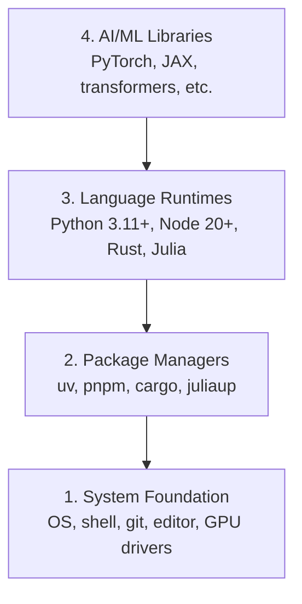

# Окружение разработчика

> Инструменты формируют мышление. Настрой их один раз — настрой правильно.

**Тип:** Сборка
**Языки:** Python, Node.js, Rust
**Требования:** Нет
**Время:** ~45 минут

## Цели обучения

- Установить Python 3.11+, Node.js 20+ и Rust-тулчейны с нуля
- Настроить виртуальные окружения и пакетные менеджеры для воспроизводимых сборок
- Проверить доступ к GPU через CUDA/MPS и запустить тестовую тензорную операцию
- Понять четырёхуровневый стек: система, пакеты, рантаймы, AI-библиотеки

## Проблема

Ты собираешься изучать AI-инжиниринг в 200+ уроках на Python, TypeScript, Rust и Julia. Если твоё окружение сломано, каждый урок превращается в борьбу с инструментами вместо обучения.

Большинство пропускает настройку окружения. А потом тратит часы на отладку ошибок импорта, конфликтов версий и отсутствующих CUDA-драйверов. Мы сделаем это один раз и правильно.

## Концепция

Окружение AI-разработчика состоит из четырёх уровней:



Устанавливаем снизу вверх. Каждый уровень зависит от предыдущего.

## Собираем

### Шаг 1: Системный фундамент

Проверь систему и установи базовые инструменты.

```bash
# macOS
xcode-select --install
brew install git curl wget

# Ubuntu/Debian
sudo apt update && sudo apt install -y build-essential git curl wget

# Windows (use WSL2)
wsl --install -d Ubuntu-24.04
```

### Шаг 2: Python с uv

Мы используем `uv` — он в 10–100 раз быстрее pip и автоматически управляет виртуальными окружениями.

```bash
curl -LsSf https://astral.sh/uv/install.sh | sh

uv python install 3.12

uv venv
source .venv/bin/activate  # or .venv\Scripts\activate on Windows

uv pip install numpy matplotlib jupyter
```

Проверка:

```python
import sys
print(f"Python {sys.version}")

import numpy as np
print(f"NumPy {np.__version__}")
a = np.array([1, 2, 3])
print(f"Vector: {a}, dot product with itself: {np.dot(a, a)}")
```

### Шаг 3: Node.js с pnpm

Для уроков на TypeScript (агенты, MCP-серверы, веб-приложения).

```bash
curl -fsSL https://fnm.vercel.app/install | bash
fnm install 22
fnm use 22

npm install -g pnpm

node -e "console.log('Node', process.version)"
```

### Шаг 4: Rust

Для уроков, критичных к производительности (инференс, системы).

```bash
curl --proto '=https' --tlsv1.2 -sSf https://sh.rustup.rs | sh

rustc --version
cargo --version
```

### Шаг 5: Julia (опционально)

Для уроков с интенсивной математикой, где Julia особенно хороша.

```bash
curl -fsSL https://install.julialang.org | sh

julia -e 'println("Julia ", VERSION)'
```

### Шаг 6: Настройка GPU (если есть)

```bash
# NVIDIA
nvidia-smi

# Install PyTorch with CUDA
uv pip install torch torchvision torchaudio --index-url https://download.pytorch.org/whl/cu124
```

```python
import torch
print(f"CUDA available: {torch.cuda.is_available()}")
if torch.cuda.is_available():
    print(f"GPU: {torch.cuda.get_device_name(0)}")
```

Нет GPU? Не проблема. Большинство уроков работает на CPU. Для уроков с интенсивным обучением используй Google Colab или облачные GPU.

### Шаг 7: Проверка всего

Запусти проверочный скрипт:

```bash
python phases/00-setup-and-tooling/01-dev-environment/code/verify.py
```

## Используем

Твоё окружение готово для каждого урока этого курса. Вот что и где понадобится:

| Язык | Используется в | Пакетный менеджер |
|------|---------------|-------------------|
| Python | Фазы 1–12 (ML, DL, NLP, CV, Audio, LLM) | uv |
| TypeScript | Фазы 13–17 (инструменты, агенты, рои, инфраструктура) | pnpm |
| Rust | Фазы 12, 15–17 (производительные системы) | cargo |
| Julia | Фаза 1 (математические основы) | Pkg |

## В продакшен

Этот урок создаёт проверочный скрипт, который кто угодно может запустить для проверки своей настройки.

См. `outputs/prompt-env-check.md` — промпт, помогающий AI-ассистентам диагностировать проблемы окружения.

## Упражнения

1. Запусти проверочный скрипт и исправь все ошибки
2. Создай Python-виртуальное окружение для этого курса и установи PyTorch
3. Напиши «hello world» на всех четырёх языках и запусти каждый

---

> 📝 **Перевод:** русская адаптация. [Оригинал](en.md) | Глоссарий: [GLOSSARY.ru.md](../../../glossary/GLOSSARY.ru.md)
