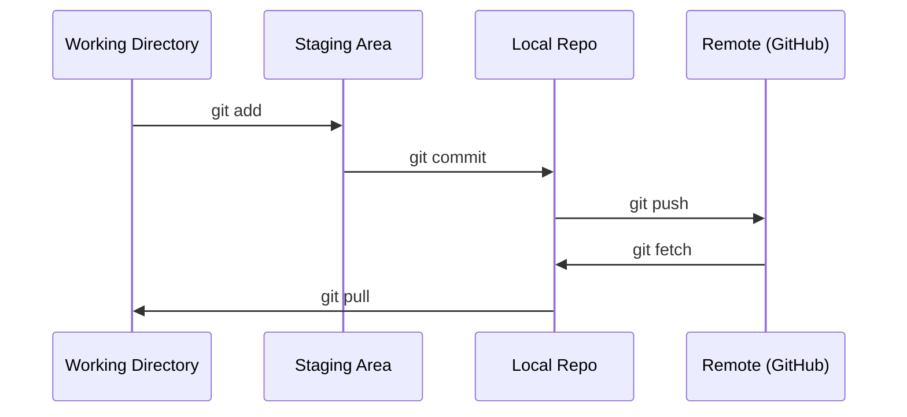

# Git и совместная работа

> Контроль версий обязателен. Каждый эксперимент, каждая модель, каждый урок, который ты здесь создашь, отслеживается.

**Тип:** Изучение
**Языки:** --
**Требования:** Фаза 0, Урок 01
**Время:** ~30 минут

## Цели обучения

- Настроить учётные данные git и освоить ежедневный рабочий процесс: add, commit, push
- Создавать и сливать ветки для изолированных экспериментов, не ломая main
- Написать `.gitignore`, исключающий чекпоинты моделей и большие бинарные файлы
- Просматривать историю коммитов с `git log`, чтобы понимать эволюцию проекта

## Проблема

Тебе предстоит написать сотни файлов с кодом в 20 фазах. Без контроля версий ты будешь терять работу, ломать то, что нельзя откатить, и не сможешь сотрудничать с другими.

Git — это инструмент. GitHub — место, где живёт код. Этот урок охватывает только то, что нужно для курса, и ничего лишнего.

## Концепция



Три вещи, которые нужно запомнить:
1. Делай коммиты часто (`git commit`)
2. Отправляй изменения на сервер (`git push`)
3. Ответвляйся для экспериментов (`git checkout -b experiment`)

## Собираем

### Шаг 1: Настройка git

```bash
git config --global user.name "Your Name"
git config --global user.email "you@example.com"
```

### Шаг 2: Ежедневный рабочий процесс

```bash
git status
git add file.py
git commit -m "Add perceptron implementation"
git push origin main
```

### Шаг 3: Ветвление для экспериментов

```bash
git checkout -b experiment/new-optimizer

# ... make changes, commit ...

git checkout main
git merge experiment/new-optimizer
```

### Шаг 4: Работа с репозиторием курса

```bash
git clone https://github.com/rohitg00/ai-engineering-from-scratch.git
cd ai-engineering-from-scratch

git checkout -b my-progress
# work through lessons, commit your code
git push origin my-progress
```

## Используем

Для этого курса тебе нужны ровно эти команды:

| Команда | Когда |
|---------|-------|
| `git clone` | Получить репозиторий курса |
| `git add` + `git commit` | Сохранить свою работу |
| `git push` | Отправить на GitHub |
| `git checkout -b` | Попробовать что-то, не ломая main |
| `git log --oneline` | Посмотреть, что сделано |

Всё. Rebase, cherry-pick и submodules для этого курса не нужны.

## Упражнения

1. Склонируй этот репозиторий, создай ветку `my-progress`, создай файл, сделай коммит, сделай пуш
2. Создай `.gitignore`, исключающий файлы чекпоинтов моделей (`.pt`, `.pth`, `.safetensors`)
3. Посмотри историю коммитов этого репозитория через `git log --oneline` и прочитай, как добавлялись уроки

## Ключевые термины

| Термин | Что говорят | Что на самом деле |
|--------|------------|-------------------|
| Commit | «Сохранение» | Снимок всего проекта на определённый момент времени |
| Branch | «Копия» | Указатель на коммит, который движется вперёд по мере работы |
| Merge | «Слияние кода» | Взятие изменений из одной ветки и применение их к другой |
| Remote | «Облако» | Копия репозитория, размещённая где-то ещё (GitHub, GitLab) |

---

> 📝 **Перевод:** русская адаптация. [Оригинал](en.md) | Глоссарий: [GLOSSARY.ru.md](../../../glossary/GLOSSARY.ru.md)
