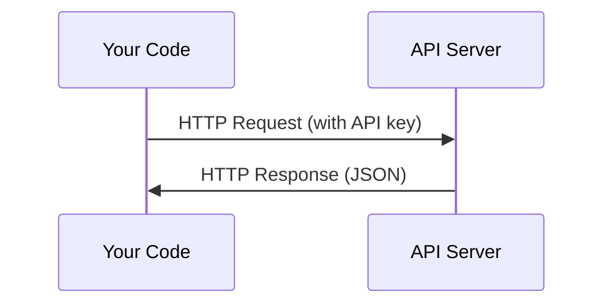

# API и ключи

> Все AI API работают одинаково: отправляешь запрос, получаешь ответ. Детали меняются, принцип неизменен.

**Тип:** Сборка
**Языки:** Python, TypeScript
**Требования:** Фаза 0, Урок 01
**Время:** ~30 минут

## Цели обучения

- Безопасно хранить API-ключи через переменные окружения и `.env`-файлы
- Сделать вызов LLM API через Anthropic Python SDK и чистый HTTP
- Сравнить форматы запросов/ответов через SDK и HTTP для отладки
- Распознавать и обрабатывать типичные ошибки API: аутентификацию и лимиты запросов

## Проблема

Начиная с Фазы 11 ты будешь вызывать LLM API (Anthropic, OpenAI, Google). В Фазах 13–16 — создавать агентов, использующих эти API в циклах. Нужно знать, как работают ключи, как их безопасно хранить и как сделать первый вызов.

## Концепция



У каждого API-вызова есть:
1. Endpoint (URL)
2. API-ключ (аутентификация)
3. Тело запроса (что ты хочешь)
4. Тело ответа (что получаешь)

## Собираем

### Шаг 1: Безопасное хранение ключей

Никогда не храни ключи в коде. Используй переменные окружения.

```bash
export ANTHROPIC_API_KEY="sk-ant-..."
export OPENAI_API_KEY="sk-..."
```

Или `.env`-файл (добавь его в `.gitignore`):

```
ANTHROPIC_API_KEY=sk-ant-...
OPENAI_API_KEY=sk-...
```

### Шаг 2: Первый вызов API (Python)

```python
import anthropic

client = anthropic.Anthropic()

response = client.messages.create(
    model="claude-sonnet-4-20250514",
    max_tokens=256,
    messages=[{"role": "user", "content": "What is a neural network in one sentence?"}]
)

print(response.content[0].text)
```

### Шаг 3: Первый вызов API (TypeScript)

```typescript
import Anthropic from "@anthropic-ai/sdk";

const client = new Anthropic();

const response = await client.messages.create({
  model: "claude-sonnet-4-20250514",
  max_tokens: 256,
  messages: [{ role: "user", content: "What is a neural network in one sentence?" }],
});

console.log(response.content[0].text);
```

### Шаг 4: Чистый HTTP (без SDK)

```python
import os
import urllib.request
import json

url = "https://api.anthropic.com/v1/messages"
headers = {
    "Content-Type": "application/json",
    "x-api-key": os.environ["ANTHROPIC_API_KEY"],
    "anthropic-version": "2023-06-01",
}
body = json.dumps({
    "model": "claude-sonnet-4-20250514",
    "max_tokens": 256,
    "messages": [{"role": "user", "content": "What is a neural network in one sentence?"}],
}).encode()

req = urllib.request.Request(url, data=body, headers=headers, method="POST")
with urllib.request.urlopen(req) as resp:
    result = json.loads(resp.read())
    print(result["content"][0]["text"])
```

Именно это SDK делают под капотом. Понимание чистого HTTP помогает при отладке.

## Используем

Для этого курса:

| API | Когда понадобится | Бесплатный уровень |
|-----|-------------------|--------------------|
| Anthropic (Claude) | Фазы 11–16 (агенты, инструменты) | $5 кредит при регистрации |
| OpenAI | Фаза 11 (сравнение) | $5 кредит при регистрации |
| Hugging Face | Фазы 4–10 (модели, датасеты) | Бесплатно |

Не нужно всё сразу. Настраивай, когда потребуется в уроке.

## Результат

Этот урок создаёт:
- `outputs/prompt-api-troubleshooter.md` — диагностика типичных ошибок API

## Упражнения

1. Получи ключ Anthropic API и сделай первый вызов
2. Попробуй чистый HTTP и сравни формат ответа с SDK-версией
3. Намеренно используй неверный ключ и прочитай сообщение об ошибке

## Ключевые термины

| Термин | Что говорят | Что на самом деле |
|--------|------------|-------------------|
| API-ключ | «Пароль для API» | Уникальная строка, идентифицирующая аккаунт и авторизующая запросы |
| Rate limit | «Меня троттлят» | Максимум запросов в минуту/час для предотвращения злоупотреблений и честного использования |
| Токен | «Слово» (в контексте API) | Единица биллинга: входные и выходные токены считаются и оплачиваются отдельно |
| Streaming | «Ответы в реальном времени» | Получение ответа слово за словом вместо ожидания полного ответа |

---

> 📝 **Перевод:** русская адаптация. [Оригинал](en.md) | Глоссарий: [GLOSSARY.ru.md](../../../glossary/GLOSSARY.ru.md)
