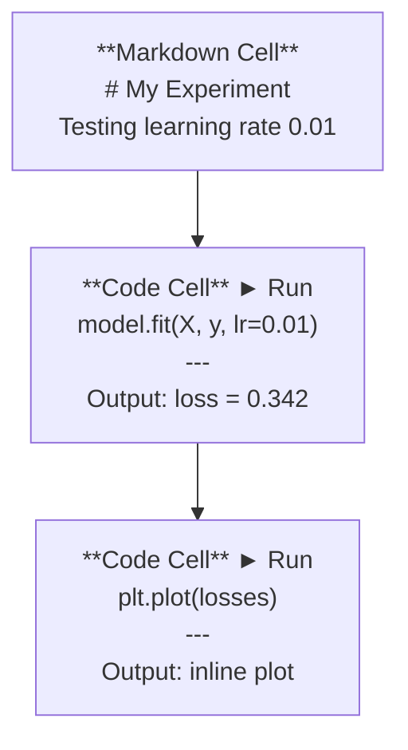
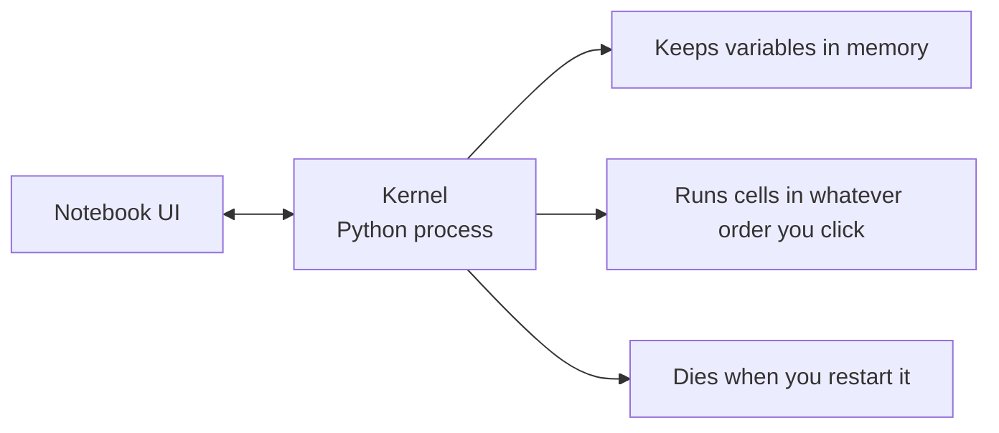

# Jupyter Notebooks

> Ноутбуки — это лабораторный стенд AI-инжиниринга. Прототипируешь здесь, а работающее переносишь в продакшен.

**Тип:** Сборка
**Языки:** Python
**Требования:** Фаза 0, Урок 01
**Время:** ~30 минут

## Цели обучения

- Установить и запустить JupyterLab, Jupyter Notebook или VS Code с расширением Jupyter
- Использовать magic-команды (`%timeit`, `%%time`, `%matplotlib inline`) для бенчмаркинга и встроенной визуализации
- Различать, когда использовать ноутбуки, а когда скрипты, и применять подход «исследуй в ноутбуках, отправляй скриптами»
- Выявлять и избегать типичных ловушек: выполнение не по порядку, скрытое состояние, утечки памяти

## Проблема

Каждая AI-статья, туториал и соревнование на Kaggle используют Jupyter-ноутбуки. Они позволяют запускать код по частям, видеть вывод прямо на месте, смешивать код с пояснениями и быстро итерироваться. Пытаться учить AI без ноутбуков — это как делать домашнюю работу по математике без черновика.

Но у ноутбуков есть реальные ловушки. Люди используют их для всего, включая то, для чего они не предназначены. Понимание, когда использовать ноутбук, а когда скрипт, спасёт от кошмаров отладки в будущем.

## Концепция

Ноутбук — это список ячеек. Каждая ячейка — либо код, либо текст.



Ядро (kernel) — это процесс Python, работающий в фоне. Когда запускаешь ячейку, код отправляется в ядро, оно выполняет его и возвращает результат. Все ячейки разделяют одно ядро, поэтому переменные сохраняются между ячейками.



Вот это «в любом порядке» — одновременно суперсила и выстрел в ногу.

## Собираем

### Шаг 1: Выбор интерфейса

Три варианта, один формат:

| Интерфейс | Установка | Для чего |
|-----------|-----------|----------|
| JupyterLab | `pip install jupyterlab` затем `jupyter lab` | Полноценный IDE, вкладки, файловый браузер, терминал |
| Jupyter Notebook | `pip install notebook` затем `jupyter notebook` | Простой, лёгкий, один ноутбук за раз |
| VS Code | Установи расширение «Jupyter» | Уже в редакторе, интеграция с git, отладка |

Все три читают и пишут один и тот же `.ipynb`-файл. Выбирай, что нравится. JupyterLab — самый распространённый в AI.

```bash
pip install jupyterlab
jupyter lab
```

### Шаг 2: Клавиатурные сокращения, которые важны

Работаешь в двух режимах. Нажми `Escape` для командного режима (синяя полоса слева), `Enter` для режима редактирования (зелёная полоса).

**Командный режим (самое частое):**

| Клавиша | Действие |
|---------|----------|
| `Shift+Enter` | Выполнить ячейку, перейти к следующей |
| `A` | Вставить ячейку сверху |
| `B` | Вставить ячейку снизу |
| `DD` | Удалить ячейку |
| `M` | Преобразовать в markdown |
| `Y` | Преобразовать в код |
| `Z` | Отменить операцию с ячейкой |
| `Ctrl+Shift+H` | Показать все сокращения |

**Режим редактирования:**

| Клавиша | Действие |
|---------|----------|
| `Tab` | Автодополнение |
| `Shift+Tab` | Показать сигнатуру функции |
| `Ctrl+/` | Закомментировать/раскомментировать |

`Shift+Enter` — та кнопка, которую будешь нажимать тысячу раз в день. Выучи её первой.

### Шаг 3: Типы ячеек

**Ячейки кода** выполняют Python и показывают результат:

```python
import numpy as np
data = np.random.randn(1000)
data.mean(), data.std()
```

Вывод: `(0.0032, 0.9987)`

**Markdown-ячейки** отображают форматированный текст. Используй их, чтобы документировать что и зачем ты делаешь. Поддерживают заголовки, жирный, курсив, LaTeX (`$E = mc^2$`), таблицы и изображения.

### Шаг 4: Magic-команды

Это не Python. Это специфичные для Jupyter команды, начинающиеся с `%` (строчная) или `%%` (ячеечная).

**Замер времени выполнения:**

```python
%timeit np.random.randn(10000)
```

Вывод: `45.2 µs ± 1.3 µs per loop`

```python
%%time
model.fit(X_train, y_train, epochs=10)
```

Вывод: `Wall time: 2.34 s`

`%timeit` запускает код много раз и усредняет. `%%time` — один раз. Используй `%timeit` для микробенчмарков, `%%time` для обучения.

**Включить встроенные графики:**

```python
%matplotlib inline
```

Теперь каждый `plt.plot()` или `plt.show()` отображается прямо в ноутбуке.

**Установка пакетов не выходя из ноутбука:**

```python
!pip install scikit-learn
```

Префикс `!` запускает любую shell-команду.

**Проверка переменных окружения:**

```python
%env CUDA_VISIBLE_DEVICES
```

### Шаг 5: Отображение rich-вывода

Ноутбуки автоматически показывают последнее выражение в ячейке. Но можно управлять:

```python
import pandas as pd

df = pd.DataFrame({
    "model": ["Linear", "Random Forest", "Neural Net"],
    "accuracy": [0.72, 0.89, 0.94],
    "training_time": [0.1, 2.3, 45.6]
})
df
```

Это отрендерит форматированную HTML-таблицу, а не текстовую свалку. То же с графиками:

```python
import matplotlib.pyplot as plt

plt.figure(figsize=(8, 4))
plt.plot([1, 2, 3, 4], [1, 4, 2, 3])
plt.title("Inline Plot")
plt.show()
```

График появляется прямо под ячейкой. Поэтому ноутбуки доминируют в AI: ты видишь данные, график и код вместе.

Для изображений:

```python
from IPython.display import Image, display
display(Image(filename="architecture.png"))
```

### Шаг 6: Google Colab

Colab — это бесплатный Jupyter-ноутбук в облаке. Предоставляет GPU, предустановленные библиотеки и интеграцию с Google Drive. Никакой настройки.

1. Перейди на [colab.research.google.com](https://colab.research.google.com)
2. Загрузи любой `.ipynb`-файл из этого курса
3. Runtime > Change runtime type > T4 GPU (бесплатно)

Отличия Colab от локального Jupyter:
- Файлы не сохраняются между сессиями (сохраняй на Drive или скачивай)
- Предустановлено: numpy, pandas, matplotlib, torch, tensorflow, sklearn
- `from google.colab import files` — для загрузки/скачивания файлов
- `from google.colab import drive; drive.mount('/content/drive')` — для постоянного хранения
- Сессии завершаются через 90 минут бездействия (бесплатный уровень)

## Используем

### Ноутбуки vs скрипты: что когда использовать

| Ноутбуки для | Скрипты для |
|-------------|------------|
| Исследования датасета | Обучающих пайплайнов |
| Прототипирования модели | Переиспользуемых утилит |
| Визуализации результатов | Всего с `if __name__` |
| Объяснения своей работы | Кода, запускаемого по расписанию |
| Быстрых экспериментов | Продакшен-кода |
| Упражнений курса | Пакетов и библиотек |

Правило: **исследуй в ноутбуках, переноси в скрипты**.

Распространённый рабочий процесс в AI:
1. Исследуешь данные в ноутбуке
2. Прототипируешь модель в ноутбуке
3. Когда заработало — переносишь код в `.py`-файлы
4. Импортируешь эти `.py`-файлы обратно в ноутбук для дальнейших экспериментов

### Типичные ловушки

**Выполнение не по порядку.** Запускаешь ячейку 5, потом 2, потом 7. На твоей машине работает, но ломается, когда кто-то запускает сверху вниз. Исправление: Kernel > Restart & Run All перед тем, как делиться.

**Скрытое состояние.** Удалил ячейку, но переменная из неё всё ещё в памяти. Ноутбук выглядит чистым, но зависит от фантомной ячейки. Исправление: регулярно перезапускай ядро.

**Утечки памяти.** Загрузил датасет 4 GB, обучил модель, загрузил ещё датасет. Ничего не освобождается. Исправление: `del variable_name` и `gc.collect()`, или перезапусти ядро.

## Результат

Этот урок создаёт:
- `outputs/prompt-notebook-helper.md` — для отладки проблем с ноутбуками

## Упражнения

1. Открой JupyterLab, создай ноутбук и сравни `%timeit` для list comprehension и numpy при создании массива из 100 000 случайных чисел
2. Создай ноутбук с Markdown и кодовыми ячейками: загрузи CSV, отобрази DataFrame и построй график. Затем Kernel > Restart & Run All для проверки работы сверху вниз
3. Возьми код из `code/notebook_tips.py`, вставь в Colab-ноутбук и запусти с бесплатным GPU

## Ключевые термины

| Термин | Что говорят | Что на самом деле |
|--------|------------|-------------------|
| Kernel | «То, что выполняет мой код» | Отдельный процесс Python, выполняющий ячейки и хранящий переменные в памяти |
| Ячейка | «Блок кода» | Независимо запускаемая единица в ноутбуке: код или markdown |
| Magic-команда | «Трюки Jupyter» | Специальные команды с префиксом `%` или `%%`, управляющие окружением ноутбука |
| `.ipynb` | «Файл ноутбука» | JSON-файл с ячейками, выводами и метаданными. Расшифровывается как IPython Notebook |

## Дополнительно

- [JupyterLab Docs](https://jupyterlab.readthedocs.io/) — полный набор возможностей
- [Google Colab FAQ](https://research.google.com/colaboratory/faq.html) — ограничения и возможности Colab
- [28 Jupyter Notebook Tips](https://www.dataquest.io/blog/jupyter-notebook-tips-tricks-shortcuts/) — продвинутые сокращения

---

> 📝 **Перевод:** русская адаптация. [Оригинал](en.md) | Глоссарий: [GLOSSARY.ru.md](../../../glossary/GLOSSARY.ru.md)
