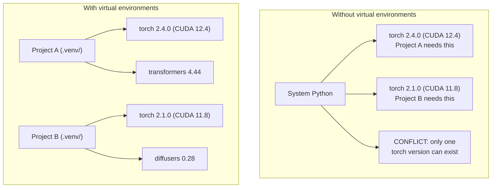

# Python-окружения

> Ад зависимостей реален. Виртуальные окружения — лекарство.

**Тип:** Сборка
**Языки:** Shell
**Требования:** Фаза 0, Урок 01
**Время:** ~30 минут

## Цели обучения

- Создавать изолированные виртуальные окружения с помощью `uv`, `venv` или `conda`
- Писать `pyproject.toml` с опциональными группами зависимостей и генерировать lock-файлы для воспроизводимости
- Диагностировать и исправлять типичные проблемы: глобальные установки, смешивание pip/conda, несовместимость версий CUDA
- Реализовать стратегию отдельных окружений для каждой фазы при конфликтующих зависимостях

## Проблема

Ты устанавливаешь PyTorch 2.4 для проекта по файнтюнингу. На следующей неделе другому проекту нужен PyTorch 2.1, потому что его CUDA-сборка зафиксирована. Обновляешь глобально — первый проект ломается. Откатываешь — ломается второй.

Это ад зависимостей. В AI/ML он происходит постоянно, потому что:

- PyTorch, JAX и TensorFlow поставляют собственные CUDA-привязки
- Библиотеки моделей фиксируют конкретные версии фреймворков
- Глобальный `pip install` перезаписывает то, что было раньше
- Сборки под CUDA 11.8 не работают с драйверами CUDA 12.x (и наоборот)

Решение: каждый проект получает собственное изолированное окружение со своими пакетами.

## Концепция



## Собираем

### Вариант 1: uv venv (рекомендуется)

`uv` — самый быстрый пакетный менеджер Python (в 10–100 раз быстрее pip). Управляет виртуальными окружениями, версиями Python и разрешением зависимостей в одном инструменте.

```bash
curl -LsSf https://astral.sh/uv/install.sh | sh

uv python install 3.12

cd your-project
uv venv
source .venv/bin/activate
```

Установка пакетов:

```bash
uv pip install torch numpy
```

Создание проекта с `pyproject.toml` одной командой:

```bash
uv init my-ai-project
cd my-ai-project
uv add torch numpy matplotlib
```

### Вариант 2: venv (встроенный)

Если не можешь установить `uv`, Python поставляется с `venv`:

```bash
python3 -m venv .venv
source .venv/bin/activate  # Linux/macOS
.venv\Scripts\activate     # Windows

pip install torch numpy
```

Медленнее, чем `uv`, но работает везде, где установлен Python.

### Вариант 3: conda (когда нужно)

Conda управляет не-Python-зависимостями: CUDA toolkit, cuDNN, C-библиотеками. Используй, когда:

- Нужна конкретная версия CUDA toolkit без системной установки
- Работаешь на общем кластере, где нельзя ставить системные пакеты
- Инструкция библиотеки говорит «используйте conda»

```bash
# Install miniconda (not the full Anaconda)
curl -LsSf https://repo.anaconda.com/miniconda/Miniconda3-latest-Linux-x86_64.sh -o miniconda.sh
bash miniconda.sh -b

conda create -n myproject python=3.12
conda activate myproject

conda install pytorch torchvision torchaudio pytorch-cuda=12.4 -c pytorch -c nvidia
```

Одно правило: если используешь conda для окружения, используй conda для всех пакетов в нём. Смешивание `pip install` в conda-окружении вызывает конфликты, которые больно отлаживать.

### Для этого курса: стратегия отдельных окружений

Можно создать одно окружение на весь курс. Не делай этого. Разным фазам нужны разные (иногда конфликтующие) зависимости.

Стратегия:

```
ai-engineering-from-scratch/
├── .venv/                    <-- shared lightweight env for phases 0-3
├── phases/
│   ├── 04-neural-networks/
│   │   └── .venv/            <-- PyTorch env
│   ├── 05-cnns/
│   │   └── .venv/            <-- same PyTorch env (symlink or shared)
│   ├── 08-transformers/
│   │   └── .venv/            <-- might need different transformer versions
│   └── 11-llm-apis/
│       └── .venv/            <-- API SDKs, no torch needed
```

Скрипт `code/env_setup.sh` создаёт базовое окружение для курса.

## Основы pyproject.toml

В каждом проекте на Python должен быть `pyproject.toml`. Он заменяет `setup.py`, `setup.cfg` и `requirements.txt` одним файлом.

```toml
[project]
name = "ai-engineering-from-scratch"
version = "0.1.0"
requires-python = ">=3.11"
dependencies = [
    "numpy>=1.26",
    "matplotlib>=3.8",
    "jupyter>=1.0",
    "scikit-learn>=1.4",
]

[project.optional-dependencies]
torch = ["torch>=2.3", "torchvision>=0.18"]
llm = ["anthropic>=0.39", "openai>=1.50"]
```

Установка:

```bash
uv pip install -e ".[torch]"    # base + PyTorch
uv pip install -e ".[llm]"     # base + LLM SDKs
uv pip install -e ".[torch,llm]" # everything
```

## Lock-файлы

Lock-файл фиксирует каждую зависимость (включая транзитивные) до точной версии. Это гарантирует воспроизводимость: кто бы ни устанавливал из lock-файла, получает точно те же пакеты.

```bash
# uv generates uv.lock automatically when using uv add
uv add numpy

# pip-tools approach
uv pip compile pyproject.toml -o requirements.lock
uv pip install -r requirements.lock
```

Коммить lock-файл в git. Когда кто-то клонирует репо, он устанавливает из lock-файла и получает идентичные версии.

## Типичные ошибки

### 1. Глобальная установка

```bash
pip install torch  # BAD: installs to system Python

source .venv/bin/activate
pip install torch  # GOOD: installs to virtual environment
```

Проверь, куда идут пакеты:

```bash
which python       # should show .venv/bin/python, not /usr/bin/python
which pip           # should show .venv/bin/pip
```

### 2. Смешивание pip и conda

```bash
conda create -n myenv python=3.12
conda activate myenv
conda install pytorch -c pytorch
pip install some-other-package   # BAD: can break conda's dependency tracking
conda install some-other-package # GOOD: let conda manage everything
```

Если вынужден использовать pip внутри conda (некоторые пакеты есть только в pip), сначала установи все conda-пакеты, затем pip-пакеты в последнюю очередь.

### 3. Забыл активировать

```bash
python train.py           # uses system Python, missing packages
source .venv/bin/activate
python train.py           # uses project Python, packages found
```

В приглашении командной строки должно отображаться имя окружения:

```
(.venv) $ python train.py
```

### 4. Коммит .venv в git

```bash
echo ".venv/" >> .gitignore
```

Виртуальные окружения весят 200 MB–2 GB. Они локальные, не переносятся между машинами. Коммить `pyproject.toml` и lock-файл вместо этого.

### 5. Несовместимость версий CUDA

```bash
nvidia-smi                # shows driver CUDA version (e.g., 12.4)
python -c "import torch; print(torch.version.cuda)"  # shows PyTorch CUDA version

# These must be compatible.
# PyTorch CUDA version must be <= driver CUDA version.
```

## Используем

Запусти скрипт настройки для создания окружения курса:

```bash
bash phases/00-setup-and-tooling/06-python-environments/code/env_setup.sh
```

Он создаёт `.venv` в корне репозитория с основными зависимостями и проверкой.

## Упражнения

1. Запусти `env_setup.sh` и убедись, что все проверки пройдены
2. Создай второе виртуальное окружение, установи в него другую версию numpy и убедись, что окружения изолированы
3. Напиши `pyproject.toml` для проекта, которому нужны и PyTorch, и Anthropic SDK
4. Намеренно установи пакет глобально (без активации venv), посмотри, куда он попал, затем удали

## Ключевые термины

| Термин | Что говорят | Что на самом деле |
|--------|------------|-------------------|
| Виртуальное окружение | «venv» | Изолированная директория с интерпретатором Python и пакетами, отдельно от системного Python |
| Lock-файл | «Зафиксированные зависимости» | Файл со списком каждого пакета и его точной версии, гарантирующий идентичную установку на разных машинах |
| pyproject.toml | «Новый setup.py» | Стандартный файл конфигурации проекта Python, заменяющий setup.py/setup.cfg/requirements.txt |
| Транзитивная зависимость | «Зависимость зависимости» | Пакет B зависит от C; если устанавливаешь A, зависящий от B, то C — транзитивная зависимость A |
| Несовместимость CUDA | «Мой GPU не работает» | PyTorch скомпилирован под другую версию CUDA, чем поддерживает драйвер GPU |

---

> 📝 **Перевод:** русская адаптация. [Оригинал](en.md) | Глоссарий: [GLOSSARY.ru.md](../../../glossary/GLOSSARY.ru.md)
