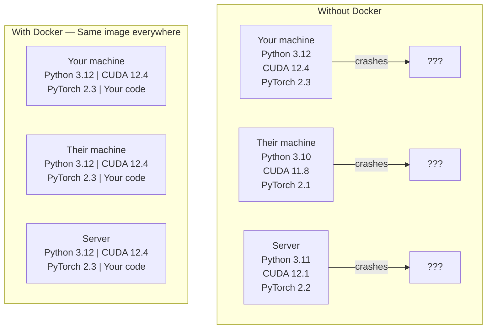

# Docker для AI

> Контейнеры делают фразу «на моей машине работает» пережитком прошлого.

**Тип:** Сборка
**Языки:** Docker
**Требования:** Фаза 0, Уроки 01 и 03
**Время:** ~60 минут

## Цели обучения

- Собрать Docker-образ с поддержкой GPU, CUDA, PyTorch и AI-библиотеками из Dockerfile
- Монтировать директории хоста как тома для сохранения моделей, датасетов и кода между пересборками
- Настроить NVIDIA Container Toolkit для доступа к GPU внутри контейнеров
- Оркестрировать мультисервисные AI-приложения (инференс-сервер + векторная БД) через Docker Compose

## Проблема

Ты обучил модель на ноутбуке с PyTorch 2.3, CUDA 12.4 и Python 3.12. У коллеги PyTorch 2.1, CUDA 11.8 и Python 3.10. Твоя модель падает на его машине. Dockerfile работает на обеих.

AI-проекты — это кошмар зависимостей. Типичный стек включает Python, PyTorch, CUDA-драйверы, cuDNN, системные C-библиотеки и специализированные пакеты вроде flash-attn, требующие точных версий компилятора. Docker упаковывает всё это в единый образ, работающий идентично везде.

## Концепция

Docker оборачивает твой код, рантайм, библиотеки и системные инструменты в изолированную единицу — контейнер. Можно думать о нём как о легковесной виртуальной машине, только он разделяет ядро ОС хоста вместо запуска собственного, поэтому стартует за секунды, а не минуты.



### Почему AI-проектам Docker нужен больше, чем остальным

1. **GPU-драйверы хрупкие.** Код под CUDA 12.4 не работает на CUDA 11.8. Docker изолирует CUDA toolkit внутри контейнера, разделяя драйвер GPU хоста через NVIDIA Container Toolkit.

2. **Веса моделей огромные.** Модель на 7B параметров — это 14 GB в fp16. Перекачивать при каждой пересборке не вариант. Тома Docker позволяют примонтировать директорию моделей с хоста.

3. **Мультисервисные архитектуры — норма.** Реальное AI-приложение — не просто Python-скрипт. Это инференс-сервер, векторная БД для RAG, возможно, веб-фронтенд. Docker Compose оркестрирует всё одной командой.

### Ключевой словарь

| Термин | Значение |
|--------|----------|
| Образ (Image) | Шаблон только для чтения. Твой рецепт. Собирается из Dockerfile. |
| Контейнер (Container) | Запущенный экземпляр образа. Твоя кухня. |
| Dockerfile | Инструкции по сборке образа. Слой за слоем. |
| Том (Volume) | Постоянное хранилище, переживающее перезапуски контейнера. |
| docker-compose | Инструмент для описания мультиконтейнерных приложений в YAML. |

### Распространённые паттерны контейнеров в AI

```
Dev Container
  Full toolkit. Editor support. Jupyter. Debugging tools.
  Used during development and experimentation.

Training Container
  Minimal. Just the training script and dependencies.
  Runs on GPU clusters. No editor, no Jupyter.

Inference Container
  Optimized for serving. Small image. Fast cold start.
  Runs behind a load balancer in production.
```

## Собираем

### Шаг 1: Установка Docker

```bash
# macOS
brew install --cask docker
open /Applications/Docker.app

# Ubuntu
curl -fsSL https://get.docker.com | sh
sudo usermod -aG docker $USER
# Log out and back in for group change to take effect
```

Проверка:

```bash
docker --version
docker run hello-world
```

### Шаг 2: Установка NVIDIA Container Toolkit (Linux с NVIDIA GPU)

Позволяет Docker-контейнерам получать доступ к GPU. Пользователи macOS и Windows (WSL2) могут пропустить — Docker Desktop обрабатывает проброс GPU иначе.

```bash
distribution=$(. /etc/os-release;echo $ID$VERSION_ID)
curl -fsSL https://nvidia.github.io/libnvidia-container/gpgkey | sudo gpg --dearmor -o /usr/share/keyrings/nvidia-container-toolkit-keyring.gpg
curl -s -L https://nvidia.github.io/libnvidia-container/$distribution/libnvidia-container.list | \
    sed 's#deb https://#deb [signed-by=/usr/share/keyrings/nvidia-container-toolkit-keyring.gpg] https://#g' | \
    sudo tee /etc/apt/sources.list.d/nvidia-container-toolkit.list

sudo apt-get update
sudo apt-get install -y nvidia-container-toolkit
sudo nvidia-ctk runtime configure --runtime=docker
sudo systemctl restart docker
```

Проверка доступа к GPU внутри контейнера:

```bash
docker run --rm --gpus all nvidia/cuda:12.4.1-base-ubuntu22.04 nvidia-smi
```

Если видишь информацию о GPU — toolkit работает.

### Шаг 3: Понимание базовых образов

Правильный выбор базового образа экономит часы отладки.

```
nvidia/cuda:12.4.1-devel-ubuntu22.04
  Full CUDA toolkit. Compilers included.
  Use for: building packages that need nvcc (flash-attn, bitsandbytes)
  Size: ~4 GB

nvidia/cuda:12.4.1-runtime-ubuntu22.04
  CUDA runtime only. No compilers.
  Use for: running pre-built code
  Size: ~1.5 GB

pytorch/pytorch:2.3.1-cuda12.4-cudnn9-runtime
  PyTorch pre-installed on top of CUDA.
  Use for: skipping the PyTorch install step
  Size: ~6 GB

python:3.12-slim
  No CUDA. CPU only.
  Use for: inference on CPU, lightweight tools
  Size: ~150 MB
```

### Шаг 4: Написание Dockerfile для AI-разработки

Вот Dockerfile из `code/Dockerfile`. Разберём его:

```dockerfile
FROM nvidia/cuda:12.4.1-devel-ubuntu22.04

ENV DEBIAN_FRONTEND=noninteractive
ENV PYTHONUNBUFFERED=1

RUN apt-get update && apt-get install -y --no-install-recommends \
    python3.12 \
    python3.12-venv \
    python3.12-dev \
    python3-pip \
    git \
    curl \
    build-essential \
    && rm -rf /var/lib/apt/lists/*

RUN update-alternatives --install /usr/bin/python python /usr/bin/python3.12 1

RUN python -m pip install --no-cache-dir --upgrade pip setuptools wheel

RUN python -m pip install --no-cache-dir \
    torch==2.3.1 \
    torchvision==0.18.1 \
    torchaudio==2.3.1 \
    --index-url https://download.pytorch.org/whl/cu124

RUN python -m pip install --no-cache-dir \
    numpy \
    pandas \
    scikit-learn \
    matplotlib \
    jupyter \
    transformers \
    datasets \
    accelerate \
    safetensors

WORKDIR /workspace

VOLUME ["/workspace", "/models"]

EXPOSE 8888

CMD ["python"]
```

Сборка:

```bash
docker build -t ai-dev -f phases/00-setup-and-tooling/07-docker-for-ai/code/Dockerfile .
```

Первый раз занимает время (загрузка базового образа CUDA + PyTorch). Последующие сборки используют кешированные слои.

Запуск:

```bash
docker run --rm -it --gpus all \
    -v $(pwd):/workspace \
    -v ~/models:/models \
    ai-dev python -c "import torch; print(f'PyTorch {torch.__version__}, CUDA: {torch.cuda.is_available()}')"
```

Запуск Jupyter внутри контейнера:

```bash
docker run --rm -it --gpus all \
    -v $(pwd):/workspace \
    -v ~/models:/models \
    -p 8888:8888 \
    ai-dev jupyter notebook --ip=0.0.0.0 --port=8888 --no-browser --allow-root
```

### Шаг 5: Монтирование томов для данных и моделей

Монтирование томов критично для AI-работы. Без них твои 14 GB загрузок моделей исчезают при остановке контейнера.

```bash
# Mount your code
-v $(pwd):/workspace

# Mount a shared models directory
-v ~/models:/models

# Mount datasets
-v ~/datasets:/data
```

В скрипте обучения загружай из примонтированного пути:

```python
from transformers import AutoModel

model = AutoModel.from_pretrained("/models/llama-7b")
```

Модель живёт на файловой системе хоста. Пересобирай контейнер сколько угодно без повторных загрузок.

### Шаг 6: Docker Compose для мультисервисных AI-приложений

Реальному RAG-приложению нужны инференс-сервер и векторная БД. Docker Compose запускает оба одной командой.

См. `code/docker-compose.yml`:

```yaml
services:
  ai-dev:
    build:
      context: .
      dockerfile: Dockerfile
    deploy:
      resources:
        reservations:
          devices:
            - driver: nvidia
              count: all
              capabilities: [gpu]
    volumes:
      - ../../../:/workspace
      - ~/models:/models
      - ~/datasets:/data
    ports:
      - "8888:8888"
    stdin_open: true
    tty: true
    command: jupyter notebook --ip=0.0.0.0 --port=8888 --no-browser --allow-root

  qdrant:
    image: qdrant/qdrant:v1.12.5
    ports:
      - "6333:6333"
      - "6334:6334"
    volumes:
      - qdrant_data:/qdrant/storage

volumes:
  qdrant_data:
```

Запуск всего:

```bash
cd phases/00-setup-and-tooling/07-docker-for-ai/code
docker compose up -d
```

Теперь AI-контейнер разработки может обращаться к векторной БД по адресу `http://qdrant:6333` по имени сервиса. Docker Compose автоматически создаёт общую сеть.

Проверка соединения из AI-контейнера:

```python
from qdrant_client import QdrantClient

client = QdrantClient(host="qdrant", port=6333)
print(client.get_collections())
```

Остановка всего:

```bash
docker compose down
```

Добавь `-v` для удаления также тома qdrant:

```bash
docker compose down -v
```

### Шаг 7: Полезные команды Docker для AI

```bash
# List running containers
docker ps

# List all images and their sizes
docker images

# Remove unused images (reclaim disk space)
docker system prune -a

# Check GPU usage inside a running container
docker exec -it <container_id> nvidia-smi

# Copy a file from container to host
docker cp <container_id>:/workspace/results.csv ./results.csv

# View container logs
docker logs -f <container_id>
```

## Используем

Теперь у тебя есть воспроизводимое окружение AI-разработки. Для всего курса:

- Используй `docker compose up` для запуска окружения разработки и векторной БД вместе
- Монтируй код, модели и данные как тома — ничего не теряется между пересборками
- Когда урок требует новый Python-пакет — добавь в Dockerfile и пересобери
- Делись Dockerfile с коллегами. У них будет точно такое же окружение.

### Нет GPU?

Убери флаг `--gpus all` и блок NVIDIA deploy. Контейнер всё ещё работает для CPU-уроков. PyTorch автоматически определяет отсутствие CUDA и переключается на CPU.

## Упражнения

1. Собери Dockerfile и запусти `python -c "import torch; print(torch.__version__)"` внутри контейнера
2. Запусти docker-compose стек и проверь, что Qdrant доступен из AI-контейнера по `http://qdrant:6333/collections`
3. Добавь `flask` в Dockerfile, пересобери и запусти простой API-сервер на порту 5000. Пробрось порт через `-p 5000:5000`
4. Измерь размер образа через `docker images`. Попробуй сменить базовый образ с `devel` на `runtime` и сравни размеры

## Ключевые термины

| Термин | Что говорят | Что на самом деле |
|--------|------------|-------------------|
| Контейнер | «Легковесная VM» | Изолированный процесс на ядре хоста, с собственной файловой системой и сетью |
| Слой образа | «Закешированный шаг» | Каждая инструкция Dockerfile создаёт слой. Неизменённые слои кешируются — пересборки быстрые. |
| NVIDIA Container Toolkit | «GPU в Docker» | Рантайм-хук, пробрасывающий GPU хоста в контейнеры через флаг `--gpus` |
| Монтирование тома | «Общая папка» | Директория хоста, отображённая в контейнер. Изменения сохраняются после остановки контейнера. |
| Базовый образ | «Отправная точка» | Образ в `FROM`, поверх которого строится Dockerfile. Определяет, что предустановлено. |

---

> 📝 **Перевод:** русская адаптация. [Оригинал](en.md) | Глоссарий: [GLOSSARY.ru.md](../../../glossary/GLOSSARY.ru.md)
