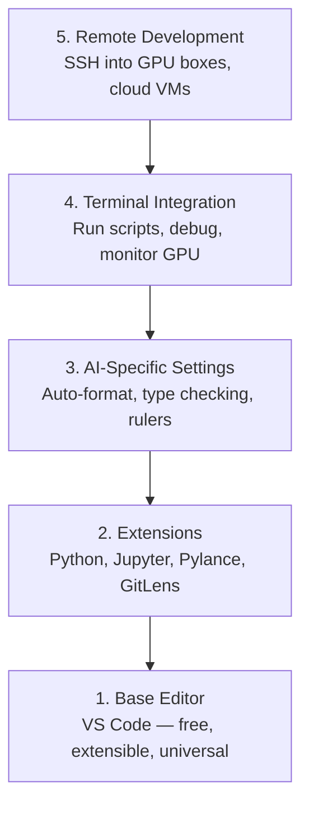

# Настройка редактора

> Ваш редактор — это ваш второй пилот. Настройте его один раз, чтобы он не мешал и начал отрабатывать своё место.

**Тип:** Build
**Языки:** --
**Пререквизиты:** Фаза 0, Урок 01
**Время:** ~20 минут

## Цели обучения

- Установить VS Code с ключевыми расширениями для Python, Jupyter, линтинга и Remote SSH
- Настроить форматирование при сохранении, проверку типов и прокрутку вывода ноутбуков для AI-воркфлоу
- Настроить Remote SSH для редактирования и отладки кода на удалённых GPU-машинах как на локальной
- Оценить альтернативные редакторы (Cursor, Windsurf, Neovim) и их компромиссы для AI-работы

## Проблема

Вы проведёте тысячи часов в редакторе: писать Python, запускать ноутбуки, отлаживать циклы обучения и подключаться по SSH к GPU-серверам. Плохо настроенный редактор превращает каждую сессию в трение: нет автодополнения, нет подсказок типов, нет встроенных ошибок, ручное форматирование и неудобная работа с терминалом.

Правильная настройка занимает 20 минут. Её отсутствие стоит вам 20 минут каждый день.

## Концепция

Редактор для AI-инженера требует пяти вещей:



## Собираем

### Шаг 1: Установка VS Code

VS Code — рекомендованный редактор. Он бесплатный, работает на всех ОС, имеет первоклассную поддержку Jupyter-ноутбуков, а экосистема расширений покрывает всё, что нужно для AI-работы.

Скачайте с [code.visualstudio.com](https://code.visualstudio.com/).

Проверьте из терминала:

```bash
code --version
```

Если `code` не найден на macOS, откройте VS Code, нажмите `Cmd+Shift+P`, введите «Shell Command» и выберите «Install 'code' command in PATH».

### Шаг 2: Установка основных расширений

Откройте встроенный терминал в VS Code (`Ctrl+`` ` или `` Cmd+` ``) и установите расширения, которые важны для AI-работы:

```bash
code --install-extension ms-python.python
code --install-extension ms-python.vscode-pylance
code --install-extension ms-toolsai.jupyter
code --install-extension eamodio.gitlens
code --install-extension ms-vscode-remote.remote-ssh
code --install-extension ms-python.debugpy
code --install-extension ms-python.black-formatter
code --install-extension charliermarsh.ruff
```

Что делает каждое:

| Расширение | Зачем |
|-----------|-----|
| Python | Поддержка языка, определение виртуальных окружений, запуск/отладка |
| Pylance | Быстрая проверка типов, автодополнение, разрешение импортов |
| Jupyter | Запуск ноутбуков внутри VS Code, обозреватель переменных |
| GitLens | Кто и что изменил, встроенный git blame |
| Remote SSH | Открыть папку на удалённой GPU-машине как локальную |
| Debugpy | Пошаговая отладка Python |
| Black Formatter | Автоформатирование при сохранении, единый стиль |
| Ruff | Быстрый линтинг, отлавливает типичные ошибки |

Файл `code/.vscode/extensions.json` в этом уроке содержит полный список рекомендаций. Когда вы откроете папку проекта, VS Code предложит их установить.

### Шаг 3: Настройка параметров

Скопируйте настройки из `code/.vscode/settings.json` этого урока или примените их вручную через `Settings > Open Settings (JSON)`.

Ключевые настройки для AI-работы:

```jsonc
{
    "python.analysis.typeCheckingMode": "basic",
    "editor.formatOnSave": true,
    "editor.rulers": [88, 120],
    "notebook.output.scrolling": true,
    "files.autoSave": "afterDelay"
}
```

Почему это важно:

- **Проверка типов на basic**: Ловит неверные типы аргументов до запуска. Экономит время отладки на несовпадении размерностей тензоров и неверных параметрах API.
- **Форматирование при сохранении**: Больше никогда не думайте о форматировании. Black всё сделает.
- **Линейки на 88 и 120**: Black переносит строки на 88 символах. Метка 120 показывает, когда docstring и комментарии становятся слишком длинными.
- **Прокрутка вывода ноутбуков**: Циклы обучения печатают тысячи строк. Без прокрутки панель вывода взрывается.
- **Автосохранение**: Вы забудете сохранить. Ваш скрипт обучения запустит устаревший код. Автосохранение предотвращает это.

### Шаг 4: Интеграция с терминалом

Встроенный терминал VS Code — это место, где вы запускаете скрипты обучения, мониторите GPU и управляете окружениями.

Настройте его правильно:

```jsonc
{
    "terminal.integrated.defaultProfile.osx": "zsh",
    "terminal.integrated.defaultProfile.linux": "bash",
    "terminal.integrated.fontSize": 13,
    "terminal.integrated.scrollback": 10000
}
```

Полезные сочетания клавиш:

| Действие | macOS | Linux/Windows |
|--------|-------|---------------|
| Переключить терминал | `` Ctrl+` `` | `` Ctrl+` `` |
| Новый терминал | `Ctrl+Shift+`` ` | `Ctrl+Shift+`` ` |
| Разделить терминал | `Cmd+\` | `Ctrl+\` |

Разделённые терминалы удобны: один для запуска скрипта, другой для мониторинга GPU через `nvidia-smi -l 1` или `watch -n 1 nvidia-smi`.

### Шаг 5: Удалённая разработка (SSH на GPU-серверы)

Это самое важное расширение для AI-работы. Вы будете запускать обучение на удалённых машинах (облачные VM, лабораторные серверы, Lambda, Vast.ai). Remote SSH позволяет открыть удалённую файловую систему, редактировать файлы, запускать терминалы и отлаживать так, будто всё локально.

Настройка:

1. Установите расширение Remote SSH (сделано в Шаге 2).
2. Нажмите `Ctrl+Shift+P` (или `Cmd+Shift+P`), введите «Remote-SSH: Connect to Host».
3. Введите `user@ваш-gpu-сервер-ip`.
4. VS Code автоматически установит свой серверный компонент на удалённой машине.

Для доступа без пароля настройте SSH-ключи:

```bash
ssh-keygen -t ed25519 -C "your-email@example.com"
ssh-copy-id user@your-gpu-box-ip
```

Добавьте хост в `~/.ssh/config` для удобства:

```
Host gpu-box
    HostName 203.0.113.50
    User ubuntu
    IdentityFile ~/.ssh/id_ed25519
    ForwardAgent yes
```

Теперь `Remote-SSH: Connect to Host > gpu-box` подключается мгновенно.

## Альтернативы

### Cursor

[cursor.com](https://cursor.com) — форк VS Code со встроенной AI-генерацией кода. Использует ту же экосистему расширений и формат настроек. Если вы пользуетесь Cursor, всё в этом уроке по-прежнему применимо. Импортируйте те же `settings.json` и `extensions.json`.

### Windsurf

[windsurf.com](https://windsurf.com) — ещё один AI-ориентированный форк VS Code. Та же история: те же расширения, тот же формат настроек, та же поддержка Remote SSH.

### Vim/Neovim

Если вы уже пользуетесь Vim или Neovim и продуктивны в нём — оставайтесь. Минимальный набор для AI-разработки на Python:

- **pyright** или **pylsp** для проверки типов (через Mason или ручную установку)
- **nvim-lspconfig** для интеграции языкового сервера
- **jupyter-vim** или **molten-nvim** для выполнения кода в стиле ноутбука
- **telescope.nvim** для поиска по файлам и символам
- **none-ls.nvim** с black и ruff для форматирования и линтинга

Если вы ещё не пользуетесь Vim — не начинайте сейчас. Кривая обучения будет конкурировать с изучением AI-инжиниринга. Используйте VS Code.

## Применяем

С этой настройкой ваш ежедневный воркфлоу выглядит так:

1. Открываете папку проекта в VS Code (или подключаетесь через Remote SSH к GPU-серверу).
2. Пишете Python в редакторе с автодополнением, подсказками типов и встроенными ошибками.
3. Запускаете Jupyter-ноутбуки прямо в редакторе через расширение Jupyter.
4. Используете встроенный терминал для скриптов обучения, `uv pip install` и мониторинга GPU.
5. Просматриваете изменения через GitLens перед коммитом.

## Упражнения

1. Установите VS Code и все расширения из Шага 2
2. Скопируйте `settings.json` из этого урока в конфигурацию VS Code
3. Откройте Python-файл и убедитесь, что Pylance показывает подсказки типов, а Black форматирует при сохранении
4. Если есть доступ к удалённой машине, настройте Remote SSH и откройте на ней папку

## Ключевые термины

| Термин | Что говорят | Что на самом деле значит |
|------|----------------|----------------------|
| LSP | «Движок автодополнения» | Language Server Protocol: стандарт, по которому редакторы получают информацию о типах, дополнения и диагностику от сервера конкретного языка |
| Pylance | «Плагин для Python» | Языковой сервер Microsoft для Python, использующий Pyright для проверки типов и IntelliSense |
| Remote SSH | «Работа на сервере» | Расширение VS Code, запускающее облегчённый сервер на удалённой машине и передающее интерфейс локальному редактору |
| Format on save | «Авто-форматтер» | Редактор запускает форматтер (Black, Ruff) при каждом сохранении, чтобы стиль кода всегда был единообразным |
