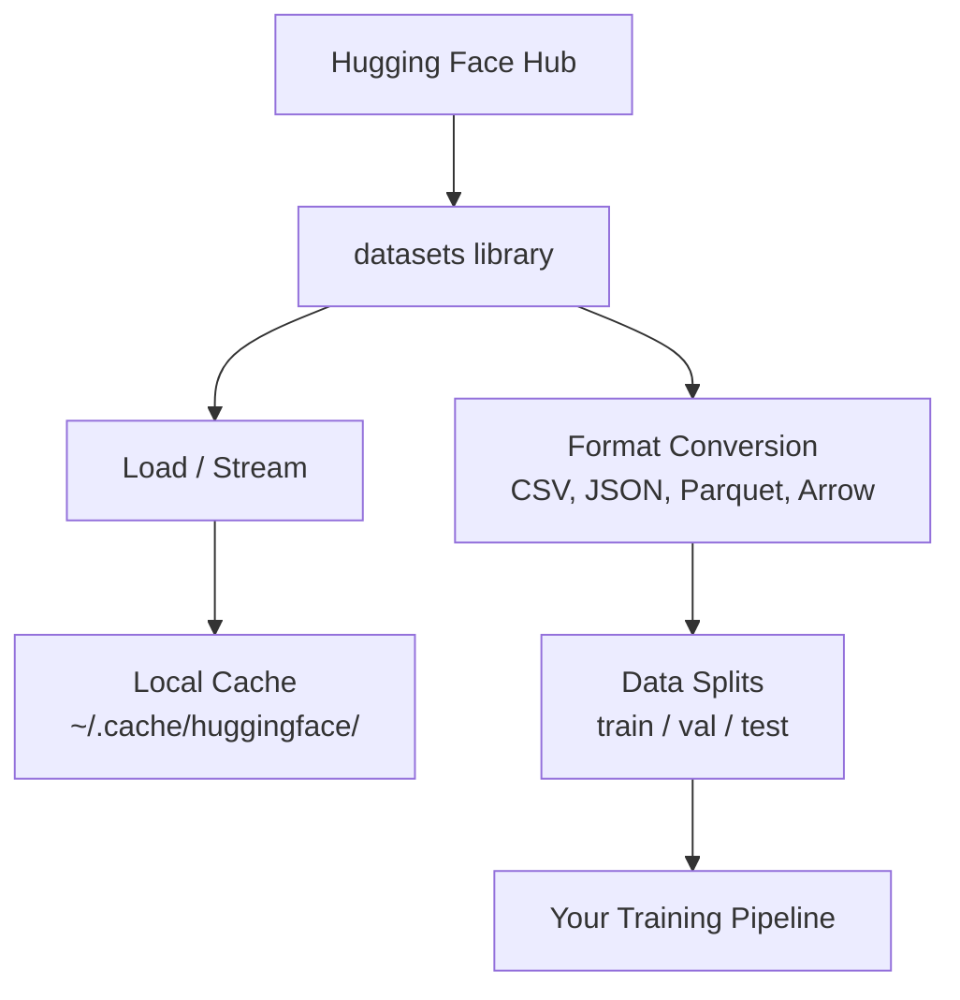

# Управление данными

> Данные — это топливо. То, как Вы ими управляете, определяет, как быстро Вы едете.

**Тип:** Build
**Язык:** Python
**Пререквизиты:** Фаза 0, Урок 01
**Время:** ~45 минут

## Цели обучения

- Загружать, стримить и кешировать датасеты с помощью библиотеки Hugging Face `datasets`
- Конвертировать между форматами CSV, JSON, Parquet и Arrow и объяснять их компромиссы
- Создавать воспроизводимые разбиения train/validation/test с фиксированными random seed
- Управлять большими файлами моделей и датасетов с помощью `.gitignore`, Git LFS или DVC

## Проблема

Каждый AI-проект начинается с данных. Вам нужно находить датасеты, скачивать их, конвертировать между форматами, разбивать на обучающую и проверочную выборки и версионировать их так, чтобы эксперименты были воспроизводимы. Делать это вручную каждый раз — медленно и чревато ошибками. Вам нужен повторяемый воркфлоу.

## Концепция



Библиотека Hugging Face `datasets` — это стандартный способ загрузки данных для работы с ИИ. Она из коробки обрабатывает скачивание, кеширование, конвертацию форматов и стриминг.

## Собираем

### Шаг 1: Установка библиотеки datasets

```bash
pip install datasets huggingface_hub
```

### Шаг 2: Загрузка датасета

```python
from datasets import load_dataset

dataset = load_dataset("imdb")
print(dataset)
print(dataset["train"][0])
```

Команда скачивает датасет обзоров фильмов IMDB. После первой загрузки данные берутся из кеша в `~/.cache/huggingface/datasets/`.

### Шаг 3: Стриминг больших датасетов

Некоторые датасеты слишком велики, чтобы поместиться на диске. Стриминг загружает их построчно без скачивания целиком.

```python
dataset = load_dataset("wikimedia/wikipedia", "20220301.en", split="train", streaming=True)

for i, example in enumerate(dataset):
    print(example["title"])
    if i >= 4:
        break
```

Стриминг даёт Вам `IterableDataset`. Вы обрабатываете строки по мере их поступления. Потребление памяти остаётся постоянным независимо от размера датасета.

### Шаг 4: Форматы датасетов

Библиотека `datasets` использует Apache Arrow внутри. Вы можете конвертировать в другие форматы в зависимости от того, что нужно Вашему конвейеру.

```python
dataset = load_dataset("imdb", split="train")

dataset.to_csv("imdb_train.csv")
dataset.to_json("imdb_train.json")
dataset.to_parquet("imdb_train.parquet")
```

Сравнение форматов:

| Формат | Размер | Скорость чтения | Лучше всего для |
|--------|------|-----------|----------|
| CSV | Большой | Медленная | Человекочитаемость, электронные таблицы |
| JSON | Большой | Медленная | API, вложенные данные |
| Parquet | Маленький | Быстрая | Аналитика, колоночные запросы |
| Arrow | Маленький | Самая быстрая | Обработка в памяти (то, что `datasets` использует внутри) |

Для работы с ИИ Parquet — лучший формат хранения. Arrow — то, с чем Вы работаете в памяти. CSV и JSON — для обмена данными.

### Шаг 5: Разбиение данных

Каждому ML-проекту нужны три сплита:

- **Train**: на этом модель учится (обычно 80%)
- **Validation**: проверка прогресса во время обучения (обычно 10%)
- **Test**: финальная оценка после завершения обучения (обычно 10%)

Некоторые датасеты поставляются уже разбитыми. Если нет — разбивайте сами:

```python
dataset = load_dataset("imdb", split="train")

split = dataset.train_test_split(test_size=0.2, seed=42)
train_val = split["train"].train_test_split(test_size=0.125, seed=42)

train_ds = train_val["train"]
val_ds = train_val["test"]
test_ds = split["test"]

print(f"Train: {len(train_ds)}, Val: {len(val_ds)}, Test: {len(test_ds)}")
```

Всегда задавайте seed для воспроизводимости. Один и тот же seed каждый раз даёт одно и то же разбиение.

### Шаг 6: Скачивание и кеширование моделей

Модели — это большие файлы. Библиотека `huggingface_hub` обрабатывает скачивание и кеширование.

```python
from huggingface_hub import hf_hub_download, snapshot_download

model_path = hf_hub_download(
    repo_id="sentence-transformers/all-MiniLM-L6-v2",
    filename="config.json"
)
print(f"Cached at: {model_path}")

model_dir = snapshot_download("sentence-transformers/all-MiniLM-L6-v2")
print(f"Full model at: {model_dir}")
```

Модели кешируются в `~/.cache/huggingface/hub/`. После первого скачивания модели подгружаются мгновенно при последующих запусках.

### Шаг 7: Работа с большими файлами

Веса моделей и большие датасеты не должны попадать в git. Три варианта:

**Вариант A: .gitignore (самый простой)**

```
*.bin
*.safetensors
*.pt
*.onnx
data/*.parquet
data/*.csv
models/
```

**Вариант B: Git LFS (отслеживание больших файлов в git)**

```bash
git lfs install
git lfs track "*.bin"
git lfs track "*.safetensors"
git add .gitattributes
```

Git LFS хранит указатели в вашем репозитории, а сами файлы — на отдельном сервере. GitHub даёт 1 ГБ бесплатно.

**Вариант C: DVC (контроль версий данных)**

```bash
pip install dvc
dvc init
dvc add data/training_set.parquet
git add data/training_set.parquet.dvc data/.gitignore
git commit -m "Track training data with DVC"
```

DVC создаёт маленькие `.dvc`-файлы, которые ссылаются на ваши данные. Сами данные живут в S3, GCS или другом облачном хранилище.

| Подход | Сложность | Лучше всего для |
|----------|-----------|----------|
| .gitignore | Низкая | Персональные проекты, данные, которые можно перекачать |
| Git LFS | Средняя | Команды, которые делятся весами моделей через git |
| DVC | Высокая | Воспроизводимые эксперименты, большие датасеты, команды |

Для этого курса `.gitignore` достаточно. Используйте DVC, когда нужно воспроизводить точные эксперименты на разных машинах.

### Шаг 8: Подходы к хранению

**Локальное хранилище** работает для датасетов размером примерно до 10 ГБ. Кеш HF справляется с этим автоматически.

**Облачное хранилище** — для всего, что больше, или для общего доступа между машинами:

```python
import os

local_path = os.path.expanduser("~/.cache/huggingface/datasets/")

# s3_path = "s3://my-bucket/datasets/"
# gcs_path = "gs://my-bucket/datasets/"
```

DVC интегрируется с S3 и GCS напрямую:

```bash
dvc remote add -d myremote s3://my-bucket/dvc-store
dvc push
```

Для этого курса локального хранилища достаточно. Облачное хранилище становится актуальным, когда Вы файнтюните на удалённых GPU-инстансах.

## Датасеты, используемые в курсе

| Датасет | Уроки | Размер | Чему учит |
|---------|---------|------|----------------|
| IMDB | Токенизация, классификация | 84 МБ | Основы классификации текста |
| WikiText | Языковое моделирование | 181 МБ | Предсказание следующего токена |
| SQuAD | QA-системы | 35 МБ | Вопросно-ответные системы, спаны |
| Common Crawl (подвыборка) | Эмбеддинги | Разный | Крупномасштабная обработка текста |
| MNIST | Основы компьютерного зрения | 21 МБ | Основы классификации изображений |
| COCO (подвыборка) | Мультимодальность | Разный | Пары изображение-текст |

Скачивать всё это сейчас не нужно. Каждый урок указывает, что ему требуется.

## Используем

Запустите вспомогательный скрипт, чтобы проверить, что всё работает:

```bash
python code/data_utils.py
```

Он скачивает небольшой датасет, конвертирует его, разбивает и выводит сводку.

## Результат

Этот урок производит:
- `code/data_utils.py` — переиспользуемая утилита для загрузки и кеширования данных
- `outputs/prompt-data-helper.md` — промпт для поиска подходящего датасета под задачу

## Упражнения

1. Загрузите датасет `glue` с конфигурацией `mrpc` и изучите первые 5 примеров
2. Стримьте датасет `c4` и посчитайте, сколько примеров Вы можете обработать за 10 секунд
3. Конвертируйте датасет в Parquet и сравните размер файла с CSV
4. Создайте разбиение 70/15/15 train/val/test с фиксированным seed и проверьте размеры

## Ключевые термины

| Термин | Что говорят | Что это на самом деле значит |
|------|----------------|----------------------|
| Dataset split | «Обучающие данные» | Именованное подмножество (train/val/test), используемое на разных этапах жизненного цикла ML |
| Streaming | «Ленивая загрузка» | Построчная обработка данных из удалённого источника без скачивания датасета целиком |
| Parquet | «Сжатый CSV» | Колоночный файловый формат, оптимизированный для аналитических запросов и эффективности хранения |
| Arrow | «Быстрый датафрейм» | Колоночный формат в памяти, используемый внутри библиотекой datasets для чтения без копирования |
| Git LFS | «Git для больших файлов» | Расширение, которое хранит большие файлы вне git-репозитория, оставляя указатели в системе контроля версий |
| DVC | «Git для данных» | Система контроля версий для датасетов и моделей, интегрирующаяся с облачным хранилищем |
| Cache | «Уже скачано» | Локальная копия ранее полученных данных, по умолчанию хранится в ~/.cache/huggingface/ |
