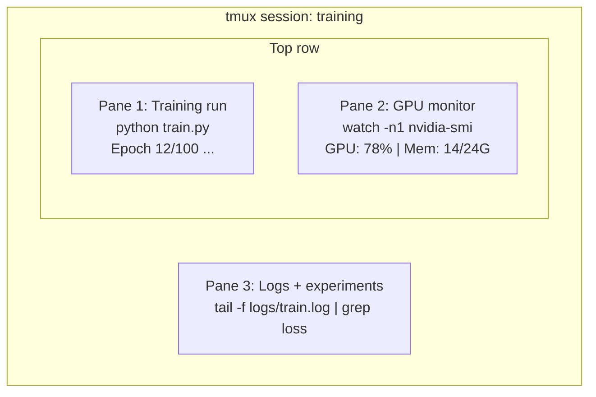

> 📝 Перевод: русская адаптация. [Оригинал](en.md) | Глоссарий: [GLOSSARY.ru.md](../../../glossary/GLOSSARY.ru.md)

# Терминал и командная оболочка

> Терминал — это среда обитания AI-инженера. Освойтесь здесь.

**Тип:** Изучение
**Языки:** --
**Пререквизиты:** Фаза 0, Урок 01
**Время:** ~35 минут

## Цели обучения

- Использовать конвейеры, перенаправления и `grep` для фильтрации и обработки логов обучения из командной строки
- Создавать постоянные сессии tmux с несколькими панелями для параллельного обучения и мониторинга GPU
- Мониторить системные и GPU-ресурсы с помощью `htop`, `nvtop` и `nvidia-smi`
- Передавать файлы между локальной и удалённой машинами через SSH, `scp` и `rsync`

## Проблема

Вы проведёте в терминале больше времени, чем в любом редакторе. Запуски обучения, мониторинг GPU, отслеживание логов, удалённые SSH-сессии, управление окружением. Каждый AI-воркфлоу проходит через командную оболочку. Если Вы медленны здесь — Вы медленны везде.

Этот урок охватывает навыки работы в терминале, важные для AI-разработки. Никакой истории Unix. Никакого погружения в Bash-скриптинг. Только то, что Вам нужно.

## Концепция



Три процесса одновременно. Один терминал. Вы можете отключиться, уйти домой, зайти обратно по SSH и переподключиться. Обучение продолжается.

## Собираем

### Шаг 1: Узнайте свою командную оболочку

Проверьте, какая у Вас оболочка:

```bash
echo $SHELL
```

Большинство систем используют `bash` или `zsh`. Обе подходят. Команды в этом курсе работают в любой из них.

Основное, что нужно знать:

```bash
# Move around
cd ~/projects/ai-engineering-from-scratch
pwd
ls -la

# History search (most useful shortcut you'll learn)
# Ctrl+R then type part of a previous command
# Press Ctrl+R again to cycle through matches

# Clear terminal
clear   # or Ctrl+L

# Cancel a running command
# Ctrl+C

# Suspend a running command (resume with fg)
# Ctrl+Z
```

### Шаг 2: Конвейеры и перенаправления

Конвейер соединяет команды. Так Вы обрабатываете логи, фильтруете вывод и связываете инструменты в цепочки. Пользоваться этим Вы будете постоянно.

```bash
# Count how many times "loss" appears in a log
cat train.log | grep "loss" | wc -l

# Extract just the loss values from training output
grep "loss:" train.log | awk '{print $NF}' > losses.txt

# Watch a log file update in real time, filtering for errors
tail -f train.log | grep --line-buffered "ERROR"

# Sort experiments by final accuracy
grep "final_accuracy" results/*.log | sort -t= -k2 -n -r

# Redirect stdout and stderr to separate files
python train.py > output.log 2> errors.log

# Redirect both to the same file
python train.py > train_full.log 2>&1
```

Три перенаправления, которые Вам нужны:

| Символ | Что делает |
|--------|-------------|
| `>` | Записать stdout в файл (перезапись) |
| `>>` | Дописать stdout в файл |
| `2>` | Записать stderr в файл |
| `2>&1` | Направить stderr туда же, куда и stdout |
| `\|` | Передать stdout одной команды как stdin следующей |

### Шаг 3: Фоновые процессы

Запуски обучения длятся часами. Держать терминал открытым всё это время Вам не захочется.

```bash
# Run in background (output still goes to terminal)
python train.py &

# Run in background, immune to hangup (closing terminal won't kill it)
nohup python train.py > train.log 2>&1 &

# Check what's running in background
jobs
ps aux | grep train.py

# Bring a background job to foreground
fg %1

# Kill a background process
kill %1
# or find its PID and kill that
kill $(pgrep -f "train.py")
```

Разница между `&`, `nohup` и `screen`/`tmux`:

| Метод | Переживает закрытие терминала? | Можно переподключиться? |
|--------|-------------------------|---------------|
| `command &` | Нет | Нет |
| `nohup command &` | Да | Нет (проверяйте лог-файл) |
| `screen` / `tmux` | Да | Да |

Для всего, что длится дольше пары минут, используйте tmux.

### Шаг 4: tmux

tmux позволяет создавать постоянные терминальные сессии с несколькими панелями. Это самый полезный инструмент для управления запусками обучения.

```bash
# Install
# macOS
brew install tmux
# Ubuntu
sudo apt install tmux

# Start a named session
tmux new -s training

# Split horizontally
# Ctrl+B then "

# Split vertically
# Ctrl+B then %

# Navigate between panes
# Ctrl+B then arrow keys

# Detach (session keeps running)
# Ctrl+B then d

# Reattach
tmux attach -t training

# List sessions
tmux ls

# Kill a session
tmux kill-session -t training
```

Типичная AI-воркфлоу сессия:

```bash
tmux new -s train

# Pane 1: start training
python train.py --epochs 100 --lr 1e-4

# Ctrl+B, " to split, then run GPU monitor
watch -n1 nvidia-smi

# Ctrl+B, % to split vertically, tail the logs
tail -f logs/experiment.log

# Now detach with Ctrl+B, d
# SSH out, go get coffee, come back
# tmux attach -t train
```

### Шаг 5: Мониторинг с htop и nvtop

```bash
# System processes (better than top)
htop

# GPU processes (if you have NVIDIA GPU)
# Install: sudo apt install nvtop (Ubuntu) or brew install nvtop (macOS)
nvtop

# Quick GPU check without nvtop
nvidia-smi

# Watch GPU usage update every second
watch -n1 nvidia-smi

# See which processes are using the GPU
nvidia-smi --query-compute-apps=pid,name,used_memory --format=csv
```

Сочетания клавиш `htop`, которые Вам пригодятся:
- `F6` или `>` — сортировка по столбцу (сортируйте по памяти, чтобы найти утечки)
- `F5` — переключение древовидного представления (видны дочерние процессы)
- `F9` — завершить процесс
- `/` — поиск по имени процесса

### Шаг 6: SSH для удалённых GPU-машин

Когда Вы арендуете облачный GPU (Lambda, RunPod, Vast.ai), подключение идёт через SSH.

```bash
# Basic connection
ssh user@gpu-box-ip

# With a specific key
ssh -i ~/.ssh/my_gpu_key user@gpu-box-ip

# Copy files to remote
scp model.pt user@gpu-box-ip:~/models/

# Copy files from remote
scp user@gpu-box-ip:~/results/metrics.json ./

# Sync a whole directory (faster for many files)
rsync -avz ./data/ user@gpu-box-ip:~/data/

# Port forward (access remote Jupyter/TensorBoard locally)
ssh -L 8888:localhost:8888 user@gpu-box-ip
# Now open localhost:8888 in your browser

# SSH config for convenience
# Add to ~/.ssh/config:
# Host gpu
#     HostName 192.168.1.100
#     User ubuntu
#     IdentityFile ~/.ssh/gpu_key
#
# Then just:
# ssh gpu
```

### Шаг 7: Полезные псевдонимы для AI-разработки

Добавьте эти строки в Ваш `~/.bashrc` или `~/.zshrc`:

```bash
source phases/00-setup-and-tooling/10-terminal-and-shell/code/shell_aliases.sh
```

Или скопируйте те, что Вам пригодятся. Ключевые псевдонимы:

```bash
# GPU status at a glance
alias gpu='nvidia-smi --query-gpu=index,name,utilization.gpu,memory.used,memory.total,temperature.gpu --format=csv,noheader'

# Kill all Python training processes
alias killtraining='pkill -f "python.*train"'

# Quick virtual environment activate
alias ae='source .venv/bin/activate'

# Watch training loss
alias watchloss='tail -f logs/*.log | grep --line-buffered "loss"'
```

Полный набор — в `code/shell_aliases.sh`.

### Шаг 8: Типовые приёмы терминала для AI-задач

Эти приёмы многократно встречаются на практике:

```bash
# Run training, log everything, notify when done
python train.py 2>&1 | tee train.log; echo "DONE" | mail -s "Training complete" you@email.com

# Compare two experiment logs side by side
diff <(grep "accuracy" exp1.log) <(grep "accuracy" exp2.log)

# Find the largest model files (clean up disk space)
find . -name "*.pt" -o -name "*.safetensors" | xargs du -h | sort -rh | head -20

# Download a model from Hugging Face
wget https://huggingface.co/model/resolve/main/model.safetensors

# Untar a dataset
tar xzf dataset.tar.gz -C ./data/

# Count lines in all Python files (see how big your project is)
find . -name "*.py" | xargs wc -l | tail -1

# Check disk space (training data fills disks fast)
df -h
du -sh ./data/*

# Environment variable check before training
env | grep -i cuda
env | grep -i torch
```

## Используем

Вот когда каждый инструмент пригодится Вам в этом курсе:

| Инструмент | Когда используется |
|------|----------------|
| tmux | При каждом запуске обучения (Фазы 3+) |
| `tail -f` + `grep` | Мониторинг логов обучения |
| `nohup` / `&` | Быстрые фоновые задачи |
| `htop` / `nvtop` | Отладка медленного обучения, ошибок OOM |
| SSH + `rsync` | Работа с облачными GPU |
| Конвейеры + перенаправления | Обработка результатов экспериментов |
| Псевдонимы | Экономия времени на повторяющихся командах |

## Упражнения

1. Установите tmux, создайте сессию с тремя панелями и запустите `htop` в одной, `watch -n1 date` в другой и Python-скрипт в третьей. Отключитесь и переподключитесь.
2. Добавьте псевдонимы из `code/shell_aliases.sh` в конфигурацию Вашей оболочки и перезагрузите командой `source ~/.zshrc` (или `~/.bashrc`).
3. Создайте поддельный лог обучения командой `for i in $(seq 1 100); do echo "epoch $i loss: $(echo "scale=4; 1/$i" | bc)"; sleep 0.1; done > fake_train.log`, а затем с помощью `grep`, `tail` и `awk` извлеките только значения функции потерь.
4. Настройте запись в SSH-конфиге для сервера, к которому у Вас есть доступ (или используйте `localhost` для тренировки синтаксиса).

## Ключевые термины

| Термин | Что говорят | Что это на самом деле значит |
|------|----------------|----------------------|
| Shell | «Терминал» | Программа, которая интерпретирует Ваши команды (bash, zsh, fish) |
| tmux | «Терминальный мультиплексор» | Программа для запуска нескольких терминальных сессий в одном окне с возможностью отключения и переподключения |
| Pipe | «Вертикальная палочка» | Оператор `\|`, который передаёт вывод одной команды на вход другой |
| PID | «ID процесса» | Уникальный номер, присвоенный каждому запущенному процессу; используется для мониторинга или завершения процесса |
| nohup | «No hangup» | Запускает команду, невосприимчивую к сигналу hangup, поэтому закрытие терминала её не убьёт |
| SSH | «Подключение к серверу» | Secure Shell — зашифрованный протокол для выполнения команд на удалённой машине |
