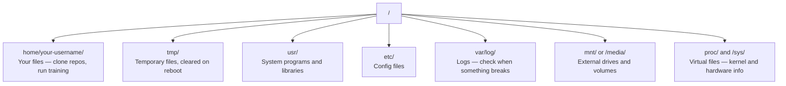

> 📝 Перевод: русская адаптация. [Оригинал](en.md) | Глоссарий: [GLOSSARY.ru.md](../../../glossary/GLOSSARY.ru.md)

# Linux для AI

> Большинство AI-систем работают на Linux. Вам нужно знать достаточно, чтобы не застрять.

**Type:** Learn
**Languages:** --
**Prerequisites:** Phase 0, Lesson 01
**Time:** ~30 minutes

## Цели обучения

- Ориентирование в файловой системе Linux и выполнение основных файловых операций из командной строки
- Управление правами доступа с помощью `chmod` и `chown` для решения ошибок «Permission denied»
- Установка системных пакетов через `apt` и настройка свежего GPU-сервера для AI-задач
- Понимание различий macOS и Linux, о которые часто спотыкаются разработчики на удалённых машинах

## Проблема

Вы разрабатываете на macOS или Windows. Но как только Вы подключаетесь по SSH к облачному GPU-серверу, арендуете инстанс Lambda или запускаете машину EC2 — Вы оказываетесь в Ubuntu. Терминал — Ваш единственный интерфейс. Никакого Finder, никакого Explorer, никакого GUI. Если Вы не умеете перемещаться по файловой системе, устанавливать пакеты и управлять процессами из командной строки, Вы платите за простой дорогих GPU-часов, пока гуглите «как распаковать файл в Linux».

Это руководство по выживанию. Здесь ровно то, что нужно для работы на удалённой Linux-машине в AI-задачах. И ничего лишнего.

## Устройство файловой системы

Linux организует всё под единым корнем `/`. Никаких `C:\` или `/Volumes`. Каталоги, с которыми Вы реально будете работать:



Ваш домашний каталог — `~` или `/home/your-username`. Почти всё, что Вы делаете, происходит здесь.

## Основные команды

Вот 15 команд, покрывающих 95% того, что Вы будете делать на удалённом GPU-сервере.

### Перемещение

```bash
pwd                         # Where am I?
ls                          # What's here?
ls -la                      # What's here, including hidden files with details?
cd /path/to/dir             # Go there
cd ~                        # Go home
cd ..                       # Go up one level
```

### Файлы и каталоги

```bash
mkdir my-project            # Create a directory
mkdir -p a/b/c              # Create nested directories in one shot

cp file.txt backup.txt      # Copy a file
cp -r src/ src-backup/      # Copy a directory (recursive)

mv old.txt new.txt          # Rename a file
mv file.txt /tmp/           # Move a file

rm file.txt                 # Delete a file (no trash, it's gone)
rm -rf my-dir/              # Delete a directory and everything inside
```

`rm -rf` — это навсегда. Отмены нет. Перепроверяйте путь перед нажатием Enter.

### Чтение файлов

```bash
cat file.txt                # Print entire file
head -20 file.txt           # First 20 lines
tail -20 file.txt           # Last 20 lines
tail -f log.txt             # Follow a log file in real time (Ctrl+C to stop)
less file.txt               # Scroll through a file (q to quit)
```

### Поиск

```bash
grep "error" training.log           # Find lines containing "error"
grep -r "learning_rate" .           # Search all files in current directory
grep -i "cuda" config.yaml          # Case-insensitive search

find . -name "*.py"                 # Find all Python files under current dir
find . -name "*.ckpt" -size +1G     # Find checkpoint files larger than 1GB
```

## Права доступа

У каждого файла в Linux есть владелец и биты прав. Вы столкнётесь с этим, когда скрипты не запускаются или не получается записать в каталог.

```bash
ls -l train.py
# -rwxr-xr-- 1 user group 2048 Mar 19 10:00 train.py
#  ^^^             owner permissions: read, write, execute
#     ^^^          group permissions: read, execute
#        ^^        everyone else: read only
```

Типовые исправления:

```bash
chmod +x train.sh           # Make a script executable
chmod 755 deploy.sh         # Owner: full, others: read+execute
chmod 644 config.yaml       # Owner: read+write, others: read only

chown user:group file.txt   # Change who owns a file (needs sudo)
```

Когда появляется «Permission denied», это почти всегда проблема прав. `chmod +x` или `sudo` решают большинство случаев.

## Управление пакетами (apt)

Ubuntu использует `apt`. Это способ установки системного ПО.

```bash
sudo apt update             # Refresh the package list (always do this first)
sudo apt install -y htop    # Install a package (-y skips confirmation)
sudo apt install -y build-essential  # C compiler, make, etc. Needed by many Python packages
sudo apt install -y tmux    # Terminal multiplexer (keep sessions alive after disconnect)

apt list --installed        # What's installed?
sudo apt remove htop        # Uninstall
```

Типичный набор пакетов для свежего GPU-сервера:

```bash
sudo apt update && sudo apt install -y \
    build-essential \
    git \
    curl \
    wget \
    tmux \
    htop \
    unzip \
    python3-venv
```

## Пользователи и sudo

Обычно Вы заходите как обычный пользователь. Для некоторых операций нужен root-доступ (администратор).

```bash
whoami                      # What user am I?
sudo command                # Run a single command as root
sudo su                     # Become root (exit to go back, use sparingly)
```

На облачных GPU-инстансах Вы, как правило, единственный пользователь и уже имеете sudo-доступ. Не запускайте всё под root. Используйте sudo только когда действительно нужно.

## Процессы и systemd

Когда обучение зависло или нужно проверить, что запущено:

```bash
htop                        # Interactive process viewer (q to quit)
ps aux | grep python        # Find running Python processes
kill 12345                  # Gracefully stop process with PID 12345
kill -9 12345               # Force kill (use when graceful doesn't work)
nvidia-smi                  # GPU processes and memory usage
```

systemd управляет службами (фоновыми демонами). Пригодится, если запускаете инференс-серверы:

```bash
sudo systemctl start nginx          # Start a service
sudo systemctl stop nginx           # Stop it
sudo systemctl restart nginx        # Restart it
sudo systemctl status nginx         # Check if it's running
sudo systemctl enable nginx         # Start automatically on boot
```

## Дисковое пространство

На GPU-серверах часто ограниченный диск. Модели и датасеты заполняют его быстро.

```bash
df -h                       # Disk usage for all mounted drives
df -h /home                 # Disk usage for /home specifically

du -sh *                    # Size of each item in current directory
du -sh ~/.cache             # Size of your cache (pip, huggingface models land here)
du -sh /data/checkpoints/   # Check how big your checkpoints are

# Find the biggest space hogs
du -h --max-depth=1 / 2>/dev/null | sort -hr | head -20
```

Быстрые способы освободить место:

```bash
# Clear pip cache
pip cache purge

# Clear apt cache
sudo apt clean

# Remove old checkpoints you don't need
rm -rf checkpoints/epoch_01/ checkpoints/epoch_02/
```

## Сеть

Вы будете скачивать модели, передавать файлы и обращаться к API из командной строки.

```bash
# Download files
wget https://example.com/model.bin                   # Download a file
curl -O https://example.com/data.tar.gz              # Same thing with curl
curl -s https://api.example.com/health | python3 -m json.tool  # Hit an API, pretty-print JSON

# Transfer files between machines
scp model.bin user@remote:/data/                     # Copy file to remote machine
scp user@remote:/data/results.csv .                  # Copy file from remote to local
scp -r user@remote:/data/checkpoints/ ./local-dir/   # Copy directory

# Sync directories (faster than scp for large transfers, resumes on failure)
rsync -avz --progress ./data/ user@remote:/data/
rsync -avz --progress user@remote:/results/ ./results/
```

Используйте `rsync` вместо `scp` для любых крупных передач. Он переносит только изменившиеся байты и умеет продолжать после обрыва соединения.

## tmux: сохранение сессий

Когда Вы подключаетесь по SSH к удалённой машине, закрытие ноутбука убивает процесс обучения. tmux это предотвращает.

```bash
tmux new -s train           # Start a new session named "train"
# ... start your training, then:
# Ctrl+B, then D            # Detach (training keeps running)

tmux ls                     # List sessions
tmux attach -t train        # Reattach to session

# Inside tmux:
# Ctrl+B, then %            # Split pane vertically
# Ctrl+B, then "            # Split pane horizontally
# Ctrl+B, then arrow keys   # Switch between panes
```

Всегда запускайте долгие задачи обучения внутри tmux. Всегда.

## WSL2 для пользователей Windows

Если Вы на Windows, WSL2 даёт настоящее Linux-окружение без двойной загрузки.

```bash
# In PowerShell (admin)
wsl --install -d Ubuntu-24.04

# After restart, open Ubuntu from Start menu
sudo apt update && sudo apt upgrade -y
```

WSL2 работает на настоящем ядре Linux. Всё из этого урока работает внутри него. Ваши файлы Windows доступны по пути `/mnt/c/Users/YourName/` из WSL.

Проброс GPU работает при установленных драйверах NVIDIA на стороне Windows. Установите драйвер NVIDIA для Windows (не для Linux), и CUDA будет доступна внутри WSL2.

## Подводные камни: macOS → Linux

Вот о что можно споткнуться при переходе с macOS:

| macOS | Linux | Примечания |
|-------|-------|------------|
| `brew install` | `sudo apt install` | Имена пакетов иногда различаются. `brew install htop` и `sudo apt install htop` работают одинаково, а вот `brew install readline` и `sudo apt install libreadline-dev` — уже нет. |
| `open file.txt` | `xdg-open file.txt` | Но на удалённом сервере GUI нет. Используйте `cat` или `less`. |
| `pbcopy` / `pbpaste` | Отсутствует | Перенаправление в/из буфера обмена по SSH не работает. |
| `~/.zshrc` | `~/.bashrc` | В macOS по умолчанию zsh. На большинстве Linux-серверов — bash. |
| `/opt/homebrew/` | `/usr/bin/`, `/usr/local/bin/` | Исполняемые файлы лежат в разных местах. |
| `sed -i '' 's/a/b/' file` | `sed -i 's/a/b/' file` | sed в macOS требует пустую строку после `-i`. В Linux — нет. |
| Файловая система без учёта регистра | Файловая система с учётом регистра | `Model.py` и `model.py` — два разных файла в Linux. |
| Перевод строки `\n` | Перевод строки `\n` | Одинаково. Но Windows использует `\r\n`, что ломает bash-скрипты. Используйте `dos2unix` для исправления. |

## Шпаргалка

```
Navigation:     pwd, ls, cd, find
Files:          cp, mv, rm, mkdir, cat, head, tail, less
Search:         grep, find
Permissions:    chmod, chown, sudo
Packages:       apt update, apt install
Processes:      htop, ps, kill, nvidia-smi
Services:       systemctl start/stop/restart/status
Disk:           df -h, du -sh
Network:        curl, wget, scp, rsync
Sessions:       tmux new/attach/detach
```

## Упражнения

1. Подключитесь по SSH к любой Linux-машине (или откройте WSL2) и перейдите в домашний каталог. Создайте папку проекта, создайте в ней три пустых файла командой `touch`, затем выведите их список через `ls -la`.
2. Установите `htop` через apt, запустите его и определите, какой процесс потребляет больше всего памяти.
3. Запустите сессию tmux, выполните внутри неё `sleep 300`, отключитесь, посмотрите список сессий и подключитесь обратно.
4. Используйте `df -h` для проверки доступного места на диске, затем с помощью `du -sh ~/.cache/*` найдите, что занимает место в кеше.
5. Передайте файл с локальной машины на удалённую через `scp`, затем выполните ту же передачу через `rsync` и сравните ощущения.
