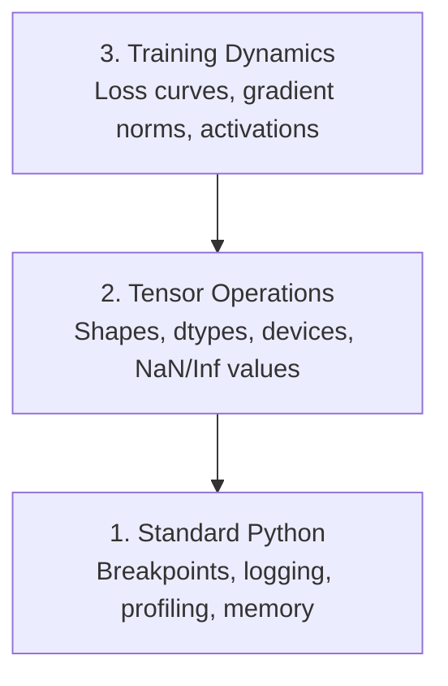

> 📝 Перевод: русская адаптация. [Оригинал](en.md) | Глоссарий: [GLOSSARY.ru.md](../../../glossary/GLOSSARY.ru.md)

# Отладка и профилирование

> Худшие баги в AI-коде не роняют программу. Они молча обучаются на мусоре и выдают красивую кривую лосса.

**Тип:** Собираем
**Язык:** Python
**Предварительные требования:** Урок 1 (Среда разработки), базовое знакомство с PyTorch
**Время:** ~60 минут

## Цели обучения

- Использовать условный `breakpoint()` и `debug_print` для проверки формы тензоров, dtype и значений NaN прямо во время обучения
- Профилировать циклы обучения с помощью `cProfile`, `line_profiler` и `tracemalloc` для поиска узких мест
- Обнаруживать распространённые AI-баги: несовпадение размерностей, NaN в лоссе, утечку данных и тензоры не на том устройстве
- Настроить TensorBoard для визуализации кривых лосса, гистограмм весов и распределений градиентов

## Проблема

AI-код ломается не так, как обычный код. Веб-приложение падает со стектрейсом. Неправильно настроенный цикл обучения работает 8 часов, сжигает $200 на GPU и выдаёт модель, которая предсказывает среднее значение для любого входа. Код ни разу не выдал ошибку. Багом был тензор не на том устройстве, забытый `.detach()` или метки, просочившиеся в признаки.

Вам нужны инструменты отладки, которые ловят такие тихие отказы до того, как они потратят Ваше время и вычислительные ресурсы.

## Концепция

Отладка AI-кода работает на трёх уровнях:



Большинство сразу прыгает на уровень 3 (разглядывая TensorBoard). Но 80% AI-багов живут на уровнях 1 и 2.

## Собираем

### Часть 1: Отладка через print (Да, это работает)

Print-отладку принято презирать. И зря. В коде с тензорами прицельный print работает лучше, чем пошаговое прохождение в отладчике — потому что Вам нужно видеть форму, dtype и диапазон значений одновременно.

```python
def debug_print(name, tensor):
    print(f"{name}: shape={tensor.shape}, dtype={tensor.dtype}, "
          f"device={tensor.device}, "
          f"min={tensor.min().item():.4f}, max={tensor.max().item():.4f}, "
          f"mean={tensor.mean().item():.4f}, "
          f"has_nan={tensor.isnan().any().item()}")
```

Вставляйте вызов после каждой подозрительной операции. Когда баг найден — убирайте print. Всё просто.

### Часть 2: Отладчик Python (pdb и breakpoint)

Встроенный отладчик недооценён для AI-задач. Вставьте `breakpoint()` в цикл обучения и исследуйте тензоры в интерактивном режиме.

```python
def training_step(model, batch, criterion, optimizer):
    inputs, labels = batch
    outputs = model(inputs)
    loss = criterion(outputs, labels)

    if loss.item() > 100 or torch.isnan(loss):
        breakpoint()

    loss.backward()
    optimizer.step()
```

Когда отладчик передаёт Вам управление, полезные команды:

- `p outputs.shape` — проверить размерности
- `p loss.item()` — увидеть значение лосса
- `p torch.isnan(outputs).sum()` — посчитать NaN'ы
- `p model.fc1.weight.grad` — проверить градиенты
- `c` — продолжить, `q` — выйти

Это условная отладка. Вы останавливаетесь только когда что-то выглядит неправильным. Для обучения на 10 000 шагов это важно.

### Часть 3: Логирование в Python

Замените print на логирование, когда отладка выходит за рамки быстрой проверки.

```python
import logging

logging.basicConfig(
    level=logging.INFO,
    format="%(asctime)s [%(levelname)s] %(message)s",
    handlers=[
        logging.FileHandler("training.log"),
        logging.StreamHandler()
    ]
)
logger = logging.getLogger(__name__)

logger.info("Starting training: lr=%.4f, batch_size=%d", lr, batch_size)
logger.warning("Loss spike detected: %.4f at step %d", loss.item(), step)
logger.error("NaN loss at step %d, stopping", step)
```

Логирование даёт временные метки, уровни серьёзности и вывод в файл. Когда обучение падает в 3 часа ночи, Вам нужен лог-файл, а не вывод терминала, который уже уехал за границу экрана.

### Часть 4: Замер времени участков кода

Понимание того, куда уходит время — первый шаг к оптимизации.

```python
import time

class Timer:
    def __init__(self, name=""):
        self.name = name

    def __enter__(self):
        self.start = time.perf_counter()
        return self

    def __exit__(self, *args):
        elapsed = time.perf_counter() - self.start
        print(f"[{self.name}] {elapsed:.4f}s")

with Timer("data loading"):
    batch = next(dataloader_iter)

with Timer("forward pass"):
    outputs = model(batch)

with Timer("backward pass"):
    loss.backward()
```

Частая находка: загрузка данных отнимает 60% времени обучения. Решение — `num_workers > 0` в DataLoader, а не более быстрый GPU.

### Часть 5: cProfile и line_profiler

Когда ручных таймеров недостаточно:

```bash
python -m cProfile -s cumtime train.py
```

Показывает каждый вызов функции, отсортированный по кумулятивному времени. Для построчного профилирования:

```bash
pip install line_profiler
```

```python
@profile
def train_step(model, data, target):
    output = model(data)
    loss = F.cross_entropy(output, target)
    loss.backward()
    return loss

# Run with: kernprof -l -v train.py
```

### Часть 6: Профилирование памяти

#### Память CPU с tracemalloc

```python
import tracemalloc

tracemalloc.start()

# your code here
model = build_model()
data = load_dataset()

snapshot = tracemalloc.take_snapshot()
top_stats = snapshot.statistics("lineno")
for stat in top_stats[:10]:
    print(stat)
```

#### Память CPU с memory_profiler

```bash
pip install memory_profiler
```

```python
from memory_profiler import profile

@profile
def load_data():
    raw = read_csv("data.csv")       # watch memory jump here
    processed = preprocess(raw)       # and here
    return processed
```

Запустите с `python -m memory_profiler your_script.py`, чтобы увидеть построчное использование памяти.

#### Память GPU в PyTorch

```python
import torch

if torch.cuda.is_available():
    print(torch.cuda.memory_summary())

    print(f"Allocated: {torch.cuda.memory_allocated() / 1e9:.2f} GB")
    print(f"Cached: {torch.cuda.memory_reserved() / 1e9:.2f} GB")
```

Когда ловите OOM (Out of Memory):

1. Уменьшите размер батча (первое, что всегда стоит попробовать)
2. Используйте `torch.cuda.empty_cache()` для освобождения закэшированной памяти
3. Используйте `del tensor` с последующим `torch.cuda.empty_cache()` для больших промежуточных тензоров
4. Используйте mixed precision (`torch.cuda.amp`) чтобы сократить потребление памяти вдвое
5. Используйте gradient checkpointing для очень глубоких моделей

### Часть 7: Типичные AI-баги и как их ловить

#### Несовпадение размерностей

Самый частый баг. Тензор имеет форму `[batch, features]`, когда модель ожидает `[batch, channels, height, width]`.

```python
def check_shapes(model, sample_input):
    print(f"Input: {sample_input.shape}")
    hooks = []

    def make_hook(name):
        def hook(module, inp, out):
            in_shape = inp[0].shape if isinstance(inp, tuple) else inp.shape
            out_shape = out.shape if hasattr(out, "shape") else type(out)
            print(f"  {name}: {in_shape} -> {out_shape}")
        return hook

    for name, module in model.named_modules():
        hooks.append(module.register_forward_hook(make_hook(name)))

    with torch.no_grad():
        model(sample_input)

    for h in hooks:
        h.remove()
```

Запустите один раз с тестовым батчем. Это покажет каждое преобразование размерности в Вашей модели.

#### NaN в лоссе

NaN в лоссе означает, что что-то взорвалось. Частые причины:

- Слишком высокая скорость обучения
- Деление на ноль в самописном лоссе
- Логарифм от нуля или отрицательного числа
- Взрывающиеся градиенты в RNN

```python
def detect_nan(model, loss, step):
    if torch.isnan(loss):
        print(f"NaN loss at step {step}")
        for name, param in model.named_parameters():
            if param.grad is not None:
                if torch.isnan(param.grad).any():
                    print(f"  NaN gradient in {name}")
                if torch.isinf(param.grad).any():
                    print(f"  Inf gradient in {name}")
        return True
    return False
```

#### Утечка данных

Ваша модель показывает 99% точности на тестовом наборе. Звучит отлично. Это баг.

```python
def check_data_leakage(train_set, test_set, id_column="id"):
    train_ids = set(train_set[id_column].tolist())
    test_ids = set(test_set[id_column].tolist())
    overlap = train_ids & test_ids
    if overlap:
        print(f"DATA LEAKAGE: {len(overlap)} samples in both train and test")
        return True
    return False
```

Также проверяйте временну́ю утечку: использование будущих данных для предсказания прошлого. Сортируйте по временной метке перед разбиением.

#### Не то устройство

Тензоры на разных устройствах (CPU против GPU) вызывают ошибки времени выполнения. Но иногда тензор молча остаётся на CPU, пока всё остальное на GPU — и обучение просто идёт медленно.

```python
def check_devices(model, *tensors):
    model_device = next(model.parameters()).device
    print(f"Model device: {model_device}")
    for i, t in enumerate(tensors):
        if t.device != model_device:
            print(f"  WARNING: tensor {i} on {t.device}, model on {model_device}")
```

### Часть 8: Основы TensorBoard

TensorBoard показывает, что происходит внутри обучения с течением времени.

```bash
pip install tensorboard
```

```python
from torch.utils.tensorboard import SummaryWriter

writer = SummaryWriter("runs/experiment_1")

for step in range(num_steps):
    loss = train_step(model, batch)

    writer.add_scalar("loss/train", loss.item(), step)
    writer.add_scalar("lr", optimizer.param_groups[0]["lr"], step)

    if step % 100 == 0:
        for name, param in model.named_parameters():
            writer.add_histogram(f"weights/{name}", param, step)
            if param.grad is not None:
                writer.add_histogram(f"grads/{name}", param.grad, step)

writer.close()
```

Запуск:

```bash
tensorboard --logdir=runs
```

На что смотреть:

- **Лосс не уменьшается**: скорость обучения слишком низкая, или проблема в архитектуре модели
- **Лосс дико колеблется**: скорость обучения слишком высокая
- **Лосс уходит в NaN**: численная нестабильность (см. раздел про NaN выше)
- **Лосс на обучении падает, на валидации растёт**: переобучение
- **Гистограммы весов схлопываются в ноль**: затухающие градиенты
- **Гистограммы градиентов взрываются**: нужно gradient clipping

### Часть 9: Отладчик VS Code

Для интерактивной отладки настройте VS Code через `launch.json`:

```json
{
    "version": "0.2.0",
    "configurations": [
        {
            "name": "Debug Training",
            "type": "debugpy",
            "request": "launch",
            "program": "${file}",
            "console": "integratedTerminal",
            "justMyCode": false
        }
    ]
}
```

Ставьте точки останова кликом по полю слева от номера строки. Панель Variables позволяет исследовать свойства тензоров. Консоль отладки (Debug Console) даёт выполнять произвольные выражения Python прямо во время исполнения.

Особенно полезно для пошагового прохождения пайплайнов предобработки данных — когда хочется видеть каждое преобразование.

## Используем

Вот воркфлоу отладки, который ловит большинство AI-багов:

1. **До обучения**: запустите `check_shapes` с тестовым батчем. Убедитесь, что размерности входа и выхода соответствуют ожидаемым.
2. **Первые 10 шагов**: используйте `debug_print` для лосса, выходов модели и градиентов. Подтвердите, что нигде нет NaN, а значения — в разумных диапазонах.
3. **Во время обучения**: логируйте лосс, скорость обучения и нормы градиентов. Используйте TensorBoard для визуализации.
4. **Когда что-то ломается**: вставьте `breakpoint()` в точке отказа. Исследуйте тензоры в интерактивном режиме.
5. **Для производительности**: замерьте время загрузки данных, прямого прохода и обратного прохода по отдельности. Профилируйте память, если близки к OOM.

## Результат

Запустите скрипт с набором инструментов отладки:

```bash
python phases/00-setup-and-tooling/12-debugging-and-profiling/code/debug_tools.py
```

См. `outputs/prompt-debug-ai-code.md` — там промпт, помогающий диагностировать специфичные для AI баги.

## Упражнения

1. Запустите `debug_tools.py` и изучите вывод каждого раздела. Модифицируйте тестовую модель так, чтобы вызвать NaN (подсказка: деление на ноль в прямом проходе) — и смотрите, как детектор его ловит.
2. Профилируйте цикл обучения с `cProfile` и найдите самую медленную функцию.
3. Используйте `tracemalloc`, чтобы найти строку в пайплайне загрузки данных, которая выделяет больше всего памяти.
4. Настройте TensorBoard для простого обучения и определите, переобучается ли модель.
5. Используйте `breakpoint()` внутри цикла обучения. Попрактикуйтесь в исследовании формы тензоров, устройств и значений градиентов из командной строки отладчика.
