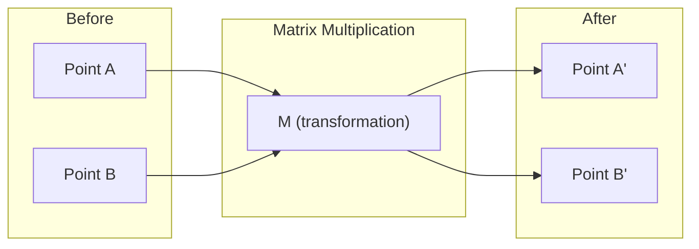
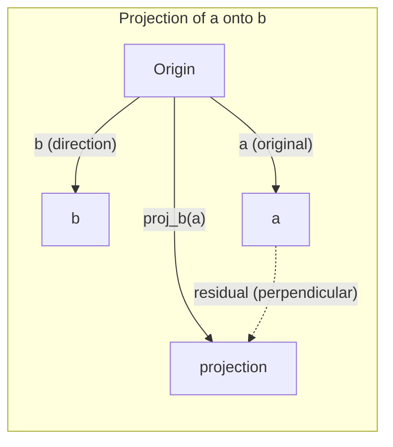

> 📝 Перевод: русская адаптация. [Оригинал](en.md) | Глоссарий: [GLOSSARY.ru.md](../../glossary/GLOSSARY.ru.md)

# Интуитивная линейная алгебра

> Каждая AI-модель — это просто матричная математика в красивой шляпе.

**Тип:** Изучаем
**Языки:** Python, Julia
**Пререквизиты:** Фаза 0
**Время:** ~60 минут

## Цели обучения

- Реализовать операции с векторами и матрицами (сложение, скалярное произведение, умножение матриц) с нуля на Python
- Объяснить геометрически, что делают скалярное произведение, проекция и процесс Грама-Шмидта
- Определить линейную независимость, ранг и базис набора векторов с помощью построчного исключения
- Связать концепции линейной алгебры с их применением в AI: эмбеддинги, оценки внимания и LoRA

## Проблема

Откройте любую статью по ML. На первой же странице Вы увидите векторы, матрицы, скалярные произведения и преобразования. Без интуитивного понимания линейной алгебры это просто символы. С ним Вы сможете увидеть, что на самом деле делает нейронная сеть — перемещает точки в пространстве.

Вам не нужно быть математиком. Вам нужно увидеть, что эти операции означают геометрически, а затем запрограммировать их самостоятельно.

## Концепция

### Векторы — это точки (и направления)

Вектор — это просто список чисел. Но эти числа имеют смысл — это координаты в пространстве.

**2D-вектор [3, 2]:**

| x | y | Точка |
|---|---|-------|
| 3 | 2 | Вектор направлен из начала координат (0,0) в точку (3, 2) на плоскости |

Длина вектора равна sqrt(3² + 2²) = sqrt(13), и он направлен вверх и вправо.

В AI векторы представляют собой всё:
- Слово → вектор из 768 чисел (его «смысл» в пространстве эмбеддингов)
- Изображение → вектор из миллионов значений пикселей
- Пользователь → вектор предпочтений

### Матрицы — это преобразования

Матрица преобразует один вектор в другой. Она может вращать, масштабировать, растягивать или проецировать.



В AI матрицы И ЕСТЬ модель:
- Веса нейронной сети → матрицы, преобразующие вход в выход
- Оценки внимания → матрицы, решающие, на чём фокусироваться
- Эмбеддинги → матрицы, отображающие слова в векторы

### Скалярное произведение измеряет сходство

Скалярное произведение двух векторов показывает, насколько они похожи.

```
a · b = a₁×b₁ + a₂×b₂ + ... + aₙ×bₙ

Одно направление:     a · b > 0  (похожи)
Перпендикулярны:      a · b = 0  (не связаны)
Противоположны:       a · b < 0  (непохожи)
```

Именно так работают поисковые системы, рекомендательные системы и RAG — ищут векторы с большим скалярным произведением.

### Линейная независимость

Векторы линейно независимы, если ни один вектор в наборе нельзя выразить как комбинацию остальных. Если v₁, v₂, v₃ независимы, они охватывают 3D-пространство. Если один является комбинацией других, они охватывают только плоскость.

Почему это важно для AI: матрица признаков должна иметь линейно независимые столбцы. Если два признака идеально скоррелированы (линейно зависимы), модель не может различить их влияние. Это вызывает мультиколлинеарность в регрессии — матрица весов становится нестабильной, и малые изменения на входе приводят к большим скачкам на выходе.

**Конкретный пример:**

```
v1 = [1, 0, 0]
v2 = [0, 1, 0]
v3 = [2, 1, 0]   # v3 = 2*v1 + v2
```

v₁ и v₂ независимы — ни один не является скалярным кратным или комбинацией другого. Но v₃ = 2*v₁ + v₂, поэтому {v₁, v₂, v₃} — зависимый набор. Все три вектора лежат в плоскости xy. Как бы Вы их ни комбинировали, невозможно достичь [0, 0, 1]. У Вас три вектора, но только два измерения свободы.

В датасете: если признак_3 = 2*признак_1 + признак_2, добавление признака_3 не даёт модели никакой новой информации. Хуже того, это делает нормальные уравнения вырожденными — не существует единственного решения для весов.

### Базис и ранг

Базис — это минимальный набор линейно независимых векторов, охватывающих всё пространство. Количество базисных векторов — это размерность пространства.

Стандартный базис для 3D-пространства — {[1,0,0], [0,1,0], [0,0,1]}. Но любые три независимых вектора в 3D образуют допустимый базис. Выбор базиса — это выбор системы координат.

Ранг матрицы = количество линейно независимых столбцов = количество линейно независимых строк. Если ранг < min(строк, столбцов), матрица является ранг-дефицитной. Это означает:
- Система имеет бесконечно много решений (или ни одного)
- Информация теряется при преобразовании
- Матрицу нельзя обратить

| Ситуация | Ранг | Что это значит для ML |
|----------|------|------------------------|
| Полный ранг (ранг = min(m, n)) | Максимально возможный | Единственное решение МНК существует. Модель хорошо обусловлена. |
| Ранг-дефицитная (ранг < min(m, n)) | Ниже максимума | Признаки избыточны. Бесконечно много решений для весов. Нужна регуляризация. |
| Ранг 1 | 1 | Каждый столбец — это масштабированная копия одного вектора. Все данные лежат на прямой. |
| Почти ранг-дефицитная (малые сингулярные числа) | Численно низкий | Матрица плохо обусловлена. Малый шум на входе → большие изменения на выходе. Используйте SVD-усечение или ridge-регрессию. |

### Проекция

Проекция вектора **a** на вектор **b** даёт компоненту **a** в направлении **b**:

```
proj_b(a) = (a · b / b · b) * b
```

Остаток (a - proj_b(a)) перпендикулярен b. Это ортогональное разложение — основа метода наименьших квадратов.

Проекция встречается повсюду в ML:
- Линейная регрессия минимизирует расстояние от наблюдений до пространства столбцов — решение И ЕСТЬ проекция
- PCA проецирует данные на направления максимальной дисперсии
- Механизм внимания в трансформерах вычисляет проекции запросов на ключи



**Пример:** a = [3, 4], b = [1, 0]

proj_b(a) = (3*1 + 4*0) / (1*1 + 0*0) * [1, 0] = 3 * [1, 0] = [3, 0]

Проекция отбрасывает y-компоненту. Это снижение размерности в простейшей форме — выбросьте направления, которые Вам не нужны.

### Процесс Грама-Шмидта

Преобразование любого набора независимых векторов в ортонормированный базис. Ортонормированный означает, что каждый вектор имеет длину 1 и каждая пара перпендикулярна.

Алгоритм:
1. Возьмите первый вектор, нормализуйте его
2. Возьмите второй вектор, вычтите его проекцию на первый, нормализуйте
3. Возьмите третий вектор, вычтите его проекции на все предыдущие, нормализуйте
4. Повторите для оставшихся векторов

```
Вход:  v1, v2, v3, ... (линейно независимы)

u1 = v1 / |v1|

w2 = v2 - (v2 · u1) * u1
u2 = w2 / |w2|

w3 = v3 - (v3 · u1) * u1 - (v3 · u2) * u2
u3 = w3 / |w3|

Выход: u1, u2, u3, ... (ортонормированный базис)
```

Именно так работает QR-разложение внутри. Q — ортонормированный базис, R содержит коэффициенты проекций. QR-разложение используется для:
- Решения линейных систем (стабильнее исключения Гаусса)
- Вычисления собственных значений (QR-алгоритм)
- Регрессии методом наименьших квадратов (стандартный численный метод)

## Собираем

### Шаг 1: Векторы с нуля (Python)

```python
class Vector:
    def __init__(self, components):
        self.components = list(components)
        self.dim = len(self.components)

    def __add__(self, other):
        return Vector([a + b for a, b in zip(self.components, other.components)])

    def __sub__(self, other):
        return Vector([a - b for a, b in zip(self.components, other.components)])

    def dot(self, other):
        return sum(a * b for a, b in zip(self.components, other.components))

    def magnitude(self):
        return sum(x**2 for x in self.components) ** 0.5

    def normalize(self):
        mag = self.magnitude()
        return Vector([x / mag for x in self.components])

    def cosine_similarity(self, other):
        return self.dot(other) / (self.magnitude() * other.magnitude())

    def __repr__(self):
        return f"Vector({self.components})"


a = Vector([1, 2, 3])
b = Vector([4, 5, 6])

print(f"a + b = {a + b}")
print(f"a · b = {a.dot(b)}")
print(f"|a| = {a.magnitude():.4f}")
print(f"cosine similarity = {a.cosine_similarity(b):.4f}")
```

### Шаг 2: Матрицы с нуля (Python)

```python
class Matrix:
    def __init__(self, rows):
        self.rows = [list(row) for row in rows]
        self.shape = (len(self.rows), len(self.rows[0]))

    def __matmul__(self, other):
        if isinstance(other, Vector):
            return Vector([
                sum(self.rows[i][j] * other.components[j] for j in range(self.shape[1]))
                for i in range(self.shape[0])
            ])
        rows = []
        for i in range(self.shape[0]):
            row = []
            for j in range(other.shape[1]):
                row.append(sum(
                    self.rows[i][k] * other.rows[k][j]
                    for k in range(self.shape[1])
                ))
            rows.append(row)
        return Matrix(rows)

    def transpose(self):
        return Matrix([
            [self.rows[j][i] for j in range(self.shape[0])]
            for i in range(self.shape[1])
        ])

    def __repr__(self):
        return f"Matrix({self.rows})"


rotation_90 = Matrix([[0, -1], [1, 0]])
point = Vector([3, 1])

rotated = rotation_90 @ point
print(f"Original: {point}")
print(f"Rotated 90°: {rotated}")
```

### Шаг 3: Почему это важно для AI

```python
import random

random.seed(42)
weights = Matrix([[random.gauss(0, 0.1) for _ in range(3)] for _ in range(2)])
input_vector = Vector([1.0, 0.5, -0.3])

output = weights @ input_vector
print(f"Input (3D): {input_vector}")
print(f"Output (2D): {output}")
print("This is what a neural network layer does -- matrix multiplication.")
```

### Шаг 4: Версия на Julia

```julia
a = [1.0, 2.0, 3.0]
b = [4.0, 5.0, 6.0]

println("a + b = ", a + b)
println("a · b = ", a ⋅ b)       # Julia supports unicode operators
println("|a| = ", √(a ⋅ a))
println("cosine = ", (a ⋅ b) / (√(a ⋅ a) * √(b ⋅ b)))

# Matrix-vector multiplication
W = [0.1 -0.2 0.3; 0.4 0.5 -0.1]
x = [1.0, 0.5, -0.3]
println("Wx = ", W * x)
println("This is a neural network layer.")
```

### Шаг 5: Линейная независимость и проекция с нуля (Python)

```python
def is_linearly_independent(vectors):
    n = len(vectors)
    dim = len(vectors[0].components)
    mat = Matrix([v.components[:] for v in vectors])
    rows = [row[:] for row in mat.rows]
    rank = 0
    for col in range(dim):
        pivot = None
        for row in range(rank, len(rows)):
            if abs(rows[row][col]) > 1e-10:
                pivot = row
                break
        if pivot is None:
            continue
        rows[rank], rows[pivot] = rows[pivot], rows[rank]
        scale = rows[rank][col]
        rows[rank] = [x / scale for x in rows[rank]]
        for row in range(len(rows)):
            if row != rank and abs(rows[row][col]) > 1e-10:
                factor = rows[row][col]
                rows[row] = [rows[row][j] - factor * rows[rank][j] for j in range(dim)]
        rank += 1
    return rank == n


def project(a, b):
    scalar = a.dot(b) / b.dot(b)
    return Vector([scalar * x for x in b.components])


def gram_schmidt(vectors):
    orthonormal = []
    for v in vectors:
        w = v
        for u in orthonormal:
            proj = project(w, u)
            w = w - proj
        if w.magnitude() < 1e-10:
            continue
        orthonormal.append(w.normalize())
    return orthonormal


v1 = Vector([1, 0, 0])
v2 = Vector([1, 1, 0])
v3 = Vector([1, 1, 1])
basis = gram_schmidt([v1, v2, v3])
for i, u in enumerate(basis):
    print(f"u{i+1} = {u}")
    print(f"  |u{i+1}| = {u.magnitude():.6f}")

print(f"u1 · u2 = {basis[0].dot(basis[1]):.6f}")
print(f"u1 · u3 = {basis[0].dot(basis[2]):.6f}")
print(f"u2 · u3 = {basis[1].dot(basis[2]):.6f}")
```

## Используем

Теперь то же самое с NumPy — то, что Вы будете использовать на практике:

```python
import numpy as np

a = np.array([1, 2, 3], dtype=float)
b = np.array([4, 5, 6], dtype=float)

print(f"a + b = {a + b}")
print(f"a · b = {np.dot(a, b)}")
print(f"|a| = {np.linalg.norm(a):.4f}")
print(f"cosine = {np.dot(a, b) / (np.linalg.norm(a) * np.linalg.norm(b)):.4f}")

W = np.random.randn(2, 3) * 0.1
x = np.array([1.0, 0.5, -0.3])
print(f"Wx = {W @ x}")
```

### Ранг, проекция и QR с NumPy

```python
import numpy as np

A = np.array([[1, 2], [2, 4]])
print(f"Rank: {np.linalg.matrix_rank(A)}")

a = np.array([3, 4])
b = np.array([1, 0])
proj = (np.dot(a, b) / np.dot(b, b)) * b
print(f"Projection of {a} onto {b}: {proj}")

Q, R = np.linalg.qr(np.random.randn(3, 3))
print(f"Q is orthogonal: {np.allclose(Q @ Q.T, np.eye(3))}")
print(f"R is upper triangular: {np.allclose(R, np.triu(R))}")
```

### PyTorch — тензоры это векторы с автодифференцированием

```python
import torch

x = torch.randn(3, requires_grad=True)
y = torch.tensor([1.0, 0.0, 0.0])

similarity = torch.dot(x, y)
similarity.backward()

print(f"x = {x.data}")
print(f"y = {y.data}")
print(f"dot product = {similarity.item():.4f}")
print(f"d(dot)/dx = {x.grad}")
```

Градиент скалярного произведения по x — это просто y. PyTorch вычислил это автоматически. Каждая операция в нейронной сети построена из таких операций — матричных умножений, скалярных произведений, проекций — и автодифференцирование отслеживает градиенты через все из них.

Вы только что построили с нуля то, что NumPy делает одной строкой. Теперь Вы знаете, что происходит под капотом.

## Результат

Этот урок создаёт:
- `outputs/prompt-linear-algebra-tutor.md` — промпт для AI-ассистентов, обучающих линейной алгебре через геометрическую интуицию

## Связи

Всё в этом уроке связано с конкретными аспектами современного AI:

| Концепция | Где применяется |
|-----------|-----------------|
| Скалярное произведение | Оценки внимания в трансформерах, косинусное сходство в RAG |
| Матричное умножение | Каждый слой нейронной сети, каждое линейное преобразование |
| Линейная независимость | Отбор признаков, предотвращение мультиколлинеарности |
| Ранг | Определение разрешимости системы, LoRA (низкоранговая адаптация) |
| Проекция | Линейная регрессия (проецирование на пространство столбцов), PCA |
| Грама-Шмидта / QR | Численные решатели, вычисление собственных значений |
| Ортонормированный базис | Стабильные численные вычисления, отбеливающие преобразования |

LoRA заслуживает особого упоминания. Она файнтюнит большие языковые модели, раскладывая обновления весов в низкоранговые матрицы. Вместо обновления матрицы весов 4096×4096 (16M параметров) LoRA обновляет две матрицы размера 4096×16 и 16×4096 (131K параметров). Ограничение ранга 16 означает, что LoRA предполагает: обновление весов лежит в 16-мерном подпространстве полного 4096-мерного пространства. Это линейная алгебра, делающая реальную работу.

## Упражнения

1. Реализуйте `Vector.angle_between(other)`, возвращающий угол в градусах между двумя векторами
2. Создайте 2D-матрицу масштабирования, удваивающую x-координату и утраивающую y-координату, затем примените её к вектору [1, 1]
3. Имея 5 случайных словоподобных векторов (размерность 50), найдите два самых похожих, используя косинусное сходство
4. Проверьте, что выход процесса Грама-Шмидта действительно ортонормирован: каждая пара имеет скалярное произведение 0 и каждый вектор имеет длину 1
5. Создайте матрицу 3×3 ранга 2. Проверьте с помощью метода `rank()`. Затем объясните, какой геометрический объект охватывают столбцы.
6. Спроецируйте вектор [1, 2, 3] на [1, 1, 1]. Что геометрически представляет результат?

## Ключевые термины

| Термин | Как говорят | Что это на самом деле значит |
|--------|-------------|------------------------------|
| Вектор | «Стрелка» | Список чисел, представляющий точку или направление в n-мерном пространстве |
| Матрица | «Таблица чисел» | Преобразование, отображающее векторы из одного пространства в другое |
| Скалярное произведение | «Перемножить и сложить» | Мера того, насколько сонаправлены два вектора — основа поиска по сходству |
| Эмбеддинг | «Какая-то AI-магия» | Вектор, представляющий смысл чего-либо (слова, изображения, пользователя) |
| Линейная независимость | «Они не перекрываются» | Ни один вектор в наборе нельзя выразить как комбинацию остальных |
| Ранг | «Сколько измерений» | Количество линейно независимых столбцов (или строк) в матрице |
| Проекция | «Тень» | Компонента одного вектора в направлении другого |
| Базис | «Координатные оси» | Минимальный набор независимых векторов, охватывающих пространство |
| Ортонормированный | «Перпендикулярные единичные векторы» | Векторы, взаимно перпендикулярные и каждый длиной 1 |
