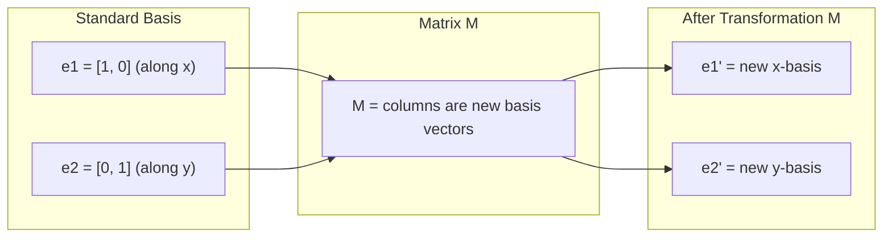
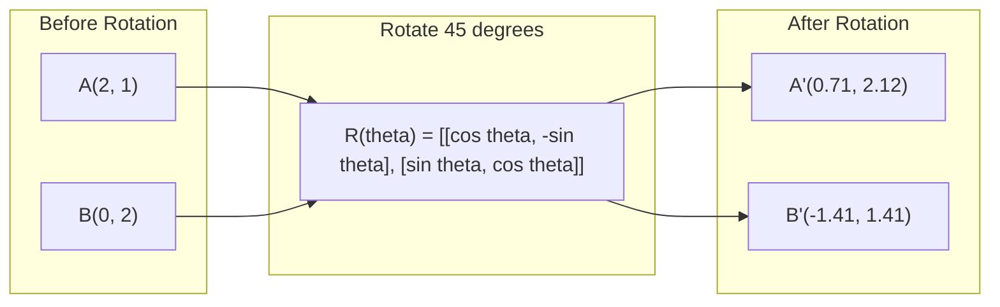
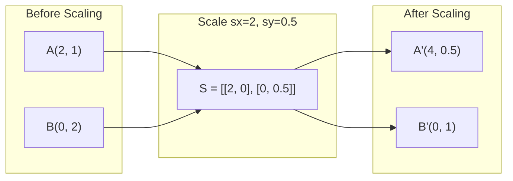
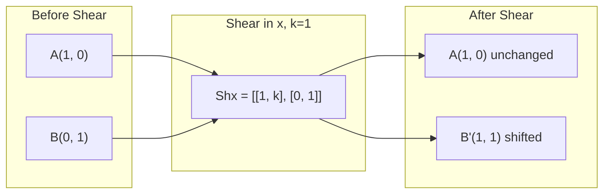
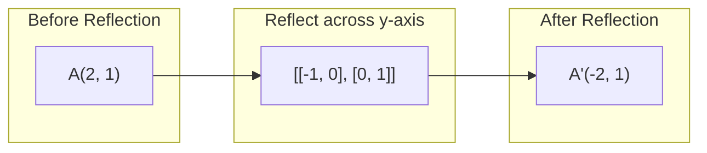
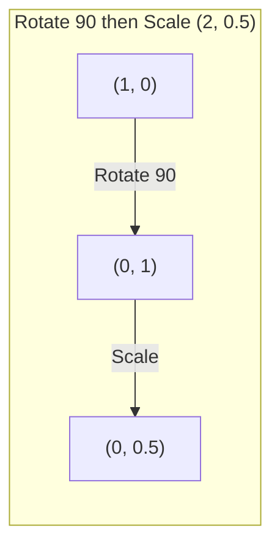
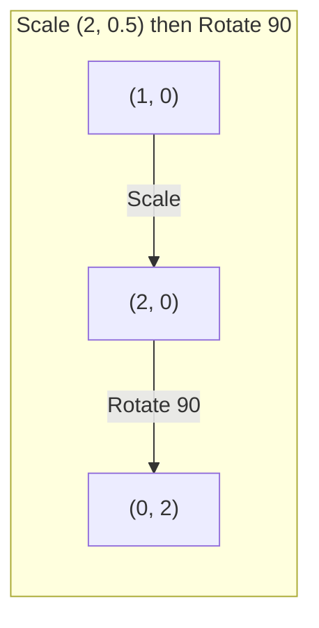

> 📝 Перевод: русская адаптация. [Оригинал](en.md) | Глоссарий: [GLOSSARY.ru.md](../../glossary/GLOSSARY.ru.md)

# Матричные преобразования

> Матрица — это машина, которая перекраивает пространство. Узнайте, что она делает с каждой точкой, и Вы поймёте всё преобразование.

**Тип:** Собираем
**Языки:** Python, Julia
**Пререквизиты:** Фаза 1, Уроки 01–02 (Интуитивная линейная алгебра, Векторы и операции с матрицами)
**Время:** ~75 минут

## Цели обучения

- Построить матрицы поворота, масштабирования, сдвига и отражения и применить их к 2D- и 3D-точкам
- Композировать несколько преобразований матричным умножением и проверить, что порядок имеет значение
- Вычислить собственные значения и собственные векторы матриц 2×2 из характеристического уравнения
- Объяснить, почему собственные значения определяют направления PCA, стабильность RNN и поведение спектральной кластеризации

## Проблема

Вы читаете про PCA и видите «найдите собственные векторы ковариационной матрицы». Читаете про стабильность модели и видите «проверьте, что все собственные значения по модулю меньше 1». Читаете про аугментацию данных и видите «примените случайный поворот». Ничто из этого не имеет смысла, пока Вы не понимаете, что матрицы делают с пространством геометрически.

Матрицы — это не просто сетки чисел. Это пространственные машины. Матрица поворота вращает точки. Матрица масштабирования растягивает их. Матрица сдвига наклоняет их. Каждое преобразование, которое нейронная сеть применяет к данным — это одна из этих операций или их композиция. Этот урок делает эти операции конкретными.

## Концепция

### Преобразования как матрицы

Каждое линейное преобразование в 2D можно записать как матрицу 2×2. Матрица точно говорит Вам, куда попадают базисные векторы [1, 0] и [0, 1]. Всё остальное следует из этого.



### Поворот

2D-поворот на угол θ сохраняет расстояния и углы. Он перемещает каждую точку по дуге окружности.



В 3D Вы вращаете вокруг оси. Каждая ось имеет свою матрицу поворота:

```
Rz(theta) = | cos  -sin  0 |     Поворот вокруг оси z
            | sin   cos  0 |     (плоскость x-y вращается, z остаётся)
            |  0     0   1 |

Rx(theta) = | 1   0     0    |   Поворот вокруг оси x
            | 0  cos  -sin   |   (плоскость y-z вращается, x остаётся)
            | 0  sin   cos   |

Ry(theta) = |  cos  0  sin |     Поворот вокруг оси y
            |   0   1   0  |     (плоскость x-z вращается, y остаётся)
            | -sin  0  cos |
```

### Масштабирование

Масштабирование растягивает или сжимает независимо по каждой оси.



### Сдвиг

Сдвиг наклоняет одну ось, оставляя другую фиксированной. Он превращает прямоугольники в параллелограммы.



Матрицы сдвига:
- `Shx = [[1, k], [0, 1]]` сдвигает x на k × y
- `Shy = [[1, 0], [k, 1]]` сдвигает y на k × x

### Отражение

Отражение зеркалит точки относительно оси или прямой.



Матрицы отражения:
- Отражение относительно оси y: `[[-1, 0], [0, 1]]`
- Отражение относительно оси x: `[[1, 0], [0, -1]]`

### Композиция: цепочка преобразований

Применить преобразование A, затем B — то же самое, что умножить их матрицы: `результат = B @ A @ точка`. Порядок имеет значение. Поворот, затем масштабирование даёт иной результат, чем масштабирование, затем поворот.



Композиция: `S @ R = [[0, -2], [0.5, 0]]`



Композиция: `R @ S = [[0, -0.5], [2, 0]]`

Разные результаты. Матричное умножение не коммутативно.

### Собственные значения и собственные векторы

Большинство векторов меняют направление, когда матрица воздействует на них. Собственные векторы — особенные: матрица только масштабирует их, но никогда не поворачивает. Коэффициент масштабирования — собственное значение.

```
A @ v = lambda * v

v — собственный вектор (направление, которое сохраняется)
lambda — собственное значение (насколько он растягивается)

Пример: A = | 2  1 |
             | 1  2 |

Собственный вектор [1, 1] с собственным значением 3:
  A @ [1,1] = [3, 3] = 3 * [1, 1]     (то же направление, масштабировано в 3 раза)

Собственный вектор [1, -1] с собственным значением 1:
  A @ [1,-1] = [1, -1] = 1 * [1, -1]  (то же направление, без изменений)
```

Матрица растягивает пространство в 3 раза вдоль [1, 1] и оставляет [1, -1] неизменным. Любое другое направление — смесь этих двух.

### Спектральное разложение

Если матрица имеет n линейно независимых собственных векторов, её можно разложить:

```
A = V @ D @ V^(-1)

V = матрица, столбцы которой — собственные векторы
D = диагональная матрица собственных значений
V^(-1) = обратная к V

Это означает: повернуть в координаты собственных векторов, масштабировать вдоль каждой оси, повернуть обратно.
```

### Почему собственные значения важны

**PCA.** Собственные векторы ковариационной матрицы — это главные компоненты. Собственные значения показывают, сколько дисперсии захватывает каждая компонента. Отсортируйте по собственному значению, оставьте k наибольших — и получите снижение размерности.

**Стабильность.** В рекуррентных сетях и динамических системах собственные значения с модулем > 1 вызывают взрывной рост выходов. Модуль < 1 вызывает их затухание. Это проблема исчезающего/взрывающегося градиента, сформулированная в одном предложении.

**Спектральные методы.** Графовые нейронные сети используют собственные значения матрицы смежности. Спектральная кластеризация использует собственные значения лапласиана. Собственные векторы раскрывают структуру графа.

### Определитель как коэффициент масштабирования объёма

Определитель матрицы преобразования показывает, насколько она масштабирует площадь (2D) или объём (3D).

```
det = 1:   площадь сохранена (поворот)
det = 2:   площадь удвоена
det = 0:   пространство сжато до меньшей размерности (сингулярная)
det = -1:  площадь сохранена, но ориентация перевёрнута (отражение)

| det(Поворот) | = 1        (всегда)
| det(Масштаб sx, sy) | = sx × sy
| det(Сдвиг) | = 1           (площадь сохранена)
| det(Отражение) | = -1     (ориентация перевёрнута)
```

## Собираем

### Шаг 1: Матрицы преобразований с нуля (Python)

```python
import math

def rotation_2d(theta):
    c, s = math.cos(theta), math.sin(theta)
    return [[c, -s], [s, c]]

def scaling_2d(sx, sy):
    return [[sx, 0], [0, sy]]

def shearing_2d(kx, ky):
    return [[1, kx], [ky, 1]]

def reflection_x():
    return [[1, 0], [0, -1]]

def reflection_y():
    return [[-1, 0], [0, 1]]

def mat_vec_mul(matrix, vector):
    return [
        sum(matrix[i][j] * vector[j] for j in range(len(vector)))
        for i in range(len(matrix))
    ]

def mat_mul(a, b):
    rows_a, cols_b = len(a), len(b[0])
    cols_a = len(a[0])
    return [
        [sum(a[i][k] * b[k][j] for k in range(cols_a)) for j in range(cols_b)]
        for i in range(rows_a)
    ]

point = [1.0, 0.0]
angle = math.pi / 4

rotated = mat_vec_mul(rotation_2d(angle), point)
print(f"Rotate (1,0) by 45 deg: ({rotated[0]:.4f}, {rotated[1]:.4f})")

scaled = mat_vec_mul(scaling_2d(2, 3), [1.0, 1.0])
print(f"Scale (1,1) by (2,3): ({scaled[0]:.1f}, {scaled[1]:.1f})")

sheared = mat_vec_mul(shearing_2d(1, 0), [1.0, 1.0])
print(f"Shear (1,1) kx=1: ({sheared[0]:.1f}, {sheared[1]:.1f})")

reflected = mat_vec_mul(reflection_y(), [2.0, 1.0])
print(f"Reflect (2,1) across y: ({reflected[0]:.1f}, {reflected[1]:.1f})")
```

### Шаг 2: Композиция преобразований

```python
R = rotation_2d(math.pi / 2)
S = scaling_2d(2, 0.5)

rotate_then_scale = mat_mul(S, R)
scale_then_rotate = mat_mul(R, S)

point = [1.0, 0.0]
result1 = mat_vec_mul(rotate_then_scale, point)
result2 = mat_vec_mul(scale_then_rotate, point)

print(f"Rotate 90 then scale: ({result1[0]:.2f}, {result1[1]:.2f})")
print(f"Scale then rotate 90: ({result2[0]:.2f}, {result2[1]:.2f})")
print(f"Same? {result1 == result2}")
```

### Шаг 3: Собственные значения с нуля (2×2)

Для матрицы 2×2 `[[a, b], [c, d]]` собственные значения решают характеристическое уравнение: `lambda² - (a+d)·lambda + (ad - bc) = 0`.

```python
def eigenvalues_2x2(matrix):
    a, b = matrix[0]
    c, d = matrix[1]
    trace = a + d
    det = a * d - b * c
    discriminant = trace ** 2 - 4 * det
    if discriminant < 0:
        real = trace / 2
        imag = (-discriminant) ** 0.5 / 2
        return (complex(real, imag), complex(real, -imag))
    sqrt_disc = discriminant ** 0.5
    return ((trace + sqrt_disc) / 2, (trace - sqrt_disc) / 2)

def eigenvector_2x2(matrix, eigenvalue):
    a, b = matrix[0]
    c, d = matrix[1]
    if abs(b) > 1e-10:
        v = [b, eigenvalue - a]
    elif abs(c) > 1e-10:
        v = [eigenvalue - d, c]
    else:
        if abs(a - eigenvalue) < 1e-10:
            v = [1, 0]
        else:
            v = [0, 1]
    mag = (v[0] ** 2 + v[1] ** 2) ** 0.5
    return [v[0] / mag, v[1] / mag]

A = [[2, 1], [1, 2]]
vals = eigenvalues_2x2(A)
print(f"Matrix: {A}")
print(f"Eigenvalues: {vals[0]:.4f}, {vals[1]:.4f}")

for val in vals:
    vec = eigenvector_2x2(A, val)
    result = mat_vec_mul(A, vec)
    scaled = [val * vec[0], val * vec[1]]
    print(f"  lambda={val:.1f}, v={[round(x,4) for x in vec]}")
    print(f"    A@v = {[round(x,4) for x in result]}")
    print(f"    l*v = {[round(x,4) for x in scaled]}")
```

### Шаг 4: Определитель как коэффициент масштабирования объёма

```python
def det_2x2(matrix):
    return matrix[0][0] * matrix[1][1] - matrix[0][1] * matrix[1][0]

print(f"det(rotation 45) = {det_2x2(rotation_2d(math.pi/4)):.4f}")
print(f"det(scale 2,3)   = {det_2x2(scaling_2d(2, 3)):.1f}")
print(f"det(shear kx=1)  = {det_2x2(shearing_2d(1, 0)):.1f}")
print(f"det(reflect y)   = {det_2x2(reflection_y()):.1f}")

singular = [[1, 2], [2, 4]]
print(f"det(singular)     = {det_2x2(singular):.1f}")
print("Singular: columns are proportional, space collapses to a line.")
```

## Используем

NumPy обрабатывает всё это оптимизированными процедурами.

```python
import numpy as np

theta = np.pi / 4
R = np.array([[np.cos(theta), -np.sin(theta)],
              [np.sin(theta),  np.cos(theta)]])

point = np.array([1.0, 0.0])
print(f"Rotate (1,0) by 45 deg: {R @ point}")

S = np.diag([2.0, 3.0])
composed = S @ R
print(f"Scale(2,3) after Rotate(45): {composed @ point}")

A = np.array([[2, 1], [1, 2]], dtype=float)
eigenvalues, eigenvectors = np.linalg.eig(A)
print(f"\nEigenvalues: {eigenvalues}")
print(f"Eigenvectors (columns):\n{eigenvectors}")

for i in range(len(eigenvalues)):
    v = eigenvectors[:, i]
    lam = eigenvalues[i]
    print(f"  A @ v{i} = {A @ v}, lambda * v{i} = {lam * v}")

print(f"\ndet(R) = {np.linalg.det(R):.4f}")
print(f"det(S) = {np.linalg.det(S):.1f}")

B = np.array([[3, 1], [0, 2]], dtype=float)
vals, vecs = np.linalg.eig(B)
D = np.diag(vals)
V = vecs
reconstructed = V @ D @ np.linalg.inv(V)
print(f"\nEigendecomposition A = V @ D @ V^-1:")
print(f"Original:\n{B}")
print(f"Reconstructed:\n{reconstructed}")
```

### 3D-повороты с NumPy

```python
def rotation_3d_z(theta):
    c, s = np.cos(theta), np.sin(theta)
    return np.array([[c, -s, 0], [s, c, 0], [0, 0, 1]])

def rotation_3d_x(theta):
    c, s = np.cos(theta), np.sin(theta)
    return np.array([[1, 0, 0], [0, c, -s], [0, s, c]])

point_3d = np.array([1.0, 0.0, 0.0])
rotated_z = rotation_3d_z(np.pi / 2) @ point_3d
rotated_x = rotation_3d_x(np.pi / 2) @ point_3d

print(f"\n3D point: {point_3d}")
print(f"Rotate 90 around z: {np.round(rotated_z, 4)}")
print(f"Rotate 90 around x: {np.round(rotated_x, 4)}")
```

## Результат

Этот урок закладывает геометрический фундамент для PCA (Фаза 2) и анализа весов нейронных сетей. Код собственных значений/векторов, построенный здесь — тот же алгоритм, который обеспечивает снижение размерности, спектральную кластеризацию и анализ стабильности в продакшн ML-системах.

## Упражнения

1. Примените поворот, масштабирование и сдвиг к единичному квадрату (углы в [0,0], [1,0], [1,1], [0,1]). Выведите преобразованные углы для каждого. Проверьте, что поворот сохраняет расстояния между углами.

2. Найдите собственные значения матрицы [[4, 2], [1, 3]] вручную, используя характеристическое уравнение. Затем проверьте своей функцией с нуля и с NumPy.

3. Создайте композицию трёх преобразований (поворот на 30 градусов, масштабирование на [1.5, 0.8], сдвиг с kx=0.3) и примените её к 8 точкам, расположенным по окружности. Выведите координаты до и после. Вычислите определитель композиционной матрицы и проверьте, что он равен произведению отдельных определителей.

## Ключевые термины

| Термин | Как говорят | Что это на самом деле значит |
|--------|-------------|------------------------------|
| Матрица поворота | «Вращает объекты» | Ортогональная матрица, перемещающая точки по дугам окружности с сохранением расстояний и углов. Определитель всегда 1. |
| Матрица масштабирования | «Делает объекты больше» | Диагональная матрица, растягивающая или сжимающая независимо по каждой оси. Определитель — произведение коэффициентов масштаба. |
| Матрица сдвига | «Наклоняет объекты» | Матрица, сдвигающая одну координату пропорционально другой, превращая прямоугольники в параллелограммы. Определитель равен 1. |
| Отражение | «Зеркалит объекты» | Матрица, переворачивающая пространство относительно оси или плоскости. Определитель равен −1. |
| Композиция | «Сделать две вещи» | Умножение матриц преобразований для создания цепочки операций. Порядок важен: B @ A означает сначала применить A, затем B. |
| Собственный вектор | «Особое направление» | Направление, которое матрица только масштабирует, но никогда не поворачивает. Отпечаток преобразования. |
| Собственное значение | «Насколько растягивает» | Скалярный множитель, на который матрица масштабирует свой собственный вектор. Может быть отрицательным (переворот) или комплексным (поворот). |
| Спектральное разложение | «Разобрать матрицу на части» | Запись матрицы в виде V @ D @ V⁻¹, разделение её на фундаментальные направления и величины масштабирования. |
| Определитель | «Одно число из матрицы» | Коэффициент, на который преобразование масштабирует площадь (2D) или объём (3D). Ноль означает, что преобразование необратимо. |
| Характеристическое уравнение | «Откуда берутся собственные значения» | det(A − λI) = 0. Полином, корни которого — собственные значения. |

## Дальнейшее чтение

- [3Blue1Brown: Линейные преобразования](https://www.3blue1brown.com/lessons/linear-transformations) — визуальная интуиция о том, как матрицы перекраивают пространство
- [3Blue1Brown: Собственные векторы и значения](https://www.3blue1brown.com/lessons/eigenvalues) — лучшее визуальное объяснение геометрического смысла собственных векторов
- [MIT 18.06 Лекция 21: Собственные значения и векторы](https://ocw.mit.edu/courses/18-06-linear-algebra-spring-2010/) — классическое изложение Гилберта Стрэнга
