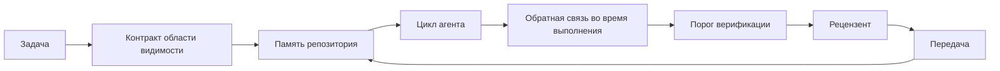

# Инженерия рабочей поверхности агента (Agent Workbench): почему работоспособные модели всё равно терпят неудачу

> Работоспособной модели недостаточно. Надёжные агенты (agent) требуют рабочей поверхности (workbench): инструкций, состояния, области видимости, обратной связи, верификации, проверки и передачи (handoff). Без этих элементов даже передовая модель (frontier model) выдаёт результат, который небезопасно отправлять в продакшн (deployment).

**Тип:** Теория + практика
**Языки:** Python (stdlib)
**Предварительные знания:** Фаза 14 · 01 (Цикл агента), Фаза 14 · 26 (Режимы отказов)
**Время:** ~45 минут

## Цели обучения

- Разделить возможности модели и надёжность исполнения.
- Назвать семь поверхностей рабочей поверхности, определяющих, будет ли результат агента отправлен в продакшн.
- Сравнить запуск только с промптом (prompt) и запуск с рабочей поверхностью на небольшой задаче в репозитории.
- Составить отчёт о режимах отказов, в котором каждый пропущенный слой поверхности сопоставлен с вызванным им симптомом.

## Проблема

Вы загружаете передовую модель в реальный репозиторий и просите добавить валидацию (validation) входных данных. Модель открывает четыре файла, записывает правдоподобный код, объявляет об успехе и останавливается. Вы запускаете тесты. Два падают. Третий файл был затронут, хотя не имел отношения к валидации. Нет записи о том, что предполагал агент, что он пробовал первым или что ещё остаётся сделать.

Модель не ошибалась в Python. Она ошибалась в работе. Она не понимала, что считается выполнением, где ей разрешено писать, какие тесты являются авторитетными и как следующая сессия должна продолжить начатое.

Это не баг модели. Это баг рабочей поверхности. Окружение вокруг агента лишено тех частей, которые превращают одноразовую генерацию в надёжное, возобновляемое инженерное решение.

## Концепция

Рабочая поверхность (workbench) — это среда выполнения, окружающая модель в процессе решения задачи. Она состоит из семи слоёв (surface):

| Слой | Что содержит | Что происходит при отсутствии |
|------|-------------|-------------------------------|
| Инструкции (Instructions) | Правила запуска, запрещённые действия, определение готовности | Агент сам догадывается, что значит «готово» |
| Состояние (State) | Текущая задача, затронутые файлы, блокировки, следующее действие | Каждая сессия начинается с нуля |
| Область видимости (Scope) | Разрешённые файлы, запрещённые файлы, критерии приёмки | Правки проникают в несвязанный код |
| Обратная связь (Feedback) | Реальный вывод команд, включённый в цикл (loop) | Агент объявляет об успехе при ошибке 400 |
| Верификация (Verification) | Тесты, линтер, smoke-тест, проверка области видимости | «Выглядит хорошо» попадает в main |
| Проверка (Review) | Второй проход с другой ролью | Строитель проверяет собственную домашнюю работу |
| Передача (Handoff) | Что изменилось, почему, что осталось | Следующая сессия заново открывает всё |

Рабочая поверхность не зависит от модели. Можно заменить модель и сохранить слои. Нельзя заменить слои и сохранить надёжность.



Цикл замыкается на файле состояния, а не на истории чата. Чат нестабилен. Репозиторий является системой учёта.

### Рабочая поверхность и инжиниринг промптов (prompt engineering)

Промптинг (prompting) говорит модели, что вы хотите на данном ходу. Рабочая поверхность говорит модели, как выполнять работу между ходами и между сессиями. Большинство историй об ошибках агентов — это ошибки рабочей поверхности, замаскированные под инжиниринг промптов.

### Рабочая поверхность и фреймворк (framework)

Фреймворк предоставляет среду выполнения (LangGraph, AutoGen, Agents SDK). Рабочая поверхность даёт агенту место для работы внутри этой среды. Оба компонента необходимы. Этот мини-курс посвящён второму.

### Рассуждение от примитивов, а не от вендорских таксономий

Сейчас написано множество материалов об «инжиниринге контейнера» (harness engineering). Addy Osmani, OpenAI, Anthropic, LangChain, Martin Fowler, MongoDB, HumanLayer, Augment Code, Thoughtworks, awesome-список walkinglabs и непрекращающийся поток статей на Medium и Hacker News — все освещают эту тему. Они расходятся в том, где проходит граница контейнера, что входит в область видимости и какую терминологию использовать. Нам не нужно становиться на чью-то сторону. Семь слоёв — это UX-уровень; под любой рабочей поверхностью лежит один и тот же набор примитивов распределённых систем,поддерживающий любой надёжный бэкенд.

Уберите на минуту ярлык «агент». Запуск агента — это вычисление (computation), охватывающее время, процессы и машины. Чтобы сделать его надёжным, вам нужны те же примитивы, которые необходимы любой продакшн-системе.

| Примитив | Что это | Что несёт для агента |
|----------|---------|----------------------|
| Функция (Function) | Типизированный обработчик. По возможности чистый. Владеет входами и выходами. | Вызов инструмента, проверка правила, шаг верификации, вызов модели |
| Worker (рабочий агент) | Долгоживущий процесс, владеющий одной или несколькими функциями и жизненным циклом | Строитель, рецензент, верификатор, MCP-сервер |
| Триггер (Trigger) | Источник событий, вызывающий функцию | Тик цикла агента, HTTP-запрос, сообщение очереди, cron, изменение файла, хук |
| Среда выполнения (Runtime) | Граница, определяющая, что запускается где, с какими таймаутами и ресурсами | Процесс Claude Code, среда выполнения LangGraph, контейнер воркера |
| HTTP / RPC | Канал связи между вызывающим кодом и воркером | Протокол вызова инструментов, MCP-запрос, API модели |
| Очередь (Queue) | Устойчивый буфер между триггером и воркером; обратное давление, повторные попытки, идемпотентность | Доска задач, журнал обратной связи, входящая папка для рецензий |
| Сессионная.persistency (Session persistence) | Состояние, переживающее сбои, перезапуски, замены модели | `agent_state.json`, чекпоинты (checkpoint), KV-хранилища, сам репозиторий |
| Политика авторизации (Authorization policy) | Кто может вызвать какую функцию с какой областью видимости | Разрешённые/запрещённые файлы, границы согласования, списки возможностей MCP |

Теперь сопоставьте семь слоёв рабочей поверхности с этими примитивами.

- **Инструкции** — политика + метаданные функций. Правила — это проверки (функции). Маршрутизатор (`AGENTS.md`) — это политика, привязанная к запуску среды выполнения.
- **Состояние** — сессионная persistency. Хранилище с ключами, которое среда выполнения читает на каждом шаге. Файл, KV или БД; важна семантика сохранения, а не конкретный бэкенд.
- **Область видимости** — политика авторизации для каждой задачи. Разрешённые/запрещённые шаблоны — это ACL. Требуемые согласования — это решётка разрешений.
- **Обратная связь** — журнал вызовов, записываемый в очередь. Каждый вызов оболочки — это запись, устойчивая и воспроизводимая.
- **Верификация** — функция. Детерминированная по входам. Запускается при закрытии задачи. При ошибке — отказ.
- **Проверка** — отдельный воркер с правами только на чтение артефактов строителя и правами только на запись отчётов проверки.
- **Передача** — устойчивая запись, генерируемая триггером завершения сессии. Триггер запуска следующей сессии считывает её.

Сам цикл агента — это воркер, который потребляет события (сообщение пользователя, результат инструмента, тик таймера), вызывает функции (модель, затем инструменты, которые выбирает модель), записывает данные (состояние, обратную связь) и генерирует триггеры (верификация, проверка, передача). Ничего загадочного; та же структура, что у обработчика задач.

### Распространённые паттерны, переведённые на язык примитивов

Каждый популярный паттерн контейнера сводится к восьми примитивам. Таблица соответствий.

| Вендорский или общественный паттерн | Что это на самом деле |
|--------------------------------------|----------------------|
| Ralph Loop (Claude Code, Codex, книга agentic_harness) — повторная инъекция исходного намерения в свежее контекстное окно, когда агент пытается остановиться раньше времени | Триггер, повторно ставящий задачу в очередь с чистым контекстом; сессионная persistency переносит цель вперёд |
| Plan / Execute / Verify (PEV) | Три воркера, по одному на роль, общающихся через состояние и очередь между фазами |
| Разделение контейнера и вычислений (OpenAI Agents SDK, апрель 2026) — разделение управляющего и исполнительного слоёв | Переформулировка control-plane / data-plane. Предшествует ярлыку «агент» на десятилетия |
| Open Agent Passport (OAP, март 2026) — подписание и аудит каждого вызова инструмента в соответствии с декларативной политикой перед выполнением | Политика авторизации, обеспечиваемая воркером предварительного действия, с подписанным аудитом в очереди |
| Guides and Sensors (Birgitta Böckeler / Thoughtworks) — правила подачи (feedforward) + обратная связь (feedback) | Политика авторизации + функции верификации + трассировка наблюдаемости (observability) |
| Прогрессивная компактификация, 5 этапов (реверс-инжиниринг Claude Code, апрель 2026) | Воркер управления состоянием, выполняющий cron-подобные операции над сессионной persistency для удержания её в рамках бюджета |
| Хуки / middleware (LangChain, Claude Code) — перехват вызовов модели и инструментов | Триггеры + функции, обёрнутые вокруг пути вызова среды выполнения |
| Навыки как Markdown с прогрессивным раскрытием (Anthropic, Flue) | Реестр функций, где метаданные функций загружаются в контекст по мере необходимости |
| Песочничные агенты (Codex, Sandcastle, Vercel Sandbox) | Вычислительный слой: среда выполнения с изолированной файловой системой, сетью и жизненным циклом |
| MCP-серверы | Воркеры, предоставляющие функции через стабильный RPC со списками возможностей в качестве авторизации |

Каждая строка в этой таблице — это сообщество агентов, приходящее к примитиву, который уже имел имя в распределённых системах, и дающее ему новое. Полезные ярлыки для маркетинга; бесполезные как инженерная терминология.

### Что говорят фактические данные

Утверждение о приоритете контейнера над моделью теперь подкреплено цифрами. Стоит знать, потому что это единственный честный аргумент против «просто подождите более умную модель».

- Terminal Bench 2.0 — та же модель, изменение контейнера переместило агента для программирования за пределы топ-30 на пятое место (LangChain, *Anatomy of an Agent Harness*).
- Vercel — удалил 80% инструментов своего агента; доля успешных выполнений выросла с 80% до 100% (MongoDB).
- Harvey — юридические агенты более чем удвоили точность исключительно за счёт оптимизации контейнера (MongoDB).
- 88% проектов корпоративных AI-агентов не доходят до продакшна. Отказы группируются вокруг среды выполнения, а не рассуждений (preprints.org, *Harness Engineering for Language Agents*, март 2026).
- Бенчмарк-исследование 2025 года на трёх популярных open-source-фреймворках показало ~50% завершённых задач; WebAgent в условиях длинного контекста (long-context) рухнул с 40–50% до менее 10%, в основном из-за бесконечных циклов и потери цели (широко освещалось в публикациях начала 2026 года).

Вывод не в том, что контейнер побеждает навсегда. Модели со временем действительно усваивают приёмы контейнера. Вывод в том, что сегодня основная инженерная нагрузка лежит вокруг модели, а не внутри неё, и примитивы, которые выдерживают эту нагрузку — те же, которые любая продакшн-система всегда нуждалась.

### Где вендорские описания недостаточны

Это та часть, по поводу которой не нужно быть вежливым.

- LangChain в *The Anatomy of an Agent Harness* перечисляет одиннадцать компонентов — промпты, инструменты, хуки, песочницы, оркестрацию (orchestration), память, навыки, субагентов и «глупый цикл» среды выполнения. Он не упоминает очереди (queue), воркеры как единицу развёртывания, семантику триггеров, сессионную persistency как отдельную задачу или политику авторизации. Он рассматривает контейнер как объект настройки, а не как развёртываемую систему.
- Addy Osmani в *Agent Harness Engineering* формулирует `Agent = Model + Harness` и паттерн храповика (ratchet), но не говорит, из чего состоит контейнер. Это позиция, а не спецификация.
- Anthropic и OpenAI наиболее подробны в описании слоёв, но остаются внутри собственных сред выполнения. Объявление о «разделении контейнера и вычислений» в Agents SDK за апрель 2026 года — первая вендорская публикация, которая явно поддерживает разделение control-plane / data-plane. Это примитивная идея, а не новая.
- Книга agentic_harness рассматривает контейнер как конфигурационный объект (Jaymin West, *Agentic Engineering*, глава 6), и самый сильный тезис в ней: «контейнер является основной границей безопасности в агентной системе». Это просто переформулировка политики авторизации.
- Треды на Hacker News приходят к тому же месту. Тред за апрель 2026 года *The agent harness belongs outside the sandbox* утверждает, что контейнер должен работать «скорее как гипервизор, который находится вне всего и авторизует доступ на основе контекста и пользователя». То есть снова — политика авторизации как отдельный слой.

Вам не нужно не соглашаться ни с одним из этих текстов, чтобы заметить пробел. Они описывают UX системы, которая уже существует. Мы описываем систему. Когда система построена правильно, семь слоёв вытекают из примитивов. Когда она построена неправильно, никакое количество полировок `AGENTS.md` не исправит отсутствующую очередь.

Поэтому, когда вы слышите «инжиниринг контейнера» (harness engineering) в другом месте, переводите на язык примитивов. Промпты и правила — это политика и функции. Каркас — это среда выполнения. Защитные ограждения (guardrails) — это авторизация + верификация. Хуки — это триггеры. Память — это сессионная persistency. Ralph Loop — это повторная постановка в очередь. Субагенты — это воркеры. Песочницы — это вычислительные слои. Терминология меняется; инженерия — нет. Рабочая поверхность — это UX для агента; контейнер в смысле, переживающем очередную реорганизацию вендора — это функции, воркеры, триггеры, среды выполнения, очереди, persistency и политика, правильно связанные вместе.

## Собираем

`code/main.py` запускает небольшую задачу в репозитории дважды. Сначала только с промптом, затем с подключёнными семью слоями. Та же модель, та же задача. Скрипт подсчитывает, какие слои отсутствовали при неудачном запуске, и печатает отчёт о режимах отказов.

Задача в репозитории намеренно небольшая: добавить валидацию входных данных в обработчик в стиле FastAPI в одном файле и написать проходящий тест.

Запуск:

```
python3 code/main.py
```

Вывод: параллельный лог двух запусков, файл `failure_modes.json` с итогами запуска только с промптом и однстрочное заключение для запуска с рабочей поверхностью.

Агент — это небольшой детерминированный шаблонный код; суть — в слоях, а не в модели. В остальных уроках этого мини-курса вы будете восстанавливать каждый слой как реальный, многоразовый артефакт.

## Применяем

Три места, где слои рабочей поверхности уже существуют в реальности, даже если их так не называют:

- **Claude Code, Codex, Cursor.** `AGENTS.md` и `CLAUDE.md` — это слой инструкций. Слэш-команды — это область видимости. Хуки — это верификация.
- **LangGraph, OpenAI Agents SDK.** Чекпоинты и хранилища сессий — это слой состояния. Передачи (handoff) — это слой передачи.
- **CI в реальном репозитории.** Тесты, линтер и проверка типов — это верификация. Шаблон PR — это передача. CODEOWNERS — это проверка.

Инжиниринг рабочей поверхности — это дисциплина, которая делает эти слои явными и многоразовыми, вместо того чтобы заставлять каждую команду заново открывать их.

## Отправляем

`outputs/skill-workbench-audit.md` — это переносимый навык (skill), который аудитует существующий репозиторий на наличие семи слоёв рабочей поверхности и сообщает, какие отсутствуют, какие частичные и какие в хорошем состоянии. Разместите его рядом с любой настройкой агента; он подскажет, что исправлять в первую очередь.

## Упражнения

1. Выберите репозиторий, в котором вы уже запускаете агента. Оцените семь слоёв по шкале от 0 (отсутствует) до 2 (в хорошем состоянии). Какой слой самый слабый?
2. Доработайте `main.py` так, чтобы запуск только с промптом также генерировал фиктивное утверждение об «успехе». Проверьте, что порог верификации (verification gate) его бы поймал.
3. Добавьте восьмой слой для вашего собственного продукта. Обоснуйте, почему он не сводится к одному из существующих семи.
4. Перезапустите скрипт с другим шаблонным агентом, который галлюцинирует (hallucination) дополнительную запись файла. Какой слой ловит это первым?
5. Сопоставьте пять повторяющихся в индустрии режимов отказов из Фазы 14 · 26 с семью слоями. Какой режим каждый слой предназначен поглощать?

## Ключевые термины

| Термин | Что говорят | Что это на самом деле |
|--------|-------------|----------------------|
| Рабочая поверхность (Workbench) | «Настройка» | Инженерно спроектированные слои вокруг модели, которые делают работу надёжной |
| Слой (Surface) | «Документ» или «скрипт» | Именованный, машиночитаемый вход, который агент читает или записывает на каждом ходу |
| Система учёта (System of record) | «Заметки» | Файл, который агент считает источником истины, когда история чата исчезла |
| Определение готовности (Definition of done) | «Приёмка» | Объективный чек-лист, подкреплённый файлами, который агент не может подделать |
| Аудит рабочей поверхности (Workbench audit) | «Проверка готовности репозитория» | Проход по семи слоям, который отмечает отсутствующие компоненты до начала работы |

## Дополнительные материалы

Читайте эти источники как набор данных, а не как авторитеты. Каждый из них — частичная таксономия. Переведите каждый концепт обратно на примитив (функция, воркер, триггер, среда выполнения, HTTP/RPC, очередь, persistency, политика) до принятия решения о его внедрении.

Вендорские описания:

- [Addy Osmani, Agent Harness Engineering](https://addyosmani.com/blog/agent-harness-engineering/) — `Agent = Model + Harness` и паттерн храповика; скудно на инфраструктуре
- [LangChain, The Anatomy of an Agent Harness](https://blog.langchain.com/the-anatomy-of-an-agent-harness/) — одиннадцать компонентов: промпты, инструменты, хуки, оркестрация, песочницы, память, навыки, субагенты, среда выполнения; опускает очереди, развёртывание, авторизацию
- [OpenAI, Harness engineering: leveraging Codex in an agent-first world](https://openai.com/index/harness-engineering/) — точка зрения команды Codex на слои вокруг их среды выполнения
- [OpenAI, Unrolling the Codex agent loop](https://openai.com/index/unrolling-the-codex-agent-loop/) — цикл агента, сведённый к `while` по вызовам функций
- [Anthropic, Effective harnesses for long-running agents](https://www.anthropic.com/engineering/effective-harnesses-for-long-running-agents) — слои для долгосрочных задач внутри конкретной среды выполнения
- [Anthropic, Harness design for long-running application development](https://www.anthropic.com/engineering/harness-design-long-running-apps) — практические заметки по проектированию
- [LangChain Deep Agents harness capabilities](https://docs.langchain.com/oss/python/deepagents/harness) — конфигурационный слой среды выполнения

Практические материалы с полезными деталями:

- [Martin Fowler / Birgitta Böckeler, Harness engineering for coding agent users](https://martinfowler.com/articles/harness-engineering.html) — руководства (подача) + датчики (обратная связь); наиболее чистая формулировка в терминах теории управления
- [HumanLayer, Skill Issue: Harness Engineering for Coding Agents](https://www.humanlayer.dev/blog/skill-issue-harness-engineering-for-coding-agents) — «это не проблема модели, это проблема конфигурации»
- [MongoDB, The Agent Harness: Why the LLM Is the Smallest Part of Your Agent System](https://www.mongodb.com/company/blog/technical/agent-harness-why-llm-is-smallest-part-of-your-agent-system) — данные: Vercel 80% → 100%, Harvey 2× точность, Terminal Bench топ-30 → топ-5
- [Augment Code, Harness Engineering for AI Coding Agents](https://www.augmentcode.com/guides/harness-engineering-ai-coding-agents) — обзор с приоритетом ограничений
- [Sequoia podcast, Harrison Chase on Context Engineering Long-Horizon Agents](https://sequoiacap.com/podcast/context-engineering-our-way-to-long-horizon-agents-langchains-harrison-chase/) — приоритет среды выполнения над моделью

Книги, статьи и справочные реализации:

- [Jaymin West, Agentic Engineering — Chapter 6: Harnesses](https://www.jayminwest.com/agentic-engineering-book/6-harnesses) — книжный формат; рассматривает контейнер как основную границу безопасности
- [preprints.org, Harness Engineering for Language Agents (March 2026)](https://www.preprints.org/manuscript/202603.1756) — академическая формулировка как control / agency / runtime
- [walkinglabs/awesome-harness-engineering](https://github.com/walkinglabs/awesome-harness-engineering) — подобранный список чтения по контексту, оценке, наблюдаемости, оркестрации
- [ai-boost/awesome-harness-engineering](https://github.com/ai-boost/awesome-harness-engineering) — альтернативный подобранный список (инструменты, оценки, память, MCP, разрешения)
- [andrewgarst/agentic_harness](https://github.com/andrewgarst/agentic_harness) — готовая к продакшну справочная реализация с памятью на Redis и набором для оценки
- [HKUDS/OpenHarness](https://github.com/HKUDS/OpenHarness) — open-source контейнер агента со встроенным персональным агентом

Треды Hacker News, интересные своими разногласиями, а не консенсусом:

- [HN: Effective harnesses for long-running agents](https://news.ycombinator.com/item?id=46081704)
- [HN: Improving 15 LLMs at Coding in One Afternoon. Only the Harness Changed](https://news.ycombinator.com/item?id=46988596)
- [HN: The agent harness belongs outside the sandbox](https://news.ycombinator.com/item?id=47990675) — аргументы в пользу авторизации как отдельного слоя

Перекрёстные ссылки в рамках данного курса:

- Фаза 14 · 23 — Соглашения OpenTelemetry GenAI: слой наблюдаемости (observability), на который указывает литература о датчиках
- Фаза 14 · 26 — Каталог режимов отказов, которые предназначены поглощать семь слоёв
- Фаза 14 · 27 — Защита от инъекции промптов на уровне примитива политики авторизации
- Фаза 14 · 29 — Продакшн-среды выполнения (очередь, события, cron): где живут примитивы из этого урока при развёртывании
