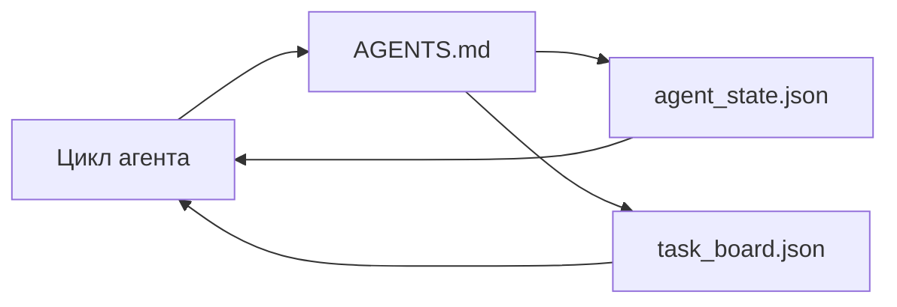

# Минимальный рабочий инструментарий агента (Minimal Agent Workbench)

> Самый маленький полезный рабочий инструментарий состоит из трёх файлов: корневого файла маршрутизатора (router) с инструкциями, файла состояния (state file) и доски задач (task board). Всё остальное надстраивается поверх. Если репозиторий не может вместить эти три файла, никакая модель его не спасёт.

**Тип:** Практическая сборка
**Языки:** Python (stdlib)
**Предусловия:** Фаза 14 · 31 (почему мощные модели всё ещё терпят неудачу)
**Время:** ~45 минут

## Цели обучения

- Определить три файла, формирующих минимально жизнеспособный рабочий инструментарий.
- Объяснить, почему короткий файл маршрутизатора (router) лучше длинного монолитного `AGENTS.md`.
- Создать файл состояния, который агент (agent) читает на каждом шаге и записывает по завершении.
- Создать доску задач, которая сохраняет работоспособность при нескольких сеансах без истории чата.

## Проблема

Большинство команд создают рабочий инструментарий, написав 3000-строчный `AGENTS.md` и считая задачу выполненной. Модель загружает его, игнорирует части, которые не может обобщить, и по-прежнему терпит неудачу там, где терпела всегда.

Вам нужно обратное. Крошечный корневой файл, который направляет агента в более глубокие файлы только при необходимости. Долговечное состояние, которое агент читает перед действием и записывает после. Доска задач, которая показывает, что в процессе, что заблокировано и что запланировано дальше.

Три файла. У каждого — своя задача. Каждый достаточно машиночитаем, чтобы впоследствии развиться в полноценную систему.

## Концепция



### AGENTS.md — это маршрутизатор, а не руководство

Хороший `AGENTS.md` — короткий. Он указывает агенту на:

- Файл состояния (где вы находитесь).
- Доску задач (что осталось).
- Более глубокие правила (в `docs/agent-rules.md`).
- Команду проверки (как убедиться, что всё работает).

Всё, что длиннее, размещается в более глубоких документах, загружаемых только при необходимости. Длинные руководства игнорируются. Короткие маршрутизаторы выполняются.

### agent_state.json — система записи

Состояние (state) хранит: идентификатор активной задачи, затронутые файлы, сделанные допущения, блокирующие факторы и следующее действие. Агент читает его на каждом шаге. Следующий сеанс читает его вместо воспроизведения истории чата.

Состояние хранится в файле, потому что история чата ненадёжна. Сеансы завершаются. Беседы обрезаются. Файл — нет.

### task_board.json — очередь

Доска задач (task board) содержит каждую задачу со статусом `todo | in_progress | done | blocked`. Это очередь, из которой агент извлекает задачи, когда состояние пусто, и которую вы читаете, когда хотите узнать, идёт ли агент по плану.

Задача на доске имеет идентификатор, цель, владельца (`builder`, `reviewer` или `human`) и критерии приёмки. Доска намеренно компактна: когда она вырастает за пределы одного экрана, у вас проблема с планированием, а не с доской.

### Три файла — это пол, а не потолок

Последующие уроки добавляют контракты объёма, обработчики обратной связи, шлюзы верификации (verification gates), чек-листы рецензентов и пакеты передачи. Три файла из данного урока — это то, на что все они опираются.

## Сборка

`code/main.py` создаёт минимальный рабочий инструментарий в пустом репозитории и демонстрирует один шаг агента, который:

1. Читает `agent_state.json`.
2. Извлекает следующую задачу из `task_board.json`, если состояние пусто.
3. Изменяет один файл в пределах области видимости.
4. Записывает обновлённое состояние.

Запуск:

```
python3 code/main.py
```

Скрипт создаёт каталог `workdir/` рядом с собой, размещает три файла, выполняет один шаг и выводит разницу (diff). Запустите его снова, чтобы увидеть, как второй шаг продолжает работу с того места, где закончился первый.

## Применение

В продуктовых решениях для агентов (agent products) те же три файла появляются под разными именами:

- **Claude Code:** `AGENTS.md` или `CLAUDE.md` для маршрутизатора, хранилища в стиле `.claude/state.json` для состояния, хуки для доски задач.
- **Codex / Cursor:** правила рабочего пространства для маршрутизатора, память сеанса для состояния, задачи в боковой панели чата для доски.
- **Пользовательский Python-агент:** те же файлы, которые вы только что создали.

Имена меняются. Структура — нет.

## Продуктивные паттерны в реальных проектах

Минимальный рабочий инструментарий выдерживает столкновение с реальными монорепозиториями, когда поверх него надстроены три паттерна. Они независимы; выбирайте те, которые действительно нужны вашему репозиторию.

**Вложенные `AGENTS.md` с приоритетом ближайшего совпадения (nearest-wins precedence).** OpenAI размещает 88 файлов `AGENTS.md` в основном репозитории — по одному на каждый подкомпонент. Codex, Cursor, Claude Code и Copilot обходят путь от рабочего файла к корню репозитория и объединяют все встреченные `AGENTS.md`. Файлы в подкаталогах расширяют корневой файл. Codex добавляет `AGENTS.override.md` для замены вместо расширения; механизм переопределения специфичен для Codex, и его следует избегать при кросс-инструментальной работе. Замер Augment Code красноречив: лучшие файлы `AGENTS.md` дают скачок качества, эквивалентный обновлению с Haiku до Opus; худшие делают результат хуже, чем его отсутствие.

**Антипаттерны, от которых стоит отказаться, даже если они кажутся всеобъемлющими.** Противоречивые инструкции молча переводят агента из интерактивного режима в жадный (greedy) (ICLR 2026 AMBIG-SWE: 48.8% → 28% коэффициент решения); нумеруйте приоритеты вместо того, чтобы ставить их в один ряд. Правила стиля без команды проверки («следуйте Google Python Style Guide») позволяют агенту выдумать соблюдение; сопоставляйте каждое правило стиля с точной командой линтера (lint). Начинать со стиля, а не с команд, маскирует путь верификации; сначала команды, потом стиль. Писать для людей, а не для агентов, расходует бюджет контекста; лаконичность — это преимущество.

**Кросс-инструментальные симлинки.** Один корневой файл с симлинками (`ln -s AGENTS.md CLAUDE.md`, `ln -s AGENTS.md .github/copilot-instructions.md`, `ln -s AGENTS.md .cursorrules`) обеспечивает единый источник истины для всех кодогенерирующих агентов. `nx ai-setup` от Nx автоматизирует это для Claude Code, Cursor, Copilot, Gemini, Codex и OpenCode из единой конфигурации.

## Выпуск

`outputs/skill-minimal-workbench.md` генерирует трёхфайловый рабочий инструментарий для любого нового репозитория: `AGENTS.md` маршрутизатор, настроенный под проект, `agent_state.json` с правильными ключами и `task_board.json`, заполненный текущим беклогом (backlog).

## Упражнения

1. Добавьте временную метку `last_run` в `agent_state.json`. Откажитесь от запуска, если файл старше 24 часов, пока оператор не подтвердит.
2. Добавьте поле `priority` в доску задач и измените механизм извлечения так, чтобы всегда выбиралась задача `todo` с наивысшим приоритетом.
3. Переведите `task_board.json` в формат JSON Lines, чтобы каждая задача была отдельной строкой, а diffs были чистыми в системе контроля версий (version control).
4. Напишите `lint_workbench.py`, который выдаёт ошибку, если `AGENTS.md` превышает 80 строк или ссылается на несуществующий файл.
5. Определите, какой из трёх файлов будет наиболее болезненно потерять. Обоснуйте.

## Ключевые термины

| Термин | Как говорят люди | Что это значит на самом деле |
|--------|-------------------|-------------------------------|
| Маршрутизатор (router) | `AGENTS.md` | Короткий корневой файл, указывающий агенту на более глубокие документы и файлы |
| Файл состояния (state file) | «Заметки» | Машиночитаемая запись о текущем положении агента, обновляемая на каждом шаге |
| Доска задач (task board) | «Беклог» | Очередь (queue) задач в формате JSON со статусом, владельцем и критериями приёмки |
| Система записи | «Источник истины» | Файл, который рабочий инструментарий считает авторитетным, когда история чата отсутствует |

## Дополнительные материалы

- [agents.md — открытая спецификация](https://agents.md/) — Adopted by Cursor, Codex, Claude Code, Copilot, Gemini, OpenCode
- [Augment Code, A good AGENTS.md is a model upgrade. A bad one is worse than no docs at all](https://www.augmentcode.com/blog/how-to-write-good-agents-dot-md-files) — замеры скачков качества
- [Blake Crosley, AGENTS.md Patterns: What Actually Changes Agent Behavior](https://blakecrosley.com/blog/agents-md-patterns) — что работает эмпирически, а что нет
- [Datadog Frontend, Steering AI Agents in Monorepos with AGENTS.md](https://dev.to/datadog-frontend-dev/steering-ai-agents-in-monorepos-with-agentsmd-13g0) — вложенная приоритетность на практике
- [Nx Blog, Teach Your AI Agent How to Work in a Monorepo](https://nx.dev/blog/nx-ai-agent-skills) — генерация единого источника для шести инструментов
- [The Prompt Shelf, AGENTS.md Best Practices: Structure, Scope, and Real Examples](https://thepromptshelf.dev/blog/agents-md-best-practices/) — порядок разделов, выдерживающий проверку
- [Anthropic, Claude Code subagents and session store](https://docs.anthropic.com/en/docs/agents-and-tools/claude-code/sub-agents)
- Фаза 14 · 31 — типы ошибок, которые этот минимальный инструментарий поглощает
- Фаза 14 · 34 — долговечная схема состояния, которой занимается данный урок
