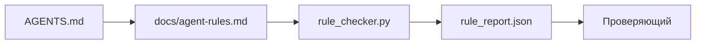

# Инструкции агента (Agent Instructions) как исполняемые ограничения

> Инструкции, записанные текстом, — это пожелания. Инструкции, записанные как ограничения, — это тесты. Рабочий стол превращает каждое правило в нечто, что агент может проверить во время выполнения, а проверяющий — после.

**Тип:** Сборка
**Языки:** Python (стандартная библиотека)
**Предварительные условия:** Фаза 14 · 32 (Минимальный рабочий стол)
**Время:** ~50 минут

## Цели обучения

- Разделять текстовую маршрутизацию и операционные правила.
- Выражать правила запуска, запрещённые действия, определение завершённости (definition of done), обработку неопределённости и границы согласования в виде машинопроверяемых ограничений.
- Реализовать средство проверки правил, которое оценивает запуск по набору правил.
- Обеспечить удобство diff для набора правил, чтобы проверяющий мог видеть, что изменилось.

## Проблема

Типичный `AGENTS.md` читается как документация по адаптации. Он говорит агенту «будь осторожен», «тщательно тестируй» и «спроси, если не уверен». Через три дня агент выпускает изменение без тестов, пишет в запрещённую директорию и никогда не спрашивает, потому что никогда не знал, где проходит граница.

Инструкции сильны, когда они операционны, и слабы, когда они лишь желания. Решение — писать правила, которые рабочий стол может интерпретировать, а проверяющий — оценивать.

## Концепция

Правила размещаются в `docs/agent-rules.md`, вдали от короткого маршрутизатора корневого уровня. Каждое правило имеет имя, категорию и проверку.



### Пять категорий, покрывающих большинство правил

| Категория | Вопрос, на который отвечает правило | Пример |
|----------|---------------------------|---------|
| Запуск (Startup) | Что должно быть истинным до начала работы? | «файл состояния существует и является актуальным» |
| Запрет (Forbidden) | Что никогда не должно происходить? | «не редактировать `scripts/release.sh`» |
| Определение завершённости (Definition of done) | Что доказывает, что задача выполнена? | «pytest завершается с кодом 0 и строка приёмки пройдена» |
| Неопределённость (Uncertainty) | Что делает агент, когда не уверен? | «открывает заметку-вопрос вместо догадки» |
| Согласование (Approval) | Что требует одобрения человека? | «любая новая зависимость, любая запись в prod» |

Правило, которое не вписывается ни в одну из пяти категорий, обычно хочет быть двумя правилами. Нужно разделить его.

### Правила доступны для машины

Каждое правило имеет slug, категорию, описание в одну строку и поле `check`, которое указывает функцию в `rule_checker.py`. Добавление правила означает добавление проверки; средство проверки растёт вместе с рабочим столом.

### Правила удобны для diff

Правила размещаются по одному на заголовок в едином markdown-файле. Переименования видны в diff. Новые правила размещаются в начале своей категории. Устаревшие правила удаляются, а не закомментировываются, потому что рабочий стол является источником истины, а не журналом чатов о том, что команда чувствовала в прошлом квартале.

### Правила и ограничения фреймворка

Ограничения фреймворка (guardrails в OpenAI Agents SDK, прерывания в LangGraph) применяют правила на уровне выполнения. Набор правил в данном уроке — это доступный для чтения человеком и проверяемый контракт, который эти ограничения реализуют. Нужны оба подхода: среда выполнения ловит нарушения во время хода выполнения, а набор правил доказывает, что среда выполняет правильные действия.

## Создание

В `code/main.py` поставляются:

- Парсер `agent-rules.md`, загружающий правила в dataclass.
- Функции проверки в стиле `rule_checker.py`, по одной на каждую ссылку `check`.
- Демонстрационный запуск агента, нарушающий два правила, и прохождение проверки, которое их обнаруживает.

Запуск:

```
python3 code/main.py
```

Вывод: разобранный набор правил, трассировка запуска, результат pass/fail для каждого правила и файл `rule_report.json`, сохранённый рядом со скриптом.

## Производственные паттерны в реальных проектах

Три паттерна отделяют набор правил, который живёт квартал, от набора, который деградирует за неделю.

**Метка серьёзности при записи.** Каждое правило несёт `severity`: `block`, `warn` или `info`. Средство проверки отчитывается по всем трём; среда выполнения отказывает только при `block`. Большинство команд завышают серьёзность в начале, а затем тихо снижают её под давлением дедлайнов; метка при записи заставляет калибровку происходить заранее. Пару с шлюзом проверки (Фаза 14 · 38), который подписывает любое переопределение правила `block` в журнал аудита `overrides.jsonl`.

**Срок действия правила как вынуждающая функция.** Каждое правило несёт дату `expires_at` (по умолчанию 90 дней с момента создания). Средство проверки выдаёт предупреждение, когда правило без нарушений не имело ни одного инцидента в течение 60 последовательных дней; следующая квартальная проверка либо обосновывает его сохранение, либо понижает до `info`, либо удаляет. Данные Cloudflare по production AI Code Review (апрель 2026, 131 246 запусков проверок в 5 169 репозиториях за 30 дней) показали, что наборы правил с явным сроком действия оставались ниже 30 правил на репозиторий; наборы без срока вырастали до 80+, причём большинство никогда не срабатывало.

**Markdown как источник, JSON как кэш.** `agent-rules.md` — это редактируемый файл; `agent-rules.lock.json` — это кэш, который средство проверки читает по горячему пути. Lock-файл перегенерируется хуком pre-commit. Diff по markdown доступны для проверки; разбор JSON не попадает в каждый ход выполнения. Та же схема, что и у `package.json` / `package-lock.json` и `Cargo.toml` / `Cargo.lock`.

## Применение

В производственной среде:

- Claude Code, Codex, Cursor считывают правила при начале сессии и цитируют их при отказе в действиях. Средство проверки перезапускает их в CI для выявления тихого дрейфа.
- Ограничения OpenAI Agents SDK регистрируют те же проверки как входные и выходные ограничения. Markdown является поверхностью документации; SDK является поверхностью среды выполнения.
- Прерывания LangGraph срабатывают, когда активный узел нарушает правило. Обработчик прерывания считывает правило, запрашивает человека и продолжает выполнение.

Набор правил переносим между всеми тремя системами, потому что он состоит только из markdown и имён функций.

## Отправка

`outputs/skill-rule-set-builder.md` опрашивает владельца проекта, классифицирует его существующие текстовые инструкции по пяти категориям и формирует версионированный `agent-rules.md` плюс заглушку средства проверки.

## Упражнения

1. Добавьте шестую категорию, если ваш продукт действительно этого требует. Обоснуйте, почему она не сводится к одной из пяти.
2. Расширьте средство проверки так, чтобы правило могло нести серьёзность (`block`, `warn`, `info`), а отчёт агрегировал данные соответствующим образом.
3. Подключите средство проверки к CI: завершайте сборку с ошибкой, если правило с серьёзностью block не проходит на последнем запуске агента.
4. Добавьте поле «срок действия» для каждого правила. Через 90 дней без сбоя проверки правило направляется на рассмотрение.
5. Найдите реальный `AGENTS.md` и перепишите его как правила пяти категорий. Сколько его строк было операционными? Сколько — лишь пожеланиями?

## Ключевые термины

| Термин | Как говорят | Что означает на самом деле |
|------|----------------|------------------------|
| Операционное правило (Operational rule) | «Настоящая инструкция» | Правило, которое рабочий стол может проверить во время выполнения |
| Правило-желание (Aspirational rule) | «Будь осторожен» | Правило без проверки; удалить или улучшить |
| Определение завершённости (Definition of done) | «Приёмка» | Объективное подтверждение завершения задачи на основе файлов |
| Серьёзность block (Block severity) | «Жёсткое правило» | Нарушение останавливает выполнение; невозможно подавить без оператора |
| Срок действия правила (Rule expiry) | «Очистка устаревших правил» | Правило без сбоев в течение N дней направляется на удаление |

## Дополнительные материалы

- [Ограничения OpenAI Agents SDK](https://platform.openai.com/docs/guides/agents-sdk/guardrails)
- [Прерывания LangGraph](https://langchain-ai.github.io/langgraph/how-tos/human_in_the_loop/breakpoints/)
- [Anthropic, Building Effective Agents](https://www.anthropic.com/research/building-effective-agents)
- [Rick Hightower, Agent RuleZ: A Deterministic Policy Engine](https://medium.com/@richardhightower/agent-rulez-a-deterministic-policy-engine-for-ai-coding-agents-9489e0561edf) — серьёзность block/warn/info в производственной среде
- [Cloudflare, Orchestrating AI Code Review at Scale](https://blog.cloudflare.com/ai-code-review/) — 131 тыс. запусков проверок, уроки композиции правил
- [microservices.io, GenAI development platform — part 1: guardrails](https://microservices.io/post/architecture/2026/03/09/genai-development-platform-part-1-development-guardrails.html) — эшелонированная защита между правилами и CI
- [Type-Checked Compliance: Deterministic Guardrails (arXiv 2604.01483)](https://arxiv.org/pdf/2604.01483) — Lean 4 как верхняя граница правила-проверки
- [logi-cmd/agent-guardrails](https://github.com/logi-cmd/agent-guardrails) — реализация merge-gate: область, мутационное тестирование, бюджеты нарушений
- Фаза 14 · 32 — минимальный рабочий стол, в который добавляется этот набор правил
- Фаза 14 · 38 — шлюз проверки, потребляющий отчёт о правилах
- Фаза 14 · 39 — агент-проверяющий, оценивающий соблюдение правил
