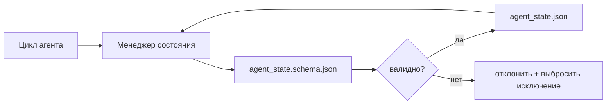

# Память репозитория и долговременное состояние

> История чата эфемерна. Репозиторий — долговременен. Рабочая среда хранит состояние агента в версионированных файлах, чтобы следующая сессия, следующий агент и следующий рецензент читали один и тот же источник истины.

**Тип:** Практическая работа
**Языки:** Python (стандартная библиотека + `jsonschema` по желанию)
**Предварительные требования:** Фаза 14 · 32 (минимальная рабочая среда)
**Время:** ~60 минут

## Цели обучения

- Определить, что относится к памяти репозитория, а что — к истории чата (chat history).
- Создать JSON-схемы для `agent_state.json` и `task_board.json`.
- Реализовать менеджер состояния, который загружает, проверяет, изменяет и сохраняет состояние атомарно.
- Использовать схему для отклонения некорректных записей до того, как они повредят рабочую среду.

## Проблема

Агент завершает сессию. Чат закрывается. Следующая сессия открывается, и агент спрашивает, с чего начать. Модель говорит «позвольте мне проверить файлы», читает устаревшие заметки и повторно выполняет уже завершённую работу. Или хуже — перезаписывает готовый файл, потому что никто не сообщил, что файл уже завершён.

Решением для рабочей среды является память репозитория (repo memory): состояние хранится в JSON-файлах в репозитории, записанных по схеме, сохраняемых атомарно и удобных для дифф-обзора в коде. Чат — это временный поток; репозиторий — система записи (system of record).

## Концепция



### Что относится к памяти репозитория

| Относится | Не относится |
|-----------|-------------|
| ID активной задачи | Необработанные расшифровки чата |
| Изменённые файлы текущей сессии | Трассировки рассуждений на уровне токенов |
| Предположения, сделанные агентом | «Пользователь казался расстроенным» |
| Открытые блокеры | Сэмплированные дополнения (completions) |
| Следующее действие | Идентификаторы моделей конкретного вендора |

Критерий — долговременность (durability): было бы это полезно через три месяца при повторном запуске CI? Если да — в репозиторий. Если нет — в телеметрию.

### Состояние по схеме

JSON Schema — это контракт. Без него каждый агент изобретает новые поля, каждый рецензент изучает новую структуру, а каждый скрипт CI должен обрабатывать особые случаи предыдущих версий. При наличии схемы некорректная запись просто отклоняется.

Схема охватывает:

- Обязательные ключи.
- Допустимые значения `status`.
- Запрещённые значения (например, `null` для массивов).
- Ограничения по шаблону (ID задач соответствуют шаблону `T-\d{3,}`).
- Поле версии для миграций.

### Атомарные записи

Записи состояния должны переживать частичные сбои: запись во временный файл, fsync, переименование поверх целевого файла. Файл состояния — источник истины; частично записанный файл хуже, чем его отсутствие.

### Миграции

При изменении схемы скрипт миграции поставляется рядом с обновлением схемы. Файл состояния содержит поле `schema_version`; менеджер отказывается загружать файл той версии, которую не может перенести.

## Реализация

`code/main.py` реализует:

- `agent_state.schema.json` и `task_board.schema.json`.
- Валидатор только на стандартной библиотеке (подмножество JSON Schema: required, type, enum, pattern, items).
- `StateManager.load`, `StateManager.update`, `StateManager.commit` с атомарными записями через временный файл и переименование.
- Демонстрацию: изменение состояния, сохранение, перезагрузка и проверка корректности цикла.

Запуск:

```
python3 code/main.py
```

Скрипт записывает `workdir/agent_state.json` и `workbench/task_board.json`, изменяет их за два шага и выводит проверенное состояние на каждом этапе.

## Паттерны из реальной эксплуатации

Четыре паттерна превращают минимальную реализацию из урока в нечто пригодное для мультиагентного моно-репозитория.

**Атомарное переименование через временный файл — не опция.** Отчёт об ошибке в проекте Hive от марта 2026 года документирует режим отказа: `state.json` записывался через `write_text()`, исключения перехатывались и подавлялись. Частичные записи приводили к тому, что сессии возобновлялись с повреждённым состоянием без какого-либо сигнала. Решение всегда одно: `tempfile.mkstemp` в той же директории, что и целевой файл, запись, `fsync`, `os.replace` (атомарное переименование в POSIX и Windows). Реализация `atomic_write` в этом уроке делает именно это.

**Ключи идемпотентности на каждый неидемпотентный вызов инструмента.** Если агент падает после вызова инструмента, но до чекпоинтирования результата, при воспроизведении повторяется вызов инструмента. Безопасно для чтения; опасно для электронной почты, вставок в БД, загрузки файлов. Паттерн: логирование каждого ID вызова инструмента перед выполнением в `pending_calls.jsonl`. При повторной попытке проверяется наличие ID; если он есть, вызов пропускается и используется кэшированный результат. Anthropic и LangChain оба указывают на это в своих рекомендациях 2026 года; чекпоинтер LangGraph сохраняет ожидающие записи по той же причине.

**Отдельные большие артефакты от состояния.** Не храните CSV-файли, длинные расшифровки или сгенерированные файлы в `agent_state.json`. Сохраняйте артефакт как отдельный файл (или загружайте в объектное хранилище), а в состоянии оставляйте только путь. Чекпоинты остаются маленькими и быстрыми; артефакты растут независимо.

**Event sourcing для аудита, снимки для возобновления.** Дописывание в журнал событий (`state.events.jsonl`) при каждом изменении; периодическое создание снимка в `state.json`. При возобновлении читается снимок, затем воспроизводятся все события после временной метки снимка. Это требует больше дискового пространства, но позволяет воспроизвести решения агента дословно — необходимо при отладке долгосрочных запусков. Та же структура, которую Postgres использует для WAL.

**Миграции схемы или отказ от загрузки.** Целое число `schema_version` — это контракт. Когда менеджер загружает файл неизвестной версии, он отказывается его читать. Поставляйте скрипт миграции рядом с обновлением схемы; `tools/migrate_state.py` выполняется идемпотентно при каждом запуске.

## Применение

В эксплуатации:

- **Чекпоинтеры LangGraph.** Та же идея, другое хранилище. Чекпоинтер сохраняет состояние графа в SQLite, Postgres или пользовательский бэкенд. Схема, изучаемая в этом уроке, — это то, к чему вы обращаетесь, когда чекпоинтер падает и вам нужно прочитать состояние вручную.
- **Блоки памяти Letta.** Долговременные блоки со структурированными схемами (Фаза 14 · 08). Та же дисциплина в рамках долгоживущих персон.
- **Хранилище сессий OpenAI Agents SDK.** Подключаемые бэкенды, чувствительные к схеме. Файл состояния в этом уроке — это локальный файловый бэкенд.

## Отправка

`outputs/skill-state-schema.md` генерирует пару JSON-схем, специфичных для проекта (состояние + доска задач), Python-класс `StateManager` с подключёнными атомарными записями и каркас миграции, чтобы следующее обновление схемы не сломало рабочую среду.

## Упражнения

1. Добавьте метку времени `last_human_touch`. Отклоняйте любую запись агента в течение пяти секунд после редактирования человеком.
2. Расширите валидатор для поддержки `oneOf`, чтобы задача могла быть либо задачей на сборку, либо задачей на рецензирование с различными обязательными полями.
3. Добавьте поле `schema_version` и напишите миграцию с v1 на v2 (переименование `blockers` в `risks`).
4. Перенесите бэкенд хранения с локального файла на SQLite. Сохраните API `StateManager` идентичным.
5. Запустите двух агентов на одном файле состояния с гонкой записи в 50 мс. Что пойдёт не так и как атомарное переименование вас спасает?

## Ключевые термины

| Термин | Как говорят | Что это на самом деле |
|--------|------------|----------------------|
| Память репозитория | «Файл с заметками» | Состояние, хранящееся в отслеживаемых файлах репозитория по схеме |
| Схема по определению | «Проверка входных данных» | Определение контракта до автора, отклонение отклонений |
| Атомарная запись | «Просто переименовать» | Запись во временный файл, fsync, переименование, чтобы частичные сбои не повредили данные |
| Миграция | «Обновление схемы» | Скрипт, преобразующий состояние версии N в состояние версии N+1 |
| Система записи | «Источник истины» | Артефакт, который рабочая среда считает авторитетным |

## Дополнительные материалы

- [Спецификация JSON Schema](https://json-schema.org/specification.html)
- [Чекпоинтеры LangGraph](https://langchain-ai.github.io/langgraph/concepts/persistence/)
- [Блоки памяти Letta](https://docs.letta.com/concepts/memory)
- [Fast.io, AI Agent State Checkpointing: A Practical Guide](https://fast.io/resources/ai-agent-state-checkpointing/) — чекпоинтирование по схеме с идемпотентностью
- [Fast.io, AI Agent Workflow State Persistence: Best Practices 2026](https://fast.io/resources/ai-agent-workflow-state-persistence/) — управление конкурентностью, TTL, event sourcing
- [Hive Issue #6263 — non-atomic state.json writes silently ignored](https://github.com/aden-hive/hive/issues/6263) — режим отказа в реальном проекте
- [eunomia, Checkpoint/Restore Systems: Evolution, Techniques, Applications](https://eunomia.dev/blog/2025/05/11/checkpointrestore-systems-evolution-techniques-and-applications-in-ai-agents/) — примитивы checkpoint/restore из истории ОС, применённые к агентам
- [Indium, 7 State Persistence Strategies for Long-Running AI Agents in 2026](https://www.indium.tech/blog/7-state-persistence-strategies-ai-agents-2026/)
- [Microsoft Agent Framework, Compaction](https://learn.microsoft.com/en-us/agent-framework/agents/conversations/compaction) — менеджер чекпоинтов от вендора
- Фаза 14 · 08 — блоки памяти и вычисления во время сна
- Фаза 14 · 32 — минимальный набор из трёх файлов, который этот урок формализует
- Фаза 14 · 40 — пакеты передачи (handoff), читаемые по той же схеме
