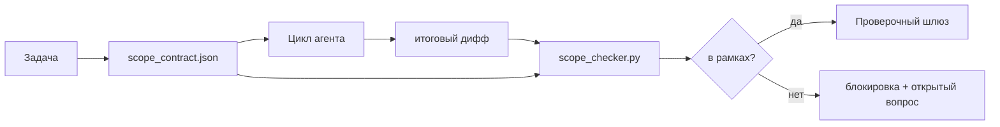

# Контракты области (Scope Contracts) и границы задач

> Модель не знает, где заканчивается работа. Контракт области (scope contract) — это файл для каждой задачи, который определяет, где работа начинается, где она заканчивается и как откатить (rollback), если работа вышла за пределы. Контракт превращает «оставайся в рамках» из пожелания в проверку.

**Тип:** Практическое задание (Build)
**Языки:** Python (стандартная библиотека)
**Предварительные требования:** Фаза 14 · 32 (Минимальная рабочая среда), Фаза 14 · 33 (Правила как ограничения)
**Время:** ~50 минут

## Цели обучения

- Написать контракт области, который агент (agent) читает в начале задачи, а проверяющий — в конце задачи.
- Указать разрешённые файлы, запрещённые файлы, критерии приёмки (acceptance criteria), план отката (rollback plan) и границы согласования (approval boundaries).
- Реализовать проверку области (scope checker), которая сравнивает дифф (diff) с контрактом и отмечает нарушения.
- Сделать расширение области (scope creep) видимым, автоматическим и подлежащим проверке.

## Проблема

Агенты расширяют область. Задача — «исправить ошибку входа». Дифф затрагивает маршрут входа (login route), вспомогательную функцию email, драйвер базы данных, README и скрипт релиза. Каждое изменение имело убедительное обоснование в момент выполнения. Вместе это уже другое изменение, чем то, которое было рассмотрено.

Расширение области — это наиболее слабо контролируемый режим отказа в работе агента, поскольку агент добросовестно описывает каждый шаг. Решение не в более строгом промпте. Решение — это контракт на диске, который фиксирует, что было обещано, и проверка, которая сравнивает результат с обещанием.

## Концепция



### Что входит в контракт области

| Поле | Назначение |
|-------|---------|
| `task_id` | Ссылка на задачу на доске |
| `goal` | Одно предложение, которое проверяющий может верифицировать |
| `allowed_files` | Глобы (glob), которые агент может записывать |
| `forbidden_files` | Глобы, которые агент не должен трогать даже случайно |
| `acceptance_criteria` | Команды тестирования или строки утверждений, подтверждающие завершённость |
| `rollback_plan` | Один абзац, который оператор может выполнить, если потребуется остановка |
| `approvals_required` | Действия за пределами области, требующие явного согласования человеком |

Контракт без `forbidden_files` неполон. Обратное пространство — это половина контракта.

### Глобы, а не сырые пути

В реальных репозиториях файлы перемещаются. Фиксируйте контракты на глобах (`app/**/*.py`, `tests/test_signup*.py`), чтобы рефакторинг между сессиями не делал контракт недействительным.

### Откат — часть области

Перечисление способов отката заставляет автора контракта подумать о том, что может пойти не так. Контракт, из которого невозможно откатиться, — это контракт, который не должен быть одобрен.

### Проверка области — это проверка диффа

Агент записывает дифф. Проверяющий считывает дифф, разрешённые глобы, запрещённые глобы и список выполненных команд приёмки. Каждое нарушение — это отмеченная находка, которую проверочный шлюз может отклонить.

## Реализация

`code/main.py` реализует:

- Схему `scope_contract.json` (подмножество JSON Schema, массивы глобов).
- Парсер диффа, который превращает список затронутых файлов и список выполненных команд в `RunSummary`.
- `scope_check`, который возвращает `(violations, in_scope, off_scope)` относительно контракта.
- Два демонстрационных запуска: один остаётся в рамках, другой выходит за них. Проверяющий отмечает расширение области с указанием конкретного файла и причины.

Запуск:

```
python3 code/main.py
```

Вывод: контракт, два запуска, результаты проверки для каждого запуска и сохранённый `scope_report.json`.

## Производственные паттерны

Практик, применяющий «specsmaxxing» (контракты области в YAML перед вызовом агента), сообщает, что частота попадания в «кроличью нору» снизилась с 52% до 21% за три недели без изменения агента. Контракт выполнил работу, а не модель. Три паттерна делают результат устойчивым.

**Бюджеты нарушений, а не бинарные отказы.** `agent-guardrails` (open-source шлюз слияний, используемый Claude Code, Cursor, Windsurf, Codex через MCP) предоставляет `violationBudget` на задачу: незначительные нарушения области в пределах бюджета отображаются как предупреждения; только при превышении бюджета шлюз слияний отказывает в слиянии. Комбинация с `violationSeverity: "error" | "warning"`. Бюджет — это то, что отличает шлюз, который принимает, от шлюза, который отключает команда, недовольная им.

**Асимметрия серьёзности по семействам путей.** Записи за пределами области в `docs/**` обычно помечаются как `warn`; записи за пределами области в `scripts/**`, `migrations/**`, `config/prod/**` всегда помечаются как `block`. Эта асимметрия должна находиться в контракте, а не в среде выполнения, поскольку она специфична для проекта и меняется от задачи к задаче.

**Бюджеты времени и сетевого трафика рядом с бюджетами файлов.** Поле `time_budget_minutes` ограничивает время выполнения; среда выполнения отказывает продолжать по его истечении без повторного согласования. Разрешительный список `network_egress` по именам хостов предотвращает тихое обращение агента к внешнему API, который не был частью задачи. Это также измерения области; файловые глобы необходимы, но недостаточны.

**Семантика слияния нескольких контрактов (минимальные привилегии).** Когда действуют два контракта области (например, общий контракт проекта и контракт для конкретной задачи), слияние выполняется следующим образом: **пересечение** `allowed_files` (оба контракта должны разрешать путь), **объединение** `forbidden_files` (любой из них может запретить), `time_budget_minutes` — наиболее строгое значение (минимум), `approvals_required` — накопление. `network_egress` равен `None` для отсутствия принуждения, `[]` для полного запрета, `[...]` для разрешительного списка; при слиянии `None` уступает другой стороне, два списка пересекаются, а полный запрет остаётся полным запретом. Закрепите это в схеме контракта, чтобы слияние было механическим и подлежащим проверке.

## Применение

Производственные паттерны:

- **Слеш-команды Claude Code.** Команда `/scope` записывает контракт и фиксирует его как контекст сессии. Подагенты читают контракт перед действием.
- **Pull-запросы GitHub.** Пушьте контракт как JSON-файл в теле PR или как зафиксированный артефакт. CI запускает проверку области против диффа слияния.
- **Прерывания LangGraph.** Нарушение области инициирует прерывание (interrupt); обработчик запрашивает у человека решение: нужно ли расширить контракт или агенту нужно отступить.

Контракт следует за задачей. При закрытии задачи контракт архивируется в `outputs/scope/closed/`.

## Деплой (Ship It)

`outputs/skill-scope-contract.md` генерирует контракт области для описания задачи и проверяющий с поддержкой глобов, который запускается в CI при каждом диффе агента.

## Упражнения

1. Добавьте поле `network_egress` со списком разрешённых внешних хостов. Отклоняйте запуски, обращающиеся к другим хостам.
2. Расширьте проверяющий: мягкий отказ для `docs/**`, жёсткий отказ для `scripts/**`. Обоснуйте асимметрию.
3. Пусть контракт выводит `allowed_files` из поля `goal` с помощью набора статических правил (без LLM). Что идёт не так при первом граничном случае?
4. Добавьте `time_budget_minutes` и отказывайте продолжать, когда время выполнения превышает его.
5. Запустите два контракта против одного диффа. Какая правильная семантика слияния, когда действуют оба?

## Ключевые термины

| Термин | Что говорят | Что это означает на самом деле |
|------|----------------|------------------------|
| Контракт области (Scope contract) | «Описание задачи» | JSON для каждой задачи, перечисляющий разрешённые/запрещённые файлы, критерии приёмки, план отката |
| Расширение области (Scope creep) | «Также затронуто...» | Файлы за пределами контракта, изменённые в рамках одной задачи |
| План отката (Rollback plan) | «Можно откатить» | Один абзац — инструкция для оператора по остановке |
| Граница согласования (Approval boundary) | «Требуется согласование» | Действие, указанное в контракте как требующее явного согласования человека |
| Проверка диффа (Diff check) | «Аудит путей» | Сравнение затронутых файлов с глобами контракта |

## Дополнительные материалы

- [Прерывания LangGraph с участием человека в цикле (human-in-the-loop)](https://langchain-ai.github.io/langgraph/concepts/human_in_the_loop/)
- [Политики согласования инструментов OpenAI Agents SDK](https://platform.openai.com/docs/guides/agents-sdk)
- [logi-cmd/agent-guardrails — шлюзы слияний и проверка области](https://github.com/logi-cmd/agent-guardrails) — бюджеты нарушений, уровни серьёзности
- [Dev|Journal, Предотвращение дрейфа конфигурации агента с помощью тестирования контрактов](https://earezki.com/ai-news/2026-05-05-i-built-a-tiny-ci-tool-to-keep-ai-agent-configs-from-drifting-in-my-repo/) — режим `--strict` без внешних зависимостей
- [Agentic Coding Is Not a Trap (логи продакшена)](https://dev.to/jtorchia/agentic-coding-is-not-a-trap-i-answered-the-viral-hn-post-with-my-own-production-logs-33d9) — результаты specsmaxxing: 52% → 21%
- [Разрешительные глобы OpenCode](https://opencode.ai/docs/agents/) — детализированная область по разрешениям
- [Knostic, Безопасность агентов для ИИ-кодирования: модели угроз и стратегии защиты](https://www.knostic.ai/blog/ai-coding-agent-security) — область как часть минимальных привилегий
- [Augment Code, шаблон ИИ-спецификации](https://www.augmentcode.com/guides/ai-spec-template) — трёхуровневая система границ (must/ask/never)
- Фаза 14 · 27 — защита от инъекции промптов, дополняющая блокировки области
- Фаза 14 · 33 — набор правил, который этот контракт специализирует для каждой задачи
- Фаза 14 · 38 — проверочный шлюз, в который докладывает проверяющий
