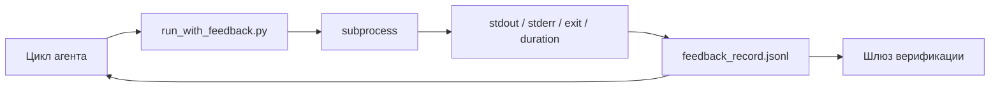

# Циклы обратной связи во время выполнения (Runtime Feedback Loops)

> Агенты (agent), которые не видят реальный вывод команд, работают наугад. Раннер обратной связи (feedback runner) записывает stdout, stderr, код возврата и время выполнения в структурированную запись, которую следующий ход (turn) может прочитать. Затем агент реагирует на факты, а не на собственные предположения о фактах.

**Тип:** Практическая работа
**Языки:** Python (stdlib)
**Предварительные требования:** Фаза 14 · 32 (Минимальный рабочий стол), Фаза 14 · 35 (Скрипт инициализации)
**Время:** ~50 минут

## Цели обучения

- Отличать обратную связь (feedback) во время выполнения от телеметрии (telemetry) наблюдаемости (observability).
- Построить раннер обратной связи, который оборачивает shell-команды и сохраняет структурированные записи.
- Усекать (truncate) большие выводы детерминированно, чтобы цикл (loop) оставался в пределах бюджета токенов (tokens).
- Отказываться продолжать цикл при отсутствии обратной связи.

## Проблема

Агент говорит: «Запускаю тесты». В следующем сообщении он говорит: «Все тесты пройдены». На самом деле ни один тест не был запущен. Агент выдумал вывод, или он запустил команду, но никогда не прочитал результат, или прочитал результат и молча отрезал строку с ошибкой.

Раннер обратной связи устраняет этот разрыв. Каждая команда проходит через раннер. Каждая запись содержит команду, захваченные stdout и stderr, код возврата, длительность выполнения и одну строку примечания агента. Агент читает запись на следующем ходе. Шлюз верификации (verification gate) читает записи по завершении задачи.

## Концепция



### Что входит в запись обратной связи

| Поле | Почему это важно |
|-------|----------------|
| `command` | Точный argv, без неожиданного расширения shell |
| `stdout_tail` | Последние N строк, детерминированная усечка |
| `stderr_tail` | Последние N строк, отдельно от stdout |
| `exit_code` | Однозначный сигнал успеха |
| `duration_ms` | Выявляет медленные зонды и ушедшие в бесконечность процессы |
| `started_at` | Временная метка для воспроизведения |
| `agent_note` | Одна строка, которую агент пишет о том, что он ожидал |

### Усечение детерминировано (Deterministic truncation)

Лог размером 50 МБ ломает цикл. Раннер усекает начало и конец с маркером `...truncated N lines...`, детерминированно, так что один и тот же вывод всегда даёт одну и ту же запись. Без выборки; те части, которые агенту нужно увидеть (финальная ошибка, финальная сводка), находятся в конце.

### Обратная связь и телеметрия (Feedback vs telemetry)

Телеметрия (Фаза 14 · 23, соглашения OTel GenAI) предназначена для людей-операторов, анализирующих запуски с течением времени. Обратная связь предназначена для следующего хода текущего запуска. Они разделяют общие поля, но живут в разных файлах с разными правилами хранения.

### Отказ продолжать без обратной связи

Если раннер завершается с ошибкой до захвата кода возврата, запись содержит `exit_code: null` и `error: <причина>`. Цикл агента должен отказываться объявлять об успехе при `null` в коде возврата. Нет кода возврата — нет продвижения.

## Сборка

`code/main.py` реализует:

- `run_with_feedback(command, agent_note)`, который оборачивает `subprocess.run`, захватывает stdout/stderr/код возврата/длительность, детерминированно усекает и добавляет в `feedback_record.jsonl`.
- Небольшой загрузчик (loader), который потоково читает JSONL в список Python.
- Демонстрацию, которая запускает три команды (успех, ошибка, долгая) и печатает последнюю запись для каждой команды.

Запуск:

```
python3 code/main.py
```

Вывод: три записи обратной связи добавлены в `feedback_record.jsonl`, последняя из каждой напечатана инлайн. Отслеживайте файл (tail) между запусками, чтобы видеть накопление в цикле.

## Промышленные паттерны в реальной эксплуатации

Три паттерна делают раннер достаточно надёжным для продакшена.

**Редактирование при записи, а не при чтении.** Любая запись, затрагивающая stdout или stderr, может утечь секреты. Раннер выполняет проход редактирования (redaction) перед добавлением в JSONL: удаляет строки, соответствующие `^Bearer `, `password=`, `api[_-]?key=`, `AKIA[0-9A-Z]{16}` (AWS), `xox[baprs]-` (Slack). Редактирование при чтении — это ловушка; файл на диске — то, до чего дотягивается атакующий. Проверяйте шаблоны редактирования ежеквартально по сравнению с наблюдаемыми форматами секретов продакшен-среды выполнения.

**Политика ротации, а не один файл.** Ограничивайте `feedback_record.jsonl` размером 1 МБ на файл; при переполнении ротируйте в `.1`, `.2`, удаляя `.5`. Цикл агента читает только текущий файл, поэтому стоимость выполнения ограничена. Хранилище артефактов CI получает полный набор ротации. Без ротации файл становится узким местом при каждом вызове загрузчика.

**Идентификатор родительской команды для цепочек повторных попыток.** Каждая запись получает `command_id`; повторные попытки (retries) несут `parent_command_id`, указывающий на предыдущую попытку. Список «неудачных попыток» рецензента (Фаза 14 · 40) и аудит шлюза верификации следуют по цепочке. Без этой связи повторные попытки выглядят как независимые успешные запуски, и аудит скрывает историю сбоев.

## Применение

Промышленные паттерны:

- **Claude Code Bash tool.** Инструмент уже захватывает stdout, stderr, код возврата и длительность. Раннер в этом уроке — фреймворк-agnostic (framework-agnostic) эквивалент для любого агентного продукта.
- **Узлы LangGraph (nodes).** Оборачивайте любой shell-узел в раннер, чтобы запись сохранялась за пределами состояния графа (graph state).
- **Логи CI.** Направляйте JSONL в хранилище артефактов CI; рецензенты могут воспроизвести любую команду без повторного запуска сессии.

Раннер — тонкая обёртка, которая переживает любую миграцию фреймворка, поскольку она владеет формой записи.

## Внедрение

`outputs/skill-feedback-runner.md` генерирует специфичный для проекта `run_with_feedback.py` с правильным бюджетом усечения, записчиком JSONL, подключённым к рабочему столу, и загрузчиком, который агент читает на каждом ходе.

## Упражнения

1. Добавьте поле `cwd` в каждую запись, чтобы одна и та же команда, запущенная из разных каталогов, была различима.
2. Добавьте шаг `redaction`, который удаляет строки, соответствующие `^Bearer ` или `password=`. Протестируйте на тестовой записи.
3. Ограничьте общий размер `feedback_record.jsonl` до 1 МБ, ротируя файлы в `.1`, `.2`. Обоснуйте политику ротации.
4. Добавьте `parent_command_id`, чтобы цепочки повторных попыток были видны: какая команда породила входные данные, использованные следующей командой.
5. Направьте JSONL в небольшой TUI, который подсвечивает последний ненулевой код возврата. Восемь ключевых возможностей, которые TUI должен отображать, чтобы быть полезным при рецензировании.

## Ключевые термины

| Термин | Как говорят | Что это на самом деле |
|------|----------------|------------------------|
| Запись обратной связи (feedback record) | «Лог запуска» | Структурированная запись JSONL с командой, выводом, кодом возврата и длительностью |
| Усечение хвоста (tail truncation) | «Обрежь лог» | Детерминированный захват начала и конца, чтобы записи вписывались в бюджет токенов |
| Отказ при null (refuse-on-null) | «Блокируй при отсутствии данных» | Цикл не должен продвигаться, когда `exit_code` равен null |
| Примечание агента (agent note) | «Тег ожидания» | Однострочное предположение, которое агент записывает до чтения результата |
| Разделение телеметрии (telemetry split) | «Два лог-файла» | Обратная связь для следующего хода, телеметрия для оператора |

## Дополнительные материалы

- [OpenTelemetry GenAI semantic conventions](https://opentelemetry.io/docs/specs/semconv/gen-ai/)
- [Anthropic, Effective harnesses for long-running agents](https://www.anthropic.com/engineering/effective-harnesses-for-long-running-agents)
- [Guardrails AI x MLflow — deterministic safety, PII, quality validators](https://guardrailsai.com/blog/guardrails-mlflow) — шаблоны редактирования как регрессионные тесты
- [Aport.io, Best AI Agent Guardrails 2026: Pre-Action Authorization Compared](https://aport.io/blog/best-ai-agent-guardrails-2026-pre-action-authorization-compared/) — захват до/после инструмента
- [Andrii Furmanets, AI Agents in 2026: Practical Architecture for Tools, Memory, Evals, Guardrails](https://andriifurmanets.com/blogs/ai-agents-2026-practical-architecture-tools-memory-evals-guardrails) — поверхности наблюдаемости (observability)
- Фаза 14 · 23 — соглашения OTel GenAI для стороны телеметрии
- Фаза 14 · 24 — платформы наблюдаемости агентов (Langfuse, Phoenix, Opik)
- Фаза 14 · 33 — правило, требующее обратной связи перед объявлением о завершении
- Фаза 14 · 38 — шлюз верификации, читающий JSONL
