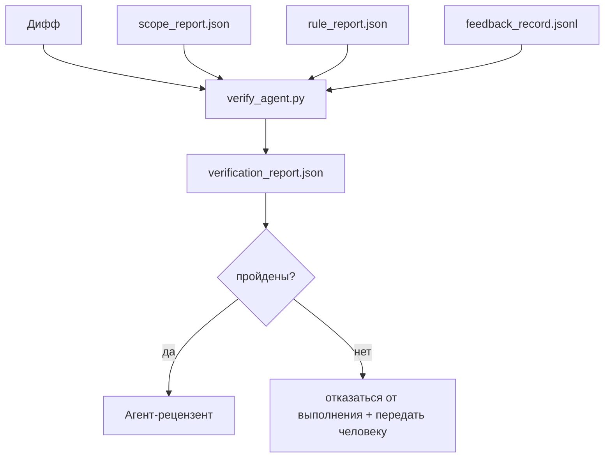

# Ворота верификации (Verification Gates)

> Агент не может самостоятельно пометить свою работу как выполненную. Ворота верификации (verification gate) читают контракт области видимости (scope contract), журнал обратной связи (feedback log), отчёт о правилах (rule report) и дифф (diff) и отвечают на один вопрос: действительно ли задача выполнена? Если ворота отвечают «нет», задача не выполнена — неважно, что говорит чат.

**Тип:** Сборка
**Языки:** Python (stdlib)
**Предварительные условия:** Фаза 14 · 33 (Правила), Фаза 14 · 36 (Область видимости), Фаза 14 · 37 (Обратная связь)
**Время:** ~55 минут

## Цели обучения

- Определить ворота верификации (verification gate) как детерминированную функцию (deterministic function) над артефактами (artifacts) рабочего стенда (workbench).
- Объединить отчёт о правилах (rule report), отчёт об области видимости (scope report), записи обратной связи (feedback records) и дифф (diff) в единую оценку.
- Генерировать `verification_report.json`, который могут прочитать и агент-рецензент (reviewer agent), и CI.
- Отказываться продвигать задачу при любом выводе с уровнем «блокировка» (block severity), без исключений.

## Проблема

Агенты слишком легко объявляют об успехе. Выделяются три формы отказа:

- «Выглядит хорошо.» Модель (model) прочитала свой собственный дифф и решила, что он корректен.
- «Тесты пройдены.» Сказано уверенно. Нет записи о фактическом запуске тестов.
- «Критерии приёмки выполнены.» Критерии приёмки (acceptance criteria) интерпретированы настолько свободно, что означают «любое напоминание о завершении».

Решение на рабочем стенде — единственные ворота верификации, которые читают артефакты, уже созданные агентом, и выносят решение. Ворота детерминированы. Ворота находятся в контроле версий (version control). Ворота подключены к CI. Агент не может их подкупить.

## Концепция



### Что проверяют ворота

| Проверка | Источник артефакта | Серьёзность |
|----------|-------------------|-------------|
| Все команды приёмки (acceptance commands) выполнены | `feedback_record.jsonl` | блокировка (block) |
| Все команды приёмки завершились с кодом нуля | `feedback_record.jsonl` | блокировка (block) |
| Проверка области видимости не содержит запрещённых записей | `scope_report.json` | блокировка (block) |
| Проверка области видимости не содержит записей за пределами области | `scope_report.json` | блокировка или предупреждение (block or warn) |
| Все правила с уровнем блокировки пройдены | `rule_report.json` | блокировка (block) |
| Отсутствуют `null` коды выхода в обратной связи | `feedback_record.jsonl` | блокировка (block) |
| Изменённые файлы соответствуют `scope.allowed_files` | оба источника | предупреждение (warn) |

Находка с уровнем `warn` помечает оценку; находка с уровнем `block` не допускает `passed: true`.

### Детерминированный, а не вероятностный подход

Ворота должны выдавать одинаковую оценку для одного и того же набора артефактов каждый раз. Никаких судей на базе LLM. Судьи на базе LLM (LLM judges) относятся к стороне рецензента (Фаза 14 · 39), где цель — качественная оценка, а не статус.

### Один отчёт — один путь

Ворота генерируют один `verification_report.json` на каждое закрытие задачи, записывая его в `outputs/verification/<task_id>.json`. CI использует тот же путь. Несколько ворот с разными путями разделяют единый источник истины (single source of truth).

### Отказ без исключений

Находки с уровнем блокировки (block severity) не могут быть переопределены агентом. Они могут быть переопределены только человеком, с записанным `override_reason` (причина переопределения) и идентификатором пользователя `overridden_by`. Переопределение — это подписанное изменение, а не решение агента.

## Реализация

`code/main.py` реализует:

- Загрузчик для каждого входного артефакта, все локально заглушены (stubbed), чтобы урок был самодостаточным.
- Чистую функцию `verify(task_id, artifacts) -> VerdictReport`.
- Принтер, отображающий результаты каждой проверки и итоговое состояние «пройдено/не пройдено».
- Демонстрацию с тремя сценариями задач: чистое прохождение, расширение области видимости (scope creep), отсутствие приёмки.

Запуск:

```
python3 code/main.py
```

Вывод: три отчёта об оценке, каждый сохранён рядом со скриптом.

## Производственные паттерны в реальной практике

Четыре паттерна превращают ворота из «ещё одна проверка стиля» в «решающий рубеж».

**Глубокая защита (defence-in-depth), а не одиночные ворота.** Pre-commit хук → статус проверки CI → хук авторизации перед инструментом (pre-tool authz hook) → ворота перед слиянием (pre-merge gate). Каждый уровень детерминирован, поэтому сбой одного уровня улавливается следующим. Руководство microservices.io за март 2026 года прямо указывает: pre-commit хук не может быть обойдён, потому что, в отличие от навыка на стороне модели, он не зависит от следования агентом инструкциям. Ворота верификации располагаются на уровне CI / перед слиянием.

**Защита детерминированной проверкой, судья-модель только для нюансов.** Парирование норм Anthropic 2026 года (Hybrid Norm pairing): проверяемые награды (verifiable rewards) — юнит-тесты, проверки схем, коды выхода — отвечают на вопрос «код решил проблему?» — рубрики LLM (LLM rubrics) отвечают на вопрос «код читаемый, безопасный, соответствует стилю?» Ворота выполняют первый класс проверок; рецензент (Фаза 14 · 39) — второй. Смешивание двух классов размывает сигнал.

**Подписанное журнальное переопределение, а не треды в Slack.** Каждое переопределение генерирует строку в `outputs/verification/overrides.jsonl` с указанием: временная метка (timestamp), код находки (finding code), причина, подписавший пользователь, текущий HEAD коммит. Среда выполнения отклоняет любое переопределение без подписи; аудиторский след отслеживается через git. Это граница между политикой переoverrides и театральными overrides.

**Порог покрытия (coverage floor) как проверка первого класса.** `coverage_report.json` питает проверку `coverage_floor` (по умолчанию 80%). Ворота отклоняют, если измеренное покрытие опускается ниже порога или ниже порога предыдущего слияния более чем на 1 процентный пункт. Без этой проверки агенты тихо удаляют тесты, которые не проходят, и отчёты верификации остаются зелёными.

**Режим `--strict` повышает предупреждения до блокировок.** Для веток релиза (release branches), PR-ов, блокирующих слияние, или постинцидентного расследования `--strict` превращает каждое предупреждение в жёсткий отказ. Флаг подключается по ветке (opt-in per branch); не является глобальным по умолчанию, поскольку строгий режим для всего разъедает повседневный рабочий процесс (workflow).

## Применение

Производственные паттерны:

- **Шаг CI.** Задание `verify_agent` запускает ворота против финальных артефактов агента. Защита слияния (merge protection) отклоняет без `passed: true`.
- **Хук перед передачей (pre-handoff hook).** Среда выполнения агента вызывает ворота перед генерацией документа передачи (handoff doc). Без зелёной оценки — нет передачи.
- **Ручная сортировка (manual triage).** Операторы читают отчёт, когда агент заявляет об успехе, а человек сомневается.

Ворота — решающий рубеж в потоке рабочего стенда. Все остальные поверхности находятся выше по течению.

## Отправка

`outputs/skill-verification-gate.md` подключает ворота к конкретному проекту: какие команды приёски питаются им, какие правила имеют уровень блокировки, какие записи за пределами области видимости допускаются, как хранится аудиторский журнал переопределений.

## Упражнения

1. Добавьте проверку `coverage_floor`: команда тестирования должна генерировать отчёт о покрытии не менее 80%. Определите, какой артефакт хранит порог.
2. Реализуйте режим `--strict`, который повышает каждое предупреждение (`warn`) до блокировки (`block`). Определите случаи, когда строгий режим является правильным по умолчанию.
3. Дайте воротам генерировать сводку (summary) в формате Markdown в дополнение к JSON. Обоснуйте, какие поля должны быть в сводке.
4. Добавьте проверку `time_since_last_human_touch`: любой файл, отредактированный в пределах 60 секунд после нажатия клавиши человеком, освобождается от флагов за пределами области видимости.
5. Запустите ворота на реальном диффе агента из вашего продукта. Сколько находок реальны, а сколько — шум? Где воротам необходимо расти?

## Ключевые термины

| Термин | Что говорят | Что это значит на самом деле |
|--------|-------------|------------------------------|
| Ворота верификации (verification gate) | «Проверка, которая останавливает всё» | Детерминированная функция над артефактами рабочего стенда, выдающая оценку «пройдено/не пройдено» |
| Блокировка (block severity) | «Жёсткий отказ» | Находка, не допускающая `passed: true` и требующая подписанного переопределения |
| Журнал переопределений (override log) | «Почему мы это пропустили» | Подписанные записи с причиной и идентификатором пользователя, аудитуемые при рецензии |
| Команда приёмки (acceptance command) | «Доказательство» | Команда оболочки, чей нулевой код выхода означает «выполнено» |
| Единый путь отчёта (one report path) | «Единый источник истины» | `outputs/verification/<task_id>.json`, используемый CI и людьми |

## Дополнительные материалы

- [Anthropic, Harness design for long-running application development](https://www.anthropic.com/engineering/harness-design-long-running-apps)
- [OpenAI Agents SDK guardrails](https://platform.openai.com/docs/guides/agents-sdk/guardrails)
- [microservices.io, GenAI dev platform: guardrails](https://microservices.io/post/architecture/2026/03/09/genai-development-platform-part-1-development-guardrails.html) — глубокая защита между pre-commit и CI
- [ICMD, The 2026 Playbook for Agentic AI Ops](https://icmd.app/article/the-2026-playbook-for-agentic-ai-ops-guardrails-costs-and-reliability-at-scale-1776661990431) — лестница approval-gate (чертёж → утверждение → автоматическое в пределах порогов)
- [Type-Checked Compliance: Deterministic Guardrails (arXiv 2604.01483)](https://arxiv.org/pdf/2604.01483) — Lean 4 как верхняя граница детерминированного контроля
- [logi-cmd/agent-guardrails — merge gate spec](https://github.com/logi-cmd/agent-guardrails) — ворота области видимости и мутационного тестирования
- [Guardrails AI x MLflow](https://guardrailsai.com/blog/guardrails-mlflow) — детерминированные валидаторы как оценщики CI
- [Akira, Real-Time Guardrails for Agentic Systems](https://www.akira.ai/blog/real-time-guardrails-agentic-systems) — ворота до и после инструмента (pre/post-tool gates)
- Фаза 14 · 27 — защита от инъекций промптов (prompt injection defences) (адверсариальная пара ворот)
- Фаза 14 · 36 — контракт области видимости, который ворота обеспечивают
- Фаза 14 · 37 — журнал обратной связи, который ворота оценивают
- Фаза 14 · 39 — агент-рецензент, которому ворота передают управление
