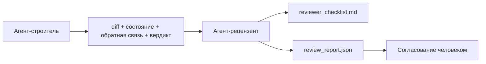

# Агент-рецензент (Reviewer Agent): Разделение строителя и проверяющего

> Агент, написавший код, не может его проверить. Рецензент — это второй цикл (loop) с другим системным промптом, другой целью и доступом только для чтения ко всему, что создал строитель. Разрыв между строителем и рецензентом — там, где живёт надёжность.

**Тип:** Сборка
**Языки:** Python (стандартная библиотека)
**Предусловия:** Фаза 14 · 38 (Проверочный шлюз (Verification Gate))
**Время:** ~55 минут

## Цели обучения

- Объяснить, почему один и тот же агент не может надёжно проверять собственную работу.
- Реализовать цикл агента-рецензента, который потребляет артефакты строителя и выдаёт структурированный отчёт проверки.
- Разработать рубрику проверки (reviewer rubric), оценивающую конкретные измерения, а не общее впечатление.
- Интегрировать рецензента в рабочую среду (workbench), чтобы шаг человеко-проверки начинался от реального артефакта, а не с чистого листа.

## Проблема

Вы просите агента исправить ошибку. Он редактирует четыре файла, запускает тесты и сообщает о завершении. Проверочный шлюз (Phase 14 · 38) подтверждает, что приёмочный тест (acceptance) был запущен, а область изменений (scope) соблюдена. Шлюз говорит `passed: true`. Вы мержите. Через два дня обнаруживаете, что исправление решило неправильную половину ошибки.

Приёмочный тест необходим, но недостаточен. Рецензент задаёт вопросы, которые приёмочный тест задать не может: было ли решена правильная задача? Не была ли область изменений расширена без пометки? Были ли задокументированы предположения, которые следовало поставить под сомнение? Оставлена ли рабочая среда в состоянии, из которого следующая сессия сможет продолжить?

## Концепция



### Рубрика рецензента

Пять измерений, каждое оценивается от 0 до 2.

| Измерение | Вопрос |
|-----------|--------|
| Соответствие задаче (Problem fit) | Решает ли изменение поставленную задачу, а не смежную? |
| Дисциплина области (Scope discipline) | Ограничивались ли правки рамками контракта, или контракт был расширен намеренно? |
| Предположения (Assumptions) | Все ли скрытые предположения задокументированы и доступны для проверки? |
| Качество проверки (Verification quality) | Действительно ли приёмочный тест доказывает достижение цели, или доказывает ослабленную версию? |
| Готовность передачи (Handoff readiness) | Сможет ли следующая сессия бесшовно продолжить работу в текущем состоянии? |

Общий балл — из 10. Набор ниже 7 — мягкий отказ (soft fail); набор ниже 5 — жёсткий отказ (hard fail).

### Рецензент — отдельная роль, а не отдельная модель

Рецензента можно запускать на той же модели, что и строителя. Дисциплина заключается в разделении ролей: другой системный промпт, другие входные данные, нет доступа на запись к diff. Смена позиции — это смена сигнала.

### Рецензент не может редактировать diff

Рецензент читает diff, состояние, обратную связь и вердикт. Он записывает отчёт. Он не патчит diff. Если в отчёте сказано «исправить это», следующий ход строителя выполняет исправление; рецензент возвращается к проверке. Смешение ролей уничтожает преимущества разрыва.

### Рубрика рецензента и проверочный шлюз

Шлюз (Phase 14 · 38) проверяет детерминированные факты: был ли запущён приёмочный тест, прошли ли правила, соблюдена ли область изменений. Рецензент делает качественные суждения: была ли это правильная работа, задокументирована ли она, пригодна ли передача для использования. Оба компонента обязательны.

## Сборка

`code/main.py` реализует:

- Датакласс `ReviewerInputs`, объединяющий артефакты, которые читает рецензент.
- Функцию оценки рубрики с одной функцией на измерение. Каждая функция детерминирована и представлена заглушкой; в реальной реализации она вызывала бы LLM.
- Запись `review_report.json` с пятью оценками, итоговым баллом и вердиктом (`pass`, `soft_fail`, `hard_fail`).
- Два демонстрационных сценария: корректное изменение и изменение «правильные тесты, неправильная задача».

Запуск:

```
python3 code/main.py
```

Вывод: два отчёта проверки, записанные на диск, и таблица баллов по измерениям в консоли.

## Продуктовые паттерны на практике

Доказательства: система AI Code Review от Cloudflare в апреле 2026 года выполнила 131 246 проверок по 48 095 запросам на слияние (merge request) в 5 169 репозиториях за 30 дней. Медианное время завершения проверки составило 3 минуты 39 секунд. До семи специализированных реценентов (безопасность, производительность, качество кода, документация, управление релизами, соответствие требованиям, Engineering Codex) работали параллельно под управлением Координатора проверок (Review Coordinator), который дедуплицировал результаты и определял степень серьёзности. Модель максимального уровня зарезервирована исключительно для координатора; специалисты работали на более дешёвых уровнях.

Четыре паттерна обеспечивают масштабируемость.

**Пул специалистов, а не один большой рецензент.** Один рецензент с пятиизмерительной рубрикой подходит для однопользовательских репозиториев. Когда кодовая база содержит критически важные с точки зрения безопасности компоненты, компоненты с высокими требованиями к производительности и документацию, её разделяют между специалистами с более компактными промптами. Координатор выполняет дедупликацию; специалисты никогда не используют полную рубрику. Разделение уровней модели получается автоматически: дешёвые специалисты, дорогой координатор.

**Снижение смещения (bias) как требование к дизайну, а не оптимизация.** Модели-судьи (LLM-as-a-Judge) демонстрируют четыре устойчивых смещения (Adnan Masood, апрель 2026): смещение позиции (GPT-4 ~40% несогласованности при смене порядка (A,B) на (B,A)), смещение многословности (~15% завышения оценок для более длинных выводов), предпочтение себя (судьи предпочитают выводы из того же семейства моделей) и авторитет (судьи завышают оценки ссылкам на известных авторов). Митигации: оценка в обоих порядках и подсчёт только согласованных побед; использование шкал 1–4, которые явным образом поощряют краткость; ротация судей между семействами моделей; удаление имён авторов перед подсчётом баллов.

**Калибровочный набор, а не общее впечатление.** Исторический набор из 10–20 задач с известными правильными вердиктами. Запускайте рецензента над этим набором при каждом изменении промпта. Если согласие с историческими данными падает ниже 80%, рубрику необходимо пересмотреть до развёртывания рецензента. Это то, что каждая команда в итоге переоткрывает для себя; лучше начать с этого сразу.

**Гибридный подход совместно со шлюзом.** Проверочный шлюз (Phase 14 · 38) обрабатывает детерминированные проверки (был ли запущён приёмочный тест, прошли ли тесты, соблюдена ли область изменений). Рецензент обрабатывает семантические проверки (была ли это правильная работа, задокументированы ли предположения, пригодна ли передача). Руководство Anthropic на 2026 год явно указывает на это разделение: не заставляйте рецензента повторять то, что уже доказал шлюз.

## Применение

Продуктовые паттерны:

- **Субагенты (subagents) Claude Code.** Субагент-рецензент запускается после того, как строитель завершает задачу. Он публикует комментарий к PR с оценками рубрики.
- **Передача (handoff) через OpenAI Agents SDK.** Строитель передаёт задачу Рецензенту при её завершении. Рецензент может передать обратно со списком замечаний или эскалировать к человеку.
- **Парирование двух моделей.** Строитель работает на более быстрой и дешёвой модели. Рецензент работает на более мощной модели с уменьшенным контекстом, сфокусированный на суждении.

Рецензент — это второй взгляд, который появляется в рабочей среде, когда люди не могут выполнять каждую проверку самостоятельно.

## Отправка

`outputs/skill-reviewer-agent.md` генерирует проектную рубрику рецензента, заглушку агента-рецензента, связанную с артефактами строителя, и интеграцию с проверочным шлюзом, чтобы человеко-проверка начиналась от написанного отчёта, а не с пустого листа.

## Упражнения

1. Добавьте шестое измерение, специфичное для вашего предметного домена. Обоснуйте, почему оно не поглощается существующими пятью.
2. Запустите рецензента с двумя различными системными промптами (лаконичный, многословный). Какой из них генерирует отчёт, который человек скорее прочитает?
3. Добавьте поле `confidence` для каждого измерения. Откажитесь от отправки отчёта, когда уверенность в наименее уверенном измерении ниже 0,6.
4. Создайте калибровочный набор: 10 исторических закрытий задач с известными правильными вердиктами. Запустите рецензента над ними. Где он не согласуется с историческими данными?
5. Добавьте механизм «запрос дополнительных доказательств»: рецензент может запросить у строителя конкретный прогон теста перед выставлением оценки. Какой правильный откат (back-off), чтобы это не зациклилось?

## Ключевые термины

| Термин | Что говорят | Что это на самом деле |
|--------|-------------|----------------------|
| Рубрика рецензента (Reviewer rubric) | «Чек-лист» | Пятиизмерительная оценка 0–2 с формулировкой вопроса для каждого измерения |
| Мягкий отказ (Soft fail) | «Требуются доработки» | Итоговый балл ниже 7; строитель получает замечания для устранения |
| Жёсткий отказ (Hard fail) | «Отклонение» | Итоговый балл ниже 5 или любое измерение с оценкой 0; остановка и эскалация к человеку |
| Разделение ролей (Role separation) | «Другой промпт» | Та же модель может выполнять обе роли; дисциплина заключается в входных данных и позиции |
| Порог уверенности (Confidence floor) | «Не отправляйте отчёты с низким сигналом» | Отказ от вынесения вердикта при неуверенности рубрики |

## Дополнительные материалы

- [Передача (handoff) через OpenAI Agents SDK](https://platform.openai.com/docs/guides/agents-sdk/handoffs)
- [Субагенты Claude Code от Anthropic](https://docs.anthropic.com/en/docs/agents-and-tools/claude-code/sub-agents)
- [Cloudflare, Orchestrating AI Code Review at Scale](https://blog.cloudflare.com/ai-code-review/) — архитектура из 7 специалистов + координатор, 131 тыс. запусков / 30 дней
- [Agent-as-a-Judge: Evaluating Agents with Agents (OpenReview / ICLR)](https://openreview.net/forum?id=DeVm3YUnpj) — бенчмарк DevAI, 366 иерархических требований к решению
- [Adnan Masood, Rubric-Based Evaluations and LLM-as-a-Judge: Methodologies, Biases, Empirical Validation](https://medium.com/@adnanmasood/rubric-based-evals-llm-as-a-judge-methodologies-and-empirical-validation-in-domain-context-71936b989e80) — 4 смещения и митигации
- [MLflow, LLM-as-a-Judge Evaluation](https://mlflow.org/llm-as-a-judge) — инструментарий для разделения строителя и оценщика
- [LangChain, How to Calibrate LLM-as-a-Judge with Human Corrections](https://www.langchain.com/articles/llm-as-a-judge) — рабочий процесс калибровочного набора
- [Evidently AI, LLM-as-a-judge: a complete guide](https://www.evidentlyai.com/llm-guide/llm-as-a-judge)
- [Arize, LLM as a Judge — Primer and Pre-Built Evaluators](https://arize.com/llm-as-a-judge/)
- Фаза 14 · 05 — Self-Refine и CRITIC (базовый вариант самопроверки одного агента)
- Фаза 14 · 30 — Разработка агентов на основе оценок (генератор калибровочного набора)
- Фаза 14 · 38 — проверочный шлюз, который читает рецензент
- Фаза 14 · 40 — пакет передачи (handoff), в который поступает отчёт рецензента
