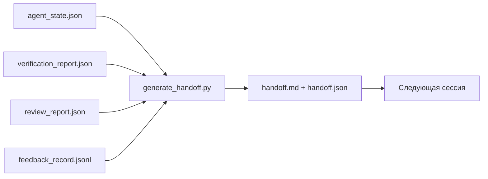

# Многосессионная передача (Multi-Session Handoff)

> Сессия (session) заканчивается. Работа — нет. Пакет передачи (handoff packet) — это артефакт (artifact), который превращает «агент (agent) работал час» в «следующая сессия продуктивна с первой минуты». Создавайте его осознанно, а не как последующую мысль.

**Тип:** Практическое задание
**Языки:** Python (stdlib)
**Предварительные требования:** Фаза 14 · 34 (Repo Memory), Фаза 14 · 38 (Verification), Фаза 14 · 39 (Reviewer)
**Время:** ~50 минут

## Цели обучения

- Определить семь полей, которые должен содержать каждый пакет передачи (handoff packet).
- Сгенерировать передачу из артефактов (artifacts) рабочего стола без ручного написания текста.
- Сократить большие журналы обратной связи (feedback) до сводки, пригодной для передачи.
- Сделать первое действие следующей сессии детерминированным.

## Проблема

Сессия заканчивается. Агент говорит: «отлично, мы продвинулись». Открывается следующая сессия. Следующий агент спрашивает: «на чём мы остановились?» Ответ первого агента утерян. Следующий агент заново открывает, заново запускает те же команды, заново задаёт человеку те же вопросы и тратит тридцать минут на восстановление последних тридцати секунд предыдущей сессии.

Цена плохой передачи (handoff) оплачивается на каждой сессии на протяжении всей жизни задачи. Решение — пакет (packet), автоматически генерируемый (generated) в конце сессии: что изменилось, почему, что было опробовано, что не сработало, что осталось, что делать первым делом в следующий раз.

## Концепция



### Семь полей, которые содержит каждая передача

| Поле | Какой вопрос отвечает |
|-------|---------------------|
| `summary` | Один абзац о том, что было сделано |
| `changed_files` | Обзор диффа (diff) |
| `commands_run` | Что было фактически выполнено |
| `failed_attempts` | Что было опробовано и почему это не сработало |
| `open_risks` | Что может создать проблемы в следующей сессии, с указанием серьёзности |
| `next_action` | Первый конкретный шаг, который выполняется в следующей сессии |
| `verdict_pointer` | Путь к отчётам о валидации (verification) и проверке (review) |

Поле `next_action` является несущим. Передача, содержащая всё кроме `next_action`, — это отчёт о состоянии, а не передача (handoff).

### Передачи генерируются, а не пишутся вручную

Передача, написанная вручную, — это передача, которую пропускают в тяжёлый день. Генератор (generator) считывает артефакты рабочего стола и формирует пакет. Задача агента — оставить рабочий стол в состоянии, которое генератор сможет обобщить, а не писать сводку самостоятельно.

### Две формы: для человека и для машины

`handoff.md` — это то, что читает человек. `handoff.json` — это то, что загружает следующий агент. Оба файла генерируются из одних и тех же исходных артефактов. Если они расходятся, приоритет имеет JSON.

### Сокращение журнала обратной связи

Полный `feedback_record.jsonl` может содержать сотни записей. Передача включает только последние K записей плюс каждую запись с ненулевым кодом завершения (exit). Следующая сессия загружает полный журнал при необходимости, но пакет остаётся компактным.

## Реализация

`code/main.py` реализует:

- Загрузчик (loader), собирающий состояние (state), результат проверки (verdict), отчёт ревью (review) и обратную связь (feedback) в единый `WorkbenchSnapshot`.
- Функцию `generate_handoff(snapshot) -> (markdown, payload)`.
- Фильтр, отбирающий последние K записей обратной связи плюс все записи с ненулевым кодом завершения.
- Демонстрационный запуск, записывающий `handoff.md` и `handoff.json` рядом со скриптом.

Запуск:

```
python3 code/main.py
```

Вывод: напечатанное тело передачи, а также оба файла на диске.

## Производственные паттерны в реальном мире

Codex CLI, Claude Code и OpenCode используют разные подходы к компактификации (compaction); структурированный пакет передачи (structured handoff packet) работает поверх всех трёх.

**Стратегии компактификации различаются; схема пакета — нет.** POST /v1/responses/compact от Codex CLI — это серверный непрозрачный AES-блок (быстрый путь для моделей (models) OpenAI); резервный вариант — локальная «сводка передачи» (handoff summary), добавляемая в виде сообщения `_summary` с ролью пользователя. Claude Code выполняет пятиэтапную прогрессивную компактификацию при 95% заполнении контекста (context). OpenCode использует скрытие сообщений на основе временных меток (timestamps) плюс сводку из 5 заголовков, сгенерированную LLM. Три разных механизма — одна и та же потребность: сериализовать то, что выживает после сжатия, в переносимый артефакт. Пакет и есть этот артефакт.

**Передача в новой сессии — это не компактификация.** Комактификация продлевает сессию; передача (handoff) корректно закрывает одну и открывает следующую. Формулировка из Hermes Issue #20372 (апрель 2026) верна: когда сжатие на месте начинает ухудшать качество, агент должен записать компактную передачу, завершить сессию и возобновить работу в чистом контексте. Пакет делает этот переход недорогим. Ошибка — продолжать сжимать до тех пор, пока качество не рухнет; решение — планировать раннюю, чистую передачу.

**Одна активная передача на ветку (branch) и тему.** Координация мультиагентных систем (multi-agent coordination) ломается на устаревших передачах чаще, чем из-за плохого вывода модели. Всегда включайте `branch`, `last_known_good_commit` и `status` со значением `active | superseded | archived`. Устаревшие передачи архивируются; только активная управляет следующей сессией. Это различие между передачей-как-заметкой и передачей-как-состоянием.

**Завершайте при 50–75% заполнении контекста, а не у стены.** Практический паттерн с ручным написанием (CLAUDE.md + HANDOVER.md) показывает лучшие результаты, когда сессия завершается при 50–75% использовании контекстного бюджета, а не при 95%. Генератор пакета запускается чисто до того, как артефакты компактификации загрязняют исходное состояние. Дешёво писать, пока контекст цел; дорого, когда модель уже теряет нить.

## Применение

Производственные паттерны:

- **Хук (hook) завершения сессии.** Среда выполнения (runtime) запускает генератор, когда пользователь закрывает чат. Пакет сохраняется в `outputs/handoff/<session_id>/`.
- **Шаблон PR.** Markdown-вывод генератора также является телом PR. Ревьюеры читают его, не открывая пять других файлов.
- **Передача между агентами (cross-agent handoff).** Создайте в одном продукте (Claude Code), продолжите в другом (Codex). Пакет является лингва-франка (lingua franca).

Пакет компактен, регулярен и дешёв в производстве. Экономия накапливается с каждой сессией.

## Доставка

`outputs/skill-handoff-generator.md` создаёт генератор, настроенный на пути к артефактам проекта, хук завершения сессии, запускающий его, и схему `handoff.json`, которую следующий агент загружает при запуске.

## Упражнения

1. Добавьте поле `assumptions_to_validate`, выводящее каждое допущение (assumption), которое автор зафиксировал, но рецензент (reviewer) не оценил выше 1.
2. По-разному сокращайте сводку обратной связи для неудачных и успешных запусков. Обоснуйте асимметрию.
3. Включите список «вопросы к человеку». Какой порог для того, чтобы вопрос попал в пакет, а не в сообщение чата?
4. Сделайте генератор идемпотентным (idempotent): два запуска дают один и тот же пакет. Что должно быть стабильным для этого?
5. Добавьте раздел «предварительные требования следующей сессии», перечисляющий именно те артефакты, которые следующая сессия должна загрузить перед действием.

## Ключевые термины

| Термин | Что говорят | Что это означает |
|------|----------------|------------------------|
| Пакет передачи (handoff packet) | «Сводка сессии» | Сгенерированный артефакт, содержащий семь полей — и в Markdown, и в JSON |
| Следующее действие (next action) | «Что делать первым» | Единственный конкретный шаг, запускающий следующую сессию |
| Сокращение обратной связи (feedback trim) | «Сводка журнала» | Последние K записей плюс все записи с ненулевым кодом завершения |
| Отчёт о состоянии (status report) | «Что мы сделали» | Документ без поля `next_action`; полезный, но не передача (handoff) |
| Указатель на вердикт (verdict pointer) | «Квитанция» | Путь к отчётам о валидации и проверке для прослеживаемости (traceability) |

## Дополнительные материалы

- [Anthropic, Effective harnesses for long-running agents](https://www.anthropic.com/engineering/effective-harnesses-for-long-running-agents)
- [OpenAI Agents SDK handoffs](https://platform.openai.com/docs/guides/agents-sdk/handoffs)
- [Codex Blog, Codex CLI Context Compaction: Architecture, Configuration, Managing Long Sessions](https://codex.danielvaughan.com/2026/03/31/codex-cli-context-compaction-architecture/) — POST /v1/responses/compact и локальный резервный вариант
- [Justin3go, Shedding Heavy Memories: Context Compaction in Codex, Claude Code, OpenCode](https://justin3go.com/en/posts/2026/04/09-context-compaction-in-codex-claude-code-and-opencode) — сравнение компактификации у трёх поставщиков
- [JD Hodges, Claude Handoff Prompt: How to Keep Context Across Sessions (2026)](https://www.jdhodges.com/blog/ai-session-handoffs-keep-context-across-conversations/) — CLAUDE.md + HANDOVER.md, контекстный бюджет 50–75%
- [Mervin Praison, Managing Handoffs in Multi-Agent Coding Sessions: Fresh Context Without Losing Continuity](https://mer.vin/2026/04/managing-handoffs-in-multi-agent-coding-sessions-fresh-context-without-losing-continuity/) — формулировка с позиции распределённых систем
- [Hermes Issue #20372 — автоматическая многосессионная передача при рискованном сжатии](https://github.com/NousResearch/hermes-agent/issues/20372)
- [Hermes Issue #499 — Context Compaction Quality Overhaul](https://github.com/NousResearch/hermes-agent/issues/499) — промпты для передачи в Codex CLI
- [Microsoft Agent Framework, Compaction](https://learn.microsoft.com/en-us/agent-framework/agents/conversations/compaction)
- [OpenCode, Context Management and Compaction](https://deepwiki.com/sst/opencode/2.4-context-management-and-compaction)
- [LangChain, Context Engineering for Agents](https://www.langchain.com/blog/context-engineering-for-agents)
- Фаза 14 · 34 — файл состояния, который считывает генератор
- Фаза 14 · 38 — результат валидации (verification verdict), на который ссылается пакет
- Фаза 14 · 39 — отчёт ревью, включённый в пакет
