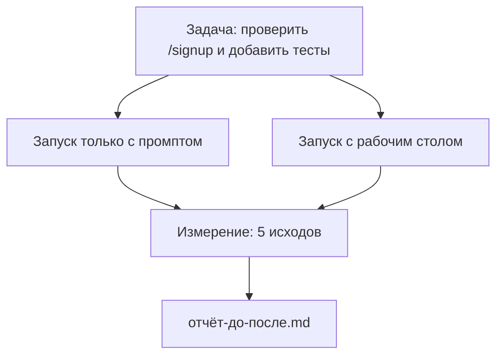

# Рабочий стол на реальном репозитории

> Одиннадцать уроков об интерфейсах (surfaces) не стоят ничего, если они не выдерживают контакта с реальной кодовой базой. В этом уроке одна и та же задача запускается дважды на небольшом приложении-примере: только промпт (prompt-only) versus рабочий стол с сопровождением (workbench-guided). Цифры говорят сами за себя.

**Тип:** Разработка
**Языки:** Python (stdlib)
**Предварительные требования:** Этапы 14 · 32 по 14 · 40
**Время:** ~60 минут

## Цели обучения

- Объединить семь интерфейсов (surfaces) рабочего стола (workbench) на небольшом приложении.
- Запустить одну и ту же задачу дважды (только промпт и рабочий стол с сопровождением) и измерить пять исходов.
- Прочитать отчёт «до/после» (before/after report) и определить, какие интерфейсы дали наибольший эффект.
- Защитить рабочий стол (workbench) от возражения «а мой и так хорошо работает».

## Проблема

Демонстрация на игрушечной задаче никого не убеждает. Рабочий стол (workbench) оправдывает себя, когда реалистичная задача на реалистичном репозитории попадает в продакшн (production) с меньшим количеством сбоев, меньшим числом откатов и пакетом (packet), который может использовать следующая сессия.

Этот урок предоставляет такой реалистичный репозиторий и запускает одну и ту же задачу через оба конвейера (pipeline). Результат — отчёт «до/после», который можно показать скептику.

## Концепция



### Приложение-пример

Минимальный обработчик в стиле FastAPI в `sample_app/`:

- `app.py` с `/signup` (без валидации (validation) на данный момент).
- `test_app.py` с одним тестом основного сценария (happy-path).
- `README.md` и `scripts/release.sh` как приманка для зон запрета (forbidden-zone bait).

### Задача

> Добавить валидацию (validation) входных данных к `/signup`: отклонять пароли короче 8 символов, возвращать 422 с типизированным конвертом ошибок (typed error envelope). Добавить тест, подтверждающий новое поведение.

### Два конвейера (pipeline)

Только промпт:

1. Прочитать README.
2. Прочитать `app.py`.
3. Редактировать файлы.
4. Объявить готовность.

Рабочий стол с сопровождением (workbench-guided):

1. Запустить скрипт инициализации (Урок 35).
2. Прочитать контракт области (scope contract) (Урок 36).
3. Прочитать состояние (state) (Урок 34).
4. Редактировать только разрешённые файлы.
5. Запустить команду приёмки (acceptance command) через средство обратной связи (feedback runner) (Урок 37).
6. Запустить проверочный шлюз (verification gate) (Урок 38).
7. Запустить ревьюера (reviewer) (Урок 39).
8. Сформировать передачу (handoff) (Урок 40).

### Пять измеряемых исходов

| Исход | Почему это важно |
|---------|----------------|
| `tests_actually_run` | Утверждения о «пройденных тестах» в большинстве случаев не проверяемы |
| `acceptance_met` | Тест, доказывающий достижение цели, должен быть тем тестом, который действительно выполнился |
| `files_outside_scope` | Неконтролируемое расширение области (scope creep) — основная скрытая проблема |
| `handoff_quality` | Следующая сессия платит за или выигрывает от этого |
| `reviewer_total` | Качественная оценка поверх шлюза (gate) |

## Реализация

`code/main.py` координирует оба конвейера (pipeline) над одним и тем же приложением-примером (sample app fixture). Оба конвейера выполнены скриптово (без LLM в цикле (in the loop)), поэтому измерения воспроизводимы. Скрипт записывает сравнение в `before-after-report.md` и `comparison.json`.

Запуск:

```
python3 code/main.py
```

Выходные данные: консольная таблица исходов по каждому конвейеру, отчёт в markdown, сохранённый рядом со скриптом, и JSON для тех, кто хочет построить график.

## Паттерны продакшна (production) в реальном мире

Вопрос скептика: «а насколько рабочий стол (workbench) действительно помогает?» Цифры 2026 года говорят гораздо больше, чем объяснение.

**Terminal Bench — из Top-30 в Top-5 на той же модели.** LangChain, *Anatomy of an Agent Harness* (апрель 2026): агент-программист поднялся извне Top-30 на пятое место в Terminal Bench 2.0, изменив только каркас (harness). Та же модель. Другие интерфейсы. Разница в 25 позиций.

**Vercel — с 80% до 100% за счёт удаления инструментов.** Vercel сообщило, что удаление 80% инструментов агента (agent) повысило показатель успеха с 80% до 100%. Меньшая поверхность инструментов, более чёткая область, меньше способов ошибиться. Побеждает негативное пространство.

**Harvey — удвоение точности (2x accuracy) только за счёт каркаса (harness).** Юридические агенты более чем удвоили свою точность благодаря оптимизации каркаса, без изменения модели (model).

**88% проектов корпоративных агентов (AI agent) не доходят до продакшна (production).** Статья preprints.org *Harness Engineering for Language Agents* (март 2026) связывает неудачи с ошибками времени выполнения (runtime), а не с рассуждением (reasoning): устаревшее состояние (state), хрупкие повторные попытки (retries), разбухший контекст, плохое восстановление после промежуточных ошибок.

**Схлопывание длинного контекста (long-context collapse).** Базовый показатель WebAgent 40–50% падает ниже 10% в условиях длинного контекста — преимущественно из-за бесконечных циклов (loops) и потери цели. «Ральф-цикл» (Ralph Loop) и пакет передачи (handoff packet) существуют именно для этого.

**Ложные срабатывания (false negatives) всё ещё существуют.** Одношаговые фактические задачи, однострочные линтеры, форматтеры, всё, что модель (model) выучила буквенно — всё это быстрее при запуске только с промптом. Бенчмарк (benchmark) должен честно перечислять такие случаи, чтобы рабочий стол (workbench) не выглядел избыточным.

Вывод не в том, что «каркас (harness) побеждает навсегда». Модели (models) со временем перенимают приёмы каркаса. Вывод в том, что сегодня инженерная нагрузка сосредоточена в семи интерфейсах (surfaces), и цифры это подтверждают.

## Применение

Этот урок — тот самый документ-аргумент, который вы приводите, когда:

- Кто-то спрашивает, почему каждый PR содержит `agent-rules.md` и контракт области (scope contract).
- Команда хочет отключить проверочный шлюз (verification gate) «только на этот спринт».
- Запускается новый продукт на базе агентов (agent product), и вам нужен универсальный бенчмарк (benchmark), чтобы понять, действительно ли он экономит время.

Цифры убедительнее объяснений.

## Отправка

`outputs/skill-workbench-benchmark.md` — это переносимое средство оценки (evaluation harness), которое запускает любой продукт на базе агентов через оба конвейера (pipeline) над собственным приложением-примером проекта и сообщает о пяти исходах.

## Упражнения

1. Добавьте шестой исход: время до первого осмысленного редактирования (time-to-first-meaningful-edit). Как измерить его корректно?
2. Запустите сравнение на реальной задаче второго дня в вашей кодовой базе. Где цифры рабочего стола (workbench) проседают?
3. Добавьте проход «ложных срабатываний» (false negative): задачи, где запуск только с промптом был бы быстрее, а накладные расходы рабочего стола (workbench overhead) — реальны. Обоснуйте, почему рабочий стол стоит сохранить.
4. Замените скриптового «агента» на реальный вызов LLM. Какие исходы становятся более шумными (noisier)?
5. Напишите одностораничную сводку для неинженера. Что выдерживает сокращение?

## Ключевые термины

| Термин | Что говорят | Что на самом деле |
|------|----------------|------------------------|
| Приложение-пример (Sample app) | «Игрушечный репозиторий» | Небольшое, но достаточно реалистичное, чтобы задействовать все семь интерфейсов (surfaces) |
| Конвейер (Pipeline) | «Воркфлоу (workflow)» | Упорядоченная последовательность чтений/записей интерфейсов (surfaces), которой следует агент (agent) |
| Отчёт «до/после» (Before/after report) | «Доказательства» | Артефакт, который вы показываете скептику |
| Ложное срабатывание (False negative) | «Избыточность рабочего стола» | Задачи, где запуск только с промптом был бы быстрее; полезно честно перечислить |
| Бенчмарк рабочего стола (Workbench benchmark) | «Показатель надёжности» | Переносимое средство (harness), запускающее сравнение на вашей кодовой базе |

## Дополнительные материалы

- [LangChain, The Anatomy of an Agent Harness](https://blog.langchain.com/the-anatomy-of-an-agent-harness/) — путь из Top-30 в Top-5 в Terminal Bench
- [MongoDB, The Agent Harness: Why the LLM Is the Smallest Part of Your Agent System](https://www.mongodb.com/company/blog/technical/agent-harness-why-llm-is-smallest-part-of-your-agent-system) — цифры Vercel и Harvey
- [preprints.org, Harness Engineering for Language Agents](https://www.preprints.org/manuscript/202603.1756) — 88% неудач в корпоративном секторе, корневые причины на уровне runtime
- [HN: Improving 15 LLMs at Coding in One Afternoon. Only the Harness Changed](https://news.ycombinator.com/item?id=46988596) — воспроизведено на 15 моделях
- [Cloudflare, Orchestrating AI Code Review at Scale](https://blog.cloudflare.com/ai-code-review/) — 131 тыс. ревью за 30 дней в продакшне (production)
- [Anthropic, Building Effective Agents](https://www.anthropic.com/research/building-effective-agents)
- Этапы 14 · 32 по 14 · 40 — интерфейсы (surfaces), которые этот урок задействует от начала до конца
- Этап 14 · 19 — SWE-bench, GAIA, AgentBench как макро-бенчмарки (macro benchmarks), дополняющие этот урок
- Этап 14 · 30 — агентная разработка на основе оценки (eval-driven agent development), в которую встраивается этот каркас (harness)
