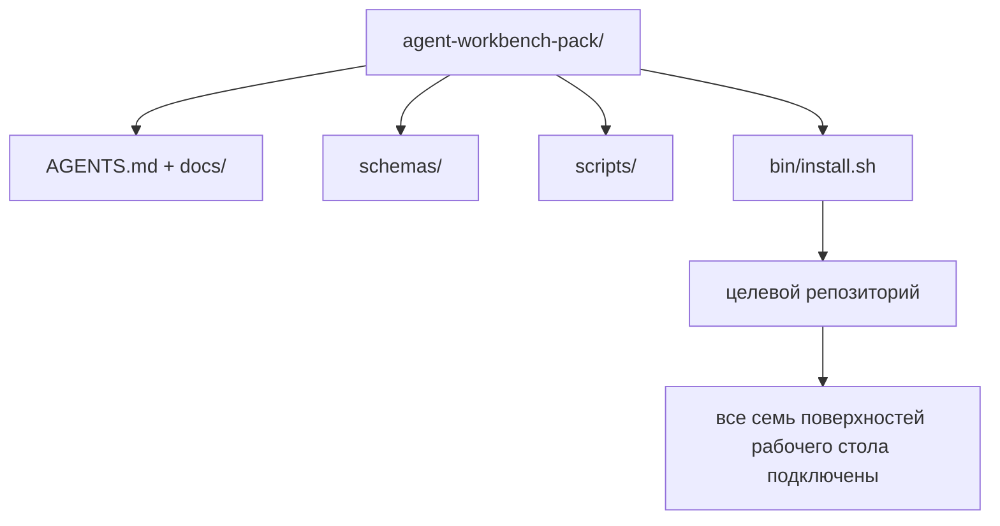

# Капстон (Capstone): Создание переиспользуемого пакета рабочего стола агента

> Мини-трек завершается пакетом (pack), который вы помещаете в любой репозиторий. Одиннадцать уроков поверхностей сжимаются в каталог, который можно скопировать через `cp -r` и получить работающего агента к следующему утру. Капстон — это артефакт, на котором строится эта учебная программа.

**Тип:** Сборка
**Языки:** Python (стандартная библиотека)
**Предварительные требования:** Фазы 14 · 31 по 14 · 41
**Время:** ~75 минут

## Цели обучения

- Упаковать семь поверхностей (surfaces) рабочего стола в один подключаемый каталог.
- Зафиксировать схемы, скрипты и шаблоны так, чтобы новый репозиторий получал проверенную базу.
- Добавить единственный скрипт установки (installer), который разворачивает пакет идемпотентно (idempotently).
- Решить, что остаётся в пакете, а что нет, и обосновать каждое решение.

## Проблема

Рабочий стол (workbench), который живёт в Google-документе, истории чата и трёх наполовину забытых скриптах, — это рабочий стол, который пересобирается каждый квартал. Решением является пакет с контролем версий (versioned pack): репозиторий или каталог с поверхностями, схемами, скриптами и установщиком из одной команды.

В конце этого урока у вас будет `outputs/agent-workbench-pack/` на диске и `bin/install.sh`, который разворачивает пакет в любой целевой репозиторий.

## Концепция



### Структура пакета

```
outputs/agent-workbench-pack/
├── AGENTS.md
├── docs/
│   ├── agent-rules.md
│   ├── reliability-policy.md
│   ├── handoff-protocol.md
│   └── reviewer-rubric.md
├── schemas/
│   ├── agent_state.schema.json
│   ├── task_board.schema.json
│   └── scope_contract.schema.json
├── scripts/
│   ├── init_agent.py
│   ├── run_with_feedback.py
│   ├── verify_agent.py
│   └── generate_handoff.py
├── bin/
│   └── install.sh
└── README.md
```

### Что включается, а что нет

В пакет включаются:

- Схемы поверхностей. Они являются контрактом.
- Четыре скрипта выше. Они являются средой выполнения (runtime).
- Четыре документа. Они являются правилами и критериями оценки.

В пакет не включаются:

- Задачи конкретного проекта. Задачи принадлежат доске целевого репозитория, а не пакету.
- Вызовы SDK сторонних поставщиков. Пакет не зависит от фреймворка (framework-agnostic).
- Текст ознакомления. Пакет живёт рядом с существующим ознакомлением команды, а не внутри него.

### Установщик

Короткий `bin/install.sh` (или `bin/install.py`):

1. Отказывает устанавливать поверх существующего пакета без флага `--force`.
2. Копирует пакет в целевой репозиторий.
3. Настраивает CI, если существует `.github/workflows/`.
4. Выводит следующие шаги: заполнить доску, задать команды приёмки (acceptance commands), запустить скрипт инициализации.

### Контроль версий (Versioning)

Пакет содержит файл `VERSION`. Изменения схем и скриптов, требующие миграций, увеличивают мажорную версию. Изменения только в документации увеличивают патч-версию. Файл `agent_state.json` целевого репозитория записывает, с какой версией пакета он был инициализирован.

## Сборка

`code/main.py` собирает пакет в `outputs/agent-workbench-pack/` рядом с уроком, заполняя его схемами и скриптами из предыдущих уроков мини-трека и документами, которые вы уже написали.

Запуск:

```
python3 code/main.py
```

Скрипт копирует и фиксирует поверхности, записывает README, выводит дерево пакета и завершается с кодом 0. Повторный запуск является идемпотентным.

## Производственные паттерны в реальных проектах

Пакет ценен только тогда, когда он выживает при форках, обновлениях и недружелюбном upstream. Четыре паттерна обеспечивают это.

**`VERSION` — это контракт, а не маркетинг.** Увеличение мажорной версии требует миграции состояния. Увеличение минорной версии требует повторного запуска проверки (checker). Патч-версии — только для документации. Установщик записывает `.workbench-version` в целевой репозиторий при каждой установке; `lint_pack.py` отказывается выпускать, если заблокированная версия целевого репозитория не совпадает с `VERSION` пакета. Именно так `npm`, `Cargo` и `pyproject.toml` выдерживают 10 лет изменений; ничего в агентах не меняет эти правила.

**Единый источник для распределения между инструментами.** Nx выпускает одну команду `nx ai-setup`, которая разворачивает `AGENTS.md`, `CLAUDE.md`, `.cursor/rules/`, `.github/copilot-instructions.md` и MCP-сервер из единой конфигурации. Пакет должен делать то же самое; установщик создаёт символические ссылки (`ln -s AGENTS.md CLAUDE.md`), чтобы единый источник правды распространялся на каждый кодирующий агент. Разделение пакета для поддержки одного инструмента вместо другого является режимом отказа.

**`uninstall.sh`, который отказывается при нетривиальном состоянии.** Удаление пакета не должно удалять `agent_state.json`, `task_board.json` или `outputs/` пользователя. Деинсталлятор удаляет схемы, скрипты, документы и `AGENTS.md` (с возможностью отключения через `--keep-agents-md`) и отказывается продолжать, если файлы состояния имеют какие-либо незакоммиченные изменения. Состояние принадлежит пользователю; пакет не владеет им.

**Навык как публикуемый продукт. Распределение в стиле SkillKit.** Пакет выпускается как навык SkillKit (skill): `skillkit install agent-workbench-pack` разворачивает его для 32 ИИ-агентов из единого источника. Репозиторий пакета является источником правды; SkillKit — каналом распределения. Зависимость от поставщика исчезает; семь поверхностей остаются неизменными.

## Использование

Три способа распространения пакета:

- **Как каталог, который вы помещаете в репозиторий.** `cp -r outputs/agent-workbench-pack /path/to/repo`.
- **Как публичный шаблонный репозиторий.** Форк и настройка, с контролем отклонения через `VERSION`.
- **Как навык SkillKit.** Подключён к вашему продукту агента, так что одна команда разворачивает его.

Пакет — это рецепт. Каждая установка — это порция.

## Отправка

`outputs/skill-workbench-pack.md` генерирует пакет, настроенный под проект: правила уточнены под историю команда, glob-паттерны области (scope) сопоставлены с репозиторием, измерения рубрики дополнены одним доменно-специфичным записью.

## Упражнения

1. Решите, какой необязательный пятый документ заслуживает включения в канонический пакет. Обоснование.
2. Перепишите установщик на Python с флагом `--dry-run`. Сравните удобство использования с bash.
3. Добавьте `bin/uninstall.sh`, который безопасно удаляет пакет и отказывается, если файлы состояния имеют нетривиальную историю. Что считается нетривиальным?
4. Добавьте `lint_pack.py`, который падает, когда пакет отклоняется от `VERSION`. Подключите его в CI репозитория пакета.
5. Составьте руководство по миграции (migration runbook) от самодельного рабочего стола к этому пакету. Какой порядок действий минимизирует время простоя?

## Ключевые термины

| Термин | Что говорят люди | Что это на самом деле |
|--------|------------------|----------------------|
| Пакет рабочего стола (Workbench pack) | «Стартовый набор» | Каталог с контролем версий, содержащий все семь поверхностей |
| Установщик (Installer) | «Скрипт настройки» | `bin/install.sh`, который разворачивает пакет идемпотентно |
| Версия пакета (Pack version) | «VERSION» | Мажорная — при изменениях схем/скриптов, патч — только для документации |
| Подключаемый пакет (Drop-in pack) | «cp -r и готово» | Пакет работает без настройки под конкретный репозиторий в первый же день |
| Форкабельный шаблон (Forkable template) | «GitHub-шаблон» | Публичный репозиторий, который можно клонировать через «Use this template» на GitHub |

## Дополнительное чтение

- Фазы 14 · 31 по 14 · 41 — каждая поверхность, которую этот пакет объединяет
- [SkillKit](https://github.com/rohitg00/skillkit) — установка этого навыка для 32 ИИ-агентов
- [Nx Blog, Teach Your AI Agent How to Work in a Monorepo](https://nx.dev/blog/nx-ai-agent-skills) — генератор из единого источника для шести инструментов
- [agents.md — открытая спецификация](https://agents.md/) — что должен реализовать роутер вашего пакета
- [HKUDS/OpenHarness](https://github.com/HKUDS/OpenHarness) — эталонная реализация пакета
- [andrewgarst/agentic_harness](https://github.com/andrewgarst/agentic_harness) — эталонная реализация с хранилищем Redis и набором оценки
- [Augment Code, A good AGENTS.md is a model upgrade](https://www.augmentcode.com/blog/how-to-write-good-agents-dot-md-files) — планка качества документации пакета
- [Anthropic, Effective harnesses for long-running agents](https://www.anthropic.com/engineering/effective-harnesses-for-long-running-agents)
- [Anthropic, Harness design for long-running application development](https://www.anthropic.com/engineering/harness-design-long-running-apps)
- Фаза 14 · 30 — разработка агентов на основе оценки (eval-driven agent development), использующая контрольную точку верификации пакета
- Фаза 14 · 41 — до/после бенчмарк, который этот пакет улучшает
