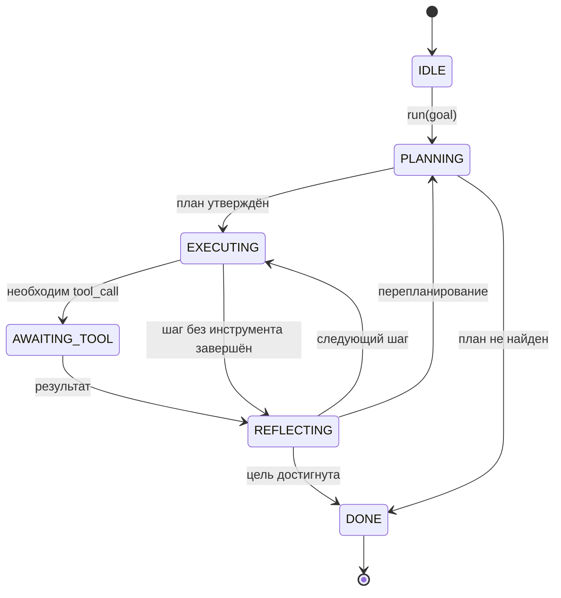

# Контракт (Contract) цикла (Loop) обвязки (Harness) агента

> Обвязка (harness) — это агент. Модель — это сопроцессор. В этом уроке мы фиксируем контракт цикла, в который можно подключить любую модель.

**Тип:** Практическая работа
**Языки:** Python
**Предварительные требования:** Уроки 01–07 фазы 13, урок 01 фазы 14
**Время:** ~90 минут

## Цели обучения
- Описать цикл обвязки агента как детерминированную конечную автомат (state machine) с явными переходами.
- Реализовать десять тем жизненного цикла хуков (hooks), через которые операторы подключают политики, телеметрию и ограничения.
- Определить две точки (pull points), в которых цикл возвращает управление вызывающему коду и возобновляется при поступлении нового входа.
- Реализовать бюджеты на уровне сессии (количество ходов, вызовов инструментов, время в секундах) без утечки частичного состояния при превышении.
- Формировать типизированный поток из одиннадцати типов событий, чтобы интерфейсы и трассировщики могли подписываться, не обращаясь напрямую к циклу.

## Рамки

Кодирующий агент, который работает без вмешательства на сорок ходов, — это не чат-цикл. Это конечный автомат, узлы которого оператор может перехватывать, а дуги — аудировать. Как только вы записываете контракт, замена моделей, инструментов или политик перестаёт быть рефакторингом и становится вызовом функции регистрации.

В этом уроке мы создаём этот контракт. Мы определяем шесть состояний, десять тем хуков, две точки возврата, одиннадцать типов событий и бюджетную модель. Всё остальное в обвязке (реестр инструментов, JSON-RPC транспорт, диспетчер, планировщик) подключается к этой структуре.

## Состояния

Цикл имеет шесть состояний. Пять из них активные. Одно — терминальное.



`IDLE` — единственная допустимая начальная точка. `DONE` — единственная допустимая конечная точка. `AWAITING_TOOL` — единственное состояние, в котором цикл уступает точку возврата. Все остальные переходы являются внутренними.

Конечный автомат детерминирован. При одинаковом журнале событий обвязка повторно входит в то же самое состояние. Это свойство позволяет воспроизводить сессии для отладки без повторного вызова модели.

## Темы хуков

Хуки (hooks) — это точка вмешательства оператора в цикл. Обвязка генерирует десять тем. Каждая тема принимает любое количество подписчиков. Подписчики выполняются в порядке регистрации. Подписчик может изменить полезную нагрузку, вызвать прерывание хода или вернуть маркер пропуска следующего шага.

```text
before_plan         after_plan
before_tool_call    after_tool_call
before_step         after_step
on_error
on_pause
on_budget_exceeded
on_complete
```

Такая структура соответствует тому, к чему пришли Claude Code, Cursor и OpenCode к середине 2025 года. Названия описательные, а не брендовые. Хук, блокирующий `rm -rf`, находится в `before_tool_call`. Хук, отправляющий спан OpenTelemetry, находится в `after_step`. Хук, возобновляющий приостановленную сессию, находится в `on_pause`.

## Точки возврата

Цикл уступает управление дважды. Первый раз — в `AWAITING_TOOL`, когда он не может продвинуться без результата инструмента. Второй раз — в `on_pause`, когда бюджет исчерпан или хук явно запросил проверку оператором.

Точка возврата — это не исключение. Это возврат. Вызывающий код проверяет состояние обвязки, загружает то, что запросила обвязка, и вызывает `resume(payload)`. Обвязка продолжает с того места, где остановилась. Это та же самая структура, что и у генератора Python. Транспорт над точкой возврата — на ваш выбор. В TUI это нажатие клавиши. Через MCP это `tools/call`. Через очередь это опрос задания.

## Поток событий

Цикл добавляет события в типизированный поток в определённых точках контракта. Поток доступен только для добавления, и подписчики могут воспроизводить его с любого смещения. Одиннадцать реализованных типов событий:

- `session.start` — генерируется один раз при вызове `run(goal)`
- `plan.draft` — генерируется, когда планировщик возвращает черновой план
- `plan.commit` — генерируется после утверждения черновика как активного плана
- `step.start` — генерируется в начале каждого выполняемого шага
- `step.end` — генерируется в конце каждого выполняемого шага
- `tool.call` — генерируется, когда шаг, требующий инструмента, уступает управление вызывающему коду
- `tool.result` — генерируется при возобновлении с результатом инструмента
- `tool.error` — генерируется при возобновлении с ошибкой или когда хук прерывает вызов
- `budget.warn` — генерируется при достижении бюджетного ограничения
- `session.pause` — генерируется, когда цикл уступает управление из-за паузы (бюджет или хук)
- `session.complete` — генерируется один раз при достижении циклом состояния `DONE`

События не дублируют полезные нагрузки хуков. Хуки — императивные (изменяют, прерывают). События — наблюдательные (фиксируют, передают). Рассматривайте их как ортогональные.

## Бюджетная модель

Сессия несёт три ограничения: количество ходов, количество вызовов инструментов и время выполнения в секундах. Каждый ход увеличивает счётчик ходов на единицу. Каждый вызов инструмента увеличивает счётчик вызовов на единицу. Время выполнения проверяется при каждом переходе состояния. При достижении любого ограничения цикл генерирует `on_budget_exceeded`, формирует `budget.warn`, а затем переходит в `IDLE` с указанием причины превышения бюджета на следующей точке возврата.

Бюджет — это не аварийное отключение. Это уступка. Вызывающий код решает — продлить бюджет и возобновить выполнение или закрыть сессию.

## Что этот урок не делает

Он не вызывает модель. Он не регистрирует реальные инструменты. Он не реализует транспорт. Это следующие четыре урока. Этот урок фиксирует контракт, чтобы следующие четыре могли подключиться к нему без переписывания.

Детерминированный планировщик в `main.py` — это заглушка. Он возвращает зашитый план из трёх шагов, два из которых требуют результата инструмента. Суть — в цикле, а не в плане.

## Как читать код

`HarnessLoop` — основной класс. Он хранит состояние, генерирует хуки, формирует события. `Budget` отслеживает ограничения. `Event` — типизированная обёртка в потоке. `HookRegistry` — таблица диспетчеризации. `_transition` — единственная функция, изменяющая состояние, поэтому инварианты конечного автомата собраны в одном месте.

Читайте `main.py` сверху вниз. Затем прочитайте `code/tests/test_loop.py`. Тесты фиксируют каждый переход и порядок вызова каждого хука.

## Дальнейшее развитие

Самая сложная часть создания обвязки в продакшене — это не конечный автомат. Это обеспечение выполнимости контракта. Контракт должен выдерживать горячую перезагрузку планировщика. Он должен выдерживать инструмент, возвращающий некорректный JSON. Он должен выдерживать хук, который вызывает исключение в `before_tool_call` на двух третях сессии из сорока ходов. Тесты в этом уроке проверяют именно эти сценарии сбоев. Запускайте их. Ломайте их. Добавляйте тесты.

Следующий урок добавляет реестр инструментов. Затем — JSON-RPC транспорт. Затем — диспетчер. К уроку двадцать четыре цикл в этом файле будет выполнять реальный план с реальными инструментами и реальными бюджетами.
