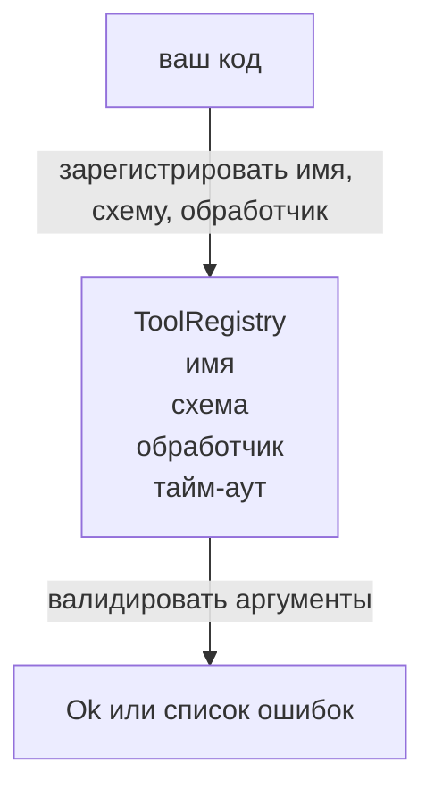

# Реестр (registry) инструментов с валидацией схемы (schema validation)

> Инструмент, который агент не может проверить, — это инструмент, который агент не может вызвать. Постройте реестр и проверку схемы до того, как вы начнёте создавать инструменты.

**Тип:** Сборочный проект
**Языки:** Python
**Предварительные требования:** Фаза 13, уроки 01–07; фаза 14, урок 01
**Время:** ~90 минут

## Цели обучения
- Иметь типизированный реестр соответствия «имя инструмента → схема → обработчик», к которому диспетчер может обратиться один раз и далее ему доверять.
- Реализовать подмножество JSON Schema 2020-12, охватывающее ключевые слова, которые используются в девяноста процентах вызовов инструментов на практике.
- Возвращать точные пути ошибок в формате JSON Pointer, чтобы модель могла исправиться за один проход.
- Отклонять повторную регистрацию без явного указания `override`, поскольку незаметная перезапись — именно то, как каталог инструментов в продакшене уходит от истины.
- Сохранять валидатор чистым (без ввода-вывода, без времени, без глобальных переменных), чтобы его можно было повторно запускать по журналу воспроизведения.

## Почему реестр предшествует инструменту

Кодовый агент в 2026 году имеет больше зарегистрированных инструментов, чем модель может вместить в одно окно контекста. Нетривиальная оболочка зарегистрирует двести инструментов и выведет от десяти до сорока на каждом ходе. Реестр является источником истины для вопросов: «какие инструменты существуют», «какую форму имеют их аргументы» и «какой обработчик я должен вызвать». Как только эти три ответа зафиксированы, остальная часть оболочки может перестать гадать.

Ошибка, которую мы хотим избежать, — это выпуск обработчиков без схем или выпуск схем без валидации. И то и другое встречается на практике. И то и другое превращает следующий уровень (диспетчер из урока двадцать три) в игру угадывания, где единственный режим отказа — это стек-трейс из обработчика.

## Как выглядит запись инструмента

```text
ToolRecord
  name        : str          (уникальное, строчные буквы, цифры и подчёркивания, сегменты разделены точками, например, snake_case.segment.case)
  description : str          (одна строка, показывается модели)
  schema      : dict         (подмножество JSON Schema 2020-12)
  handler     : Callable     (асинхронный или синхронный, возвращает Any)
  idempotent  : bool         (диспетчер использует это для решений о повторных попытках)
  timeout_ms  : int          (переопределение значения по умолчанию для конкретного инструмента)
```

Схема — это единственное поле, которое валидатор обрабатывает. Обработчик для него непрозрачен. Мы намеренно разделяем их. Схема — это данные. Обработчик — это код. Смешивание искушает разместить логику валидации внутри обработчика, а именно это мы и предотвращаем.

## Подмножество JSON Schema 2020-12

Полная спецификация 2020-12 — это целый документ. Нам нужно восемь ключевых слов.

```text
type           string / number / integer / boolean / object / array / null
properties     отображение имени свойства -> схема
required       список имён свойств
enum           список допустимых примитивных значений
minLength      целое число, применяется к строкам
maxLength      целое число, применяется к строкам
pattern        регулярное выражение, совместимое с ECMA-262, применяется к строкам
items          схема, применяемая к каждому элементу массива
```

Этого достаточно для покрытия потребностей реального API инструментов. Ключевые слова, которые мы не добавляем (oneOf, anyOf, allOf, $ref, условные выражения), допустимы в продакшн-схемах, но превращают валидатор в обходчик дерева с циклами. Мы строим реестр, а не движок JSON Schema.

## Пути ошибок в формате JSON Pointer

Когда валидация завершается неудачей, валидатор возвращает список ошибок. Каждая ошибка содержит путь в формате JSON Pointer к соответствующему месту во входных данных. Указатель — это последовательность имён свойств и индексов массивов с префиксом «/».

```text
{"a": {"b": [1, 2, "x"]}}
                    ^
                    /a/b/2
```

Модель читает пути ошибок лучше, чем обычные предложения. Если схема требует `args.user.email`, а модель передала целое число, ошибка должна содержать `/user/email` с `expected_type: string`. Модель исправит это в следующем вызове без раунда естественного языка.

## Регистрация и перезапись

`register(name, schema, handler, **opts)` по умолчанию отклоняет повторную регистрацию. Вызывающий должен передать `override=True` для замены. Это операционная гигиена. Две части кодовой базы, молча регистрирующие одно и то же имя инструмента, — это именно тот тип ошибки, на поиск которого уходит неделя в продакшене.

Реестр предоставляет три метода чтения. `get(name)` возвращает запись или выбрасывает исключение. `validate(name, args)` возвращает `Ok` или список ошибок. `names()` возвращает имена инструментов в порядке регистрации.

## Что валидатор делает и чего не делает

Это однопроходный рекурсивный обход дерева схем. Он чистый. Он не вызывает обработчики. Он не приводит типы (строка `"42"` не пройдёт проверку схемы числа). Он не выполняет незаметную усечку.

Он не является границей безопасности. Злонамеренный обработчик всё равно может вести себя непредсказуемо после успешной валидации. Диспетчер из урока двадцать три добавляет уровни тайм-аута и песочницы. Реестр добавляет форму.

## Схема



## Как читать код

`code/main.py` определяет `ToolRegistry`, `ToolRecord`, `ValidationError` и восемь функций валидатора. Валидатор диспетчеризует по `schema["type"]` (или рассматривает схему с `enum` как проверку неtyped перечисления). Каждая функция-валидатор для конкретного типа возвращает либо пустой список, либо список `ValidationError`. Обходчик верхнего уровня конкатенирует ошибки и добавляет сегменты пути при движении вглубь.

`code/tests/test_registry.py` покрывает регистрацию, перезапись, успешную валидацию, валидацию с ошибками и путями, а также каждое ключевое слово из подмножества.

## Дальнейшие шаги

Два расширения, которые вам захочется добавить после освоения этого урока, — это разрешение `$ref` относительно локального блока определений и `additionalProperties: false` для строгой проверки формы. Оба небольшие. Оба часто добавляются, когда каталог инструментов вырастает за пятьдесят инструментов. Мы не включили их в урок, чтобы объём файла оставался в пределах одного чтения.

Следующий урок (двадцать второй) создаёт транспорт JSON-RPC stdio, который предоставляет этот реестр клиенту модели. Урок после него (двадцать три) оборачивает оба компонента в диспетчер с тайм-аутами и повторными попытками.
