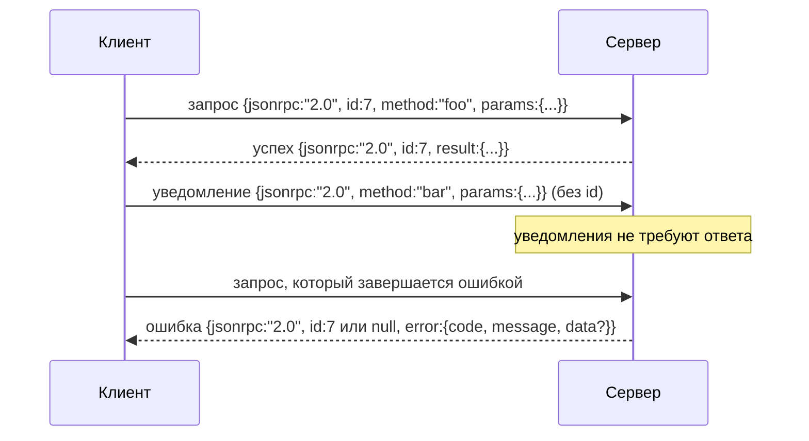

# JSON-RPC 2.0 поверх разделённого переносами строк Stdio

> Транспорт (transport) между клиентом модели и сервером инструментов — это JSON-RPC поверх stdio. Ручная реализация один раз покажет вам, за что отвечает каждый уровень фрейминга.

**Тип:** Выпускной проект
**Языки:** Python
**Предварительные требования:** Фаза 13, уроки 01–07; Фаза 14, урок 01
**Время:** ~90 минут

## Цели обучения
- Обмениваться данными в формате JSON-RPC 2.0 с фреймингом в виде JSON, разделённого переносами строк, через stdin и stdout.
- Соотнести пять стандартных кодов ошибок (-32700, -32600, -32601, -32602, -32603) и возвращать их с корректной семантикой.
- Различать запросы, ответы, уведомления (notifications) и пакеты (batches) без изобретения новых ключей обёртки.
- Обрабатывать одну ошибку разбора на строку без порчи остального потока.
- Создать самозавершающуюся демонстрацию с использованием `io.BytesIO`, чтобы урок выполнялся без запуска дочернего процесса.

## Почему JSON-RPC остаётся lingua franca

Кодовый агент в 2026 году взаимодействует примерно с двенадцатью серверами инструментов за один сеанс. Каждый сервер — отдельный процесс или удалённый эндпоинт. Формат передачи данных не менялся с 2013 года. JSON-RPC 2.0 — это двухстраничная спецификация. Он выживает, потому что альтернативы (gRPC, HTTP на каждый вызов, пользовательский бинарный формат) все навязывают компромисс, которого JSON-RPC избегает: они вынуждают выбирать между потоковой передачей, пакетной обработкой или привязкой к транспорту. JSON-RPC симметричен для stdio, сокетов, веб-сокетов и HTTP, и клиент может управлять сервером, которого он никогда не видел, если оба следуют спецификации.

В этом уроке реализуется вариант на основе stdio. JSON, разделённый переносами строк. Каждый запрос — одна строка. Каждый ответ — одна строка. Граница транспорта — это `\n`.

## Формат передачи данных

Существует четыре типа обёртки. Два отправляет клиент. Два отправляет сервер.



Уведомление не содержит `id`. Сервер не должен отвечать на него. Если сервер возвращает ответ на уведомление, клиент не сможет привязать его к месту вызова. Это одно простое правило поддерживает простоту фрейминга.

Пакет (batch) — это JSON-массив запросов или уведомлений. Сервер отвечает массивом ответов в любом порядке, по одному на каждую запись, не являющуюся уведомлением. Если все записи в пакете — уведомления, сервер ничего не возвращает.

## Пять кодов ошибок

```text
-32700  Ошибка разбора          JSON не удалось разобрать
-32600  Неверный запрос          Неправильная форма обёртки
-32601  Метод не найден
-32602  Неверные параметры
-32603  Внутренняя ошибка
```

Коды от -32000 до -32099 зарезервированы для ошибок, определяемых сервером. Всё остальное определяется приложением. Урок ограничивается пятью стандартными кодами. Если обработчик вызывает исключение, транспорт оборачивает его как -32603 с именем класса исключения в `data.exception`.

Для ошибки разбора действует особое правило. Поле `id` в ответе равно `null`, поскольку запрос не был разобран достаточно далеко, чтобы извлечь идентификатор.

## Фрейминг переносами строк и демонстрация с BytesIO

Транспорт читает по одной строке за раз. Строка — это байты вплоть до и включая `\n`. Если строку невозможно разобрать, транспорт записывает ответ с кодом -32700 и `id: null` и продолжает работу. Поток не портится. Следующая строка разбирается заново.

Для урока мы оборачиваем пару `io.BytesIO` как stdin и stdout. Сервер читает запросы до EOF, записывает ответы на каждый и завершает работу. Клиент считывает ответы обратно. Без запуска процессов. Без тайм-аутов. Поведение транспорта идентично работе с реальным pipe подпроцесса, поскольку интерфейс `io` в Python предоставляет тот же контракт `.readline()` и `.write()`.

## Диспетчеризация методов

Транспорт не знает, какие методы существуют. Он передаёт управление вызываемому объекту `handler(method, params)`, который предоставляет среда выполнения. Обработчик возвращает результат или вызывает исключение. Три класса исключений соответствуют определённым кодам ошибок.

```text
MethodNotFound -> -32601
InvalidParams  -> -32602
Любое другое   -> -32603 с именем исключения в data
```

Транспорт никогда не видит реестр инструментов. Реестр находится за обработчиком. Именно такая слоистость нам и нужна. Транспорт говорит на языке JSON-RPC. Реестр знает структуру инструментов. Диспетчер (урок двадцать третий) связывает их вместе.

## Поведение потока при ошибках

```text
клиент записывает            сервер читает             сервер записывает
---------------              -----------                ---------------
{...корректный запрос...}    разбор успешен             {...ответ, id совпадает...}
{...некорректный JSON...     ошибка разбора             {id:null, ошибка: -32700}
{...корректный запрос...}    разбор успешен             {...ответ, id совпадает...}
{...отсутствует метод...}    неверная обёртка           {id:X, ошибка: -32600}
```

Некорректная строка JSON не останавливает цикл. Отсутствие поля `method` не останавливает цикл. Исключение обработчика не останавливает цикл. Транспорт продолжает чтение до EOF.

## Уведомления и асимметричные потоки

Уведомление (notification) — это механизм «отправил и забыл». Среда выполнения использует уведомления для событий прогресса, сигналов отмены и строк журналов. Уведомления позволяют долго работающему инструменту транслировать обновления статуса без обратного вызова на каждый из них.

В уроке реализуется один вспомогательный метод для исходящих уведомлений — `write_notification`. Сервер использует его для отправки прогресса во время обработки запроса. Демонстрация показывает паттерн: поступает запрос, обработчик отправляет два уведомления о прогрессе, затем записывает окончательный ответ.

## Как читать код

`code/main.py` определяет `StdioTransport`, вспомогательную функцию разбора (`parse_request`), три вспомогательные функции записи (`write_response`, `write_error`, `write_notification`) и цикл диспетчеризации `serve`. Константы кодов ошибок расположены на уровне модуля.

`code/tests/test_transport.py` покрывает пять кодов ошибок, уведомления (ответ не записывается), пакеты (массив на входе, массив на выходе, уведомления пропускаются), некорректный JSON (ошибка разбора, затем продолжение) и асимметричный поток, в котором обработчик записывает уведомление во время вызова.

## Дальнейшие шаги

Этого транспорта достаточно для последующих уроков. Продакшн-транспорты добавляют три вещи. Поле корреляционного идентификатора, сохраняющееся при пересылке (ваш `id` уже является таким, но в сети необходим также внешний идентификатор трассировки). Канал отмены (уведомление вида `$/cancelRequest` с id выполняющегося вызова). И согласование типа содержимого, чтобы один сокет мог работать и с JSON-RPC, и с Streamable HTTP. Ни одно из этих дополнений не меняет формат передачи данных. Они добавляют метаданные.
