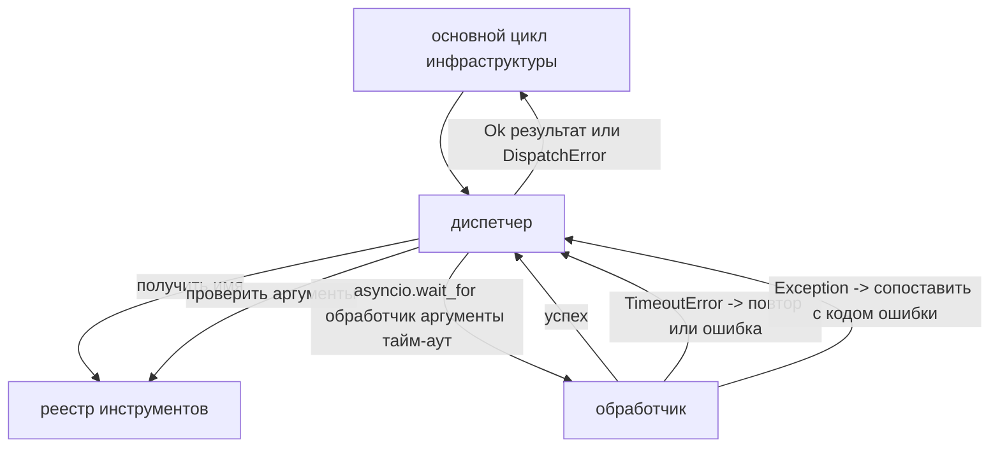
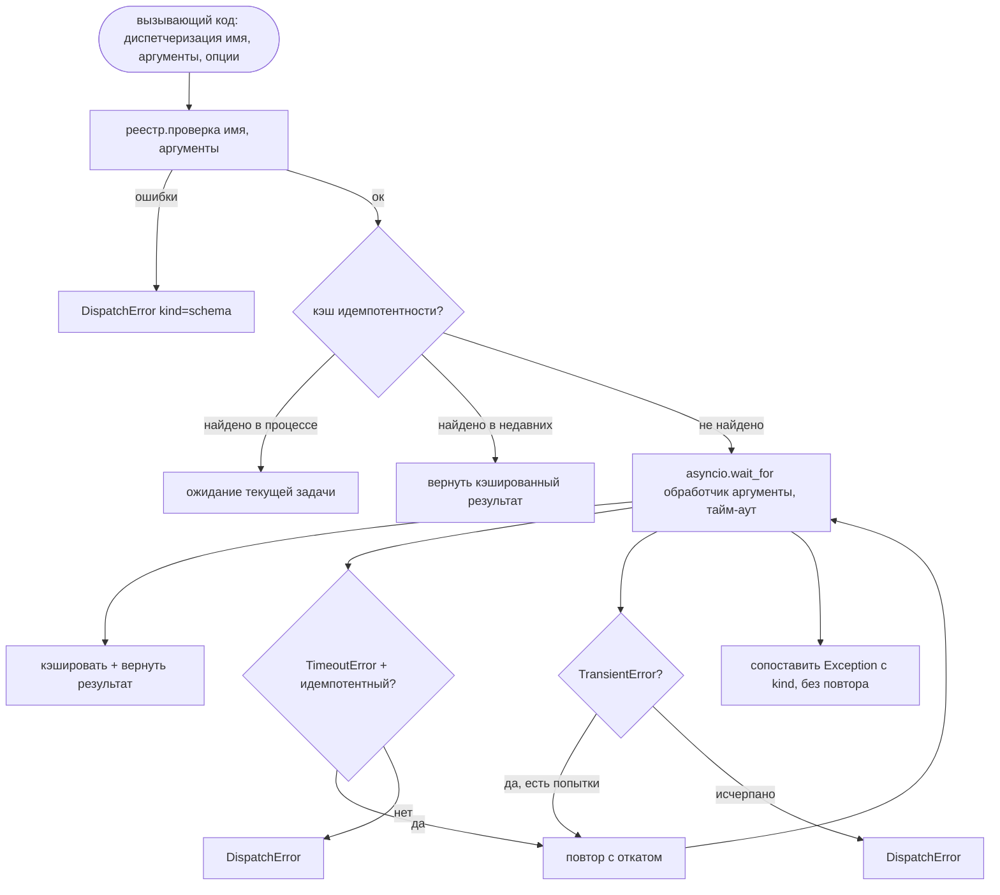

# Диспетчер вызовов функций (Function Call Dispatcher)

> Диспетчер — это место, где инфраструктура расплачивается за каждое обещание, данное схемой. Тайм-ауты, повторные попытки, дедупликация, маппинг ошибок. Всё — в одном месте.

**Тип:** Разработка
**Языки:** Python
**Предварительные знания:** Модуль 13, уроки 01–07; модуль 14, урок 01
**Время:** ~90 минут

## Цели обучения
- Обернуть обработчик инструмента в тайм-аут на каждый вызов, возвращающий типизированную ошибку вместо зависания основного цикла.
- Применить повторные попытки с экспоненциальным откатом (exponential backoff), джиттером и ограничением максимального числа попыток.
- Дедуплицировать повторные попытки по ключу идемпотентности, чтобы повторная попытка, выполняющаяся одновременно с медленным оригинальным вызовом, не была выполнена дважды.
- Отображать исключения обработчика и ошибки транспорта в единую обёртку ошибок, которую основной цикл инфраструктуры уже понимает.
- Ограничить параллельную диспетчеризацию пределом параллелизма, чтобы разветвление сорока вызовов инструментов не исчерпало цикл событий.

## Где находится диспетчер

Между основным циклом инфраструктуры (урок двадцать) и реестром инструментов (урок двадцать один). Транспорт (урок двадцать два) передаёт данные в цикл. Цикл передаёт вызов инструмента диспетчеру. Диспетчер обращается к реестру, выполняет обработчик и возвращает либо результат, либо обёртку ошибки в формате JSON-RPC.



Диспетчер — единственный уровень, который знает о таймерах, повторных попытках и идемпотентности. Цикл этого не знает. Реестр не знает. Обработчик не знает. Именно эта изоляция и является ключевой.

## Тайм-ауты

Каждый инструмент имеет тайм-аут по умолчанию. Запись в реестре содержит `timeout_ms`. Диспетчер переопределяет его при наличии переопределения для конкретного вызова, переданного инфраструктурой. Используется `asyncio.wait_for`. При наступлении тайм-аута задача обработчика отменяется, и диспетчер возвращает `DispatchError(kind="timeout")`.

Тайм-аут по умолчанию не является повторяемой ошибкой для неидемпотентных инструментов. Запись `db.write`, которая завершилась по тайм-ауту, могла быть как зафиксирована, так и нет. Повторный вызов приведёт к дублированию записи. Диспетчер учитывает флаг `idempotent` из записи реестра. Идемпотентные инструменты повторяются. Неидемпотентные — нет.

## Повторные попытки с экспоненциальным откатом

Политика повторных попыток: максимум три попытки. Откат экспоненциальный с джиттером.

```text
попытка 1  -> задержка 0
попытка 2  -> задержка 0.1с * (1 + random[0..0.5])
попытка 3  -> задержка 0.4с * (1 + random[0..0.5])
```

Повторяются только ошибки `timeout` и `transient`. Ошибки `schema`, `not_found` или `internal` не повторяются. Ошибки схемы детерминированы. Повторный вызов не изменит результат и только израсходует бюджет.

Цикл повторных попыток учитывает бюджет инфраструктуры. Если у вызывающего кода остался нулевой бюджет вызовов инструментов, диспетчер завершает работу с ошибкой на первой попытке и возвращает `kind="budget_exceeded"`.

## Дедупликация по ключу идемпотентности

Повторная попытка, которая запускается, пока оригинальный вызов ещё выполняется — это реальная проблема в продакшене. Первый вызов зависает на 4,9 секунды (чуть меньше тайм-аута). Повторная попытка запускается на пятой секунде. Теперь два запроса конкурируют за один и тот же бэкенд. Если инструмент — `payments.charge`, вы списали средства дважды.

Диспетчер принимает необязательный `idempotency_key`. Если тот же ключ уже находится в процессе выполнения при поступлении нового вызова, диспетчер ожидает завершения существующей задачи и возвращает её результат. Кэш хранит ключи в течение 60 секунд после завершения, чтобы обработать запоздалые повторные попытки.

Ключ — ответственность вызывающего кода. Инфраструктура выводит его из планировщика: `f"{step_id}:{tool_name}:{hash(args)}"`. Диспетчер не генерирует ключи самостоятельно, поскольку вывод ключа только из аргументов делает два семантически различных вызова одинаковыми.

## Обёртка ошибок

Неудачная диспетчеризация возвращает единый формат.

```text
DispatchError
  kind        : "timeout" | "transient" | "schema" | "not_found" | "internal" | "budget_exceeded"
  message     : str
  attempts    : int
  jsonrpc_code: int   (одно из -32601, -32602, -32603)
```

Основной цикл инфраструктуры сопоставляет `kind` с следующим состоянием. `schema` и `not_found` перенаправляются в `on_error` и запускают перепланирование. `timeout` и `transient` перенаправляются в `on_error` и могут как запустить, так и не запустить перепланирование в зависимости от числа попыток. `budget_exceeded` запускает `on_budget_exceeded`.

## Ограничение параллелизма при разветвлении

`gather(*calls)` выполняет все корутины одновременно. С сорока вызовами инструментов это сорок открытых сокетов или сорок каналов подпроцессов. Большинство бэкендов не любит сорок параллельных соединений от одного клиента.

Диспетчер оборачивает `gather` в семафор. Лимит параллелизма по умолчанию — восемь. Каждый вызов захватывает семафор перед диспетчеризацией и освобождает его по завершении. Вызывающий код видит результат в формате `gather`, но фактическое планирование ограничено.

## Схема одного вызова



## Как читать код

`code/main.py` определяет `Dispatcher`, `DispatchError` и `TransientError`. Диспетчер принимает реестр при конструировании. Асинхронный метод `dispatch(name, args, ...)` — единственная точка входа. Тайм-ауты на каждую попытку применяются внутри метода `_run_with_retries` через `asyncio.wait_for`. `gather_bounded(calls)` выполняет множество диспетчеризаций с ограничением параллизма.

`code/tests/test_dispatcher.py` проверяет срабатывание тайм-аута, повтор при транзиентной ошибке, отсутствие повтора при ошибке схемы, дедупликацию идемпотентности (два одновременных вызова с одинаковым ключом сворачиваются в одно выполнение обработчика) и ограничение параллелизма (работа семафора).

Тесты используют `asyncio.sleep(0)` и детерминированные обработчики на основе `Counter`, поэтому завершаются за миллисекунды и не зависят от реального времени.

## Дальнейшее развитие

Два расширения, которые добавляют диспетчеры в продакшене. Во-первых, структурированное логирование на каждом переходе (которое основной цикл через поток событий уже предоставляет, но диспетчер также должен генерировать события `dispatch.attempt` и `dispatch.retry`). Во-вторых, прерыватели цепочки (circuit breakers): после N сбоев за окно инструмент получает период остывания, в течение которого диспетчеризации немедленно возвращают `kind="circuit_open"` вместо попытки выполнить обработчик. Оба расширения встраиваются поверх этого диспетчера без изменения контракта.

Урок двадцать четыре соединяет диспетчер с агентом планирования и выполнения (plan-and-execute), чтобы вы увидели все четыре компонента в действии.
