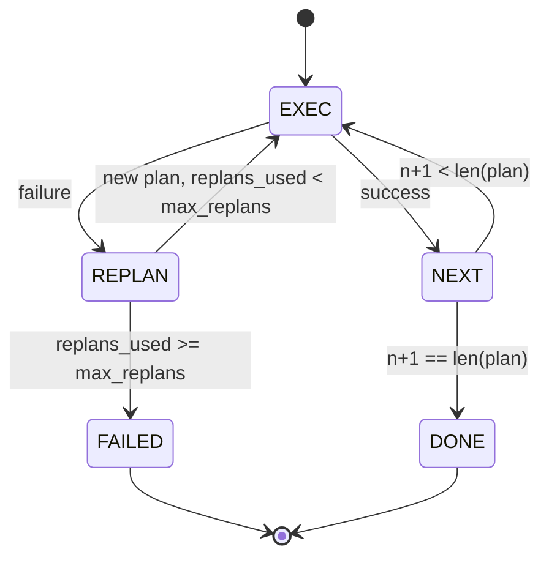

# Управление потоком планирования-выполнения (Plan-Execute Control Flow)

> План, который не выдерживает сбоя, — это скрипт. Скрипт, который умеет перепланировать, — это агент (agent). Начните с создания модуля перепланирования.

**Тип:** Практическая разработка
**Языки:** Python
**Предварительные требования:** Этап 13, уроки 01–07; Этап 14, урок 01
**Время:** ~90 минут

## Цели обучения
- Представить план как упорядоченный список типизированных шагов (step), чтобы исполнитель (executor) мог оценивать прогресс и результат.
- Выполнять шаги последовательно с контролируемой передачей ошибки обратно планировщику (planner).
- Перепланировывать (replan) с текущей позиции курсора с учётом предыдущей ошибки, чтобы следующий план был обоснованным.
- Генерировать.diff плана при каждом изменении, чтобы отслеживающий компонент (tracer) или интерфейс мог показать причину изменения плана.
- Наложить два бюджета: жёсткий лимит шагов и жёсткий лимит перепланирований.

## Планирование и выполнение (Plan and Execute) versus цепочка рассуждений (Chain-of-Thought)

Агент (agent) с цепочкой рассуждений генерирует токены и заставляет цикл угадывать, где заканчивается вызов инструмента. Агент планирования-выполнения сначала формирует структурированный план, а затем выполняет каждый шаг детерминированно. План — это данные, которые исполнительный контур (harness) может анализировать. Выполнение — это исполнительный контур, который передаёт эти данные диспетчеру (dispatcher).

Две составляющие. Планировщик (planner), который создаёт план. Исполнитель (executor), который выполняет план. Интересная часть начинается, когда исполнитель сталкивается с ошибкой. Три варианта:

```text
1. Abort         (return failed, surface the error)
2. Skip          (mark step failed, continue with the rest)
3. Replan        (hand the error to the planner, get a new plan from the cursor)
```

Перепланирование (replan) — это то, что превращает скрипт в агента.

## Структура шага (Step)

```text
Step
  id              : int           (monotonic within a plan revision)
  tool_name       : str
  args            : dict
  expected_outcome: str           (planner's stated success condition)
  result          : Any | None
  error           : str | None
```

`expected_outcome` — короткое предложение, которое планировщик генерирует вместе с шагом. Исполнитель его не проверяет. Оно нужно для двух вещей: модуль перепланирования читает его при корректировке плана; поток событий (event stream) выводит его, чтобы отслеживающий компонент мог показать: «этот шаг должен был выполнить действие X».

## Структура планировщика (Planner)

```python
def planner(goal: str, history: list[Step], last_error: str | None) -> list[Step]:
    ...
```

Чистая функция. `goal` — целевая задача пользователя. `history` — уже выполненные шаги (с заполненными результатами и ошибками). `last_error` — значение `None` при первом вызове и сообщение о последней ошибке при каждом последующем вызове. Планировщик возвращает следующий план, начиная с текущей позиции.

Планировщик не знает об исполнителе. Он не знает о повторных попытках. Он не знает о тайм-аутах. Он создаёт план. И всё.

## Исполнитель (Executor)

Исполнитель — это небольшой конечный автомат (state machine). Каждый шаг выполняется через диспетчер. Результат — один из трёх вариантов: успех, ошибка с возможностью перепланирования, фатальная ошибка. Ошибки с возможностью перепланирования возвращаются планировщику. Фатальные ошибки (превышен бюджет, достигнут лимит перепланирований) возвращают результат сессии `FAILED`.



## Изменения плана (Plan Diffs) при перепланировании

Когда планировщик возвращает новый план после ошибки, исполнитель генерирует событие `plan.diff` с тремя полями.

```text
removed: list of step ids that were in the old plan and are not in the new
added  : list of step ids in the new plan that were not in the old
revised: list of step ids whose tool_name or args changed
```

Отслеживающий компонент или интерфейс может отобразить это как зачёркивание удалённых шагов и подсветку добавленных. Суть не в формате diff. Суть в том, что перепланирование — это видимое событие, а не молчаливая перезапись.

## Два бюджета — оба жёстких

`max_steps` ограничивает общее количество выполнений шагов за всю сессию, включая перепланирования. Значение по умолчанию — двенадцать. Линейный план из пяти шагов, который перепланировывается дважды с добавлением трёх шагов каждый раз, достигает шестнадцати выполнений и превышает бюджет. Исполнитель откажет в перепланировании и вернёт `FAILED`.

`max_replans` ограничивает количество вызовов планировщика после первого плана. Значение по умолчанию — пять. Это более важное ограничение. Планировщик, который пять раз подряд возвращает один и тот же сломанный план, иначе зациклился бы, пока бюджет шагов не прервёт цикл. Ограничение количества перепланирований делает сбой быстрее и причину — очевиднее.

## Детерминированный планировщик в этом уроке

В этом уроке мы не вызываем модель. Урок поставляется с детерминированным планировщиком, который выбирает план на основе `last_error`.

```text
last_error is None    -> emit a four-step plan
last_error matches X  -> emit a three-step plan that routes around X
last_error matches Y  -> emit a two-step plan that gives up gracefully
otherwise             -> return [] (signals nothing to replan)
```

Этого достаточно для тестирования поведения исполнителя на каждом переходном пути: успех, однократное перепланирование, двукратное перепланирование, исчерпание перепланирований и исчерпание бюджета шагов.

## Структура результата (Result)

```text
SessionResult
  status      : "completed" | "failed"
  reason      : str     ("goal_met" | "step_budget" | "replan_budget" | "no_plan")
  history     : list[Step]
  revisions   : list[PlanDiff]
  events      : list[Event]
```

Исполнительный контур из урока двадцать может читать это напрямую. Диспетчер из урока двадцать три выполняет каждый шаг. Реестр (registry) из урока двадцать один валидирует аргументы каждого шага. Транспорт (transport) из урока двадцать два может представить весь этот поток через JSON-RPC клиенту модели.

## Как читать код

`code/main.py` определяет `PlanExecuteAgent`, `Step`, `PlanDiff`, `SessionResult` и детерминированный планировщик. Исполнитель — это один метод `run(goal)`, возвращающий `SessionResult`. Diff плана вычисляется путём сравнения идентификаторов шагов и кортежей `(tool_name, args)`.

`code/tests/test_agent.py` покрывает линейный успех, ошибку в середине плана с одним перепланированием, исчерпание перепланирований с возвратом `failed:replan_budget`, исчерпание бюджета шагов и формат события diff плана.

## Дальнейшее развитие

Два расширения, которые понадобятся при подключении к реальной модели. Первое — кэширование частичного плана: когда план успешно выполняет первые три из шести шагов, а затем завершается ошибкой, не нужно повторно выполнять первые три. Исполнитель уже хранит историю; планировщику достаточно её читать. Второе — параллельные ветки: текущий исполнитель работает строго последовательно. Планировщик, который генерирует независимую ветку (`gather_step` вместо `next_step`), может выполнять два вызова инструментов параллельно через диспетчер.

Оба варианта добавляют реальную сложность. Оба проще реализовать, когда линейный исполнитель закреплён. Именно это и делает этот урок.
