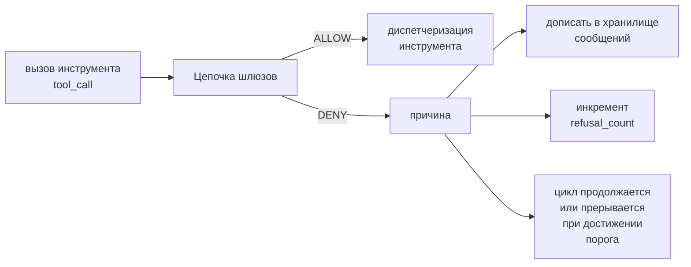
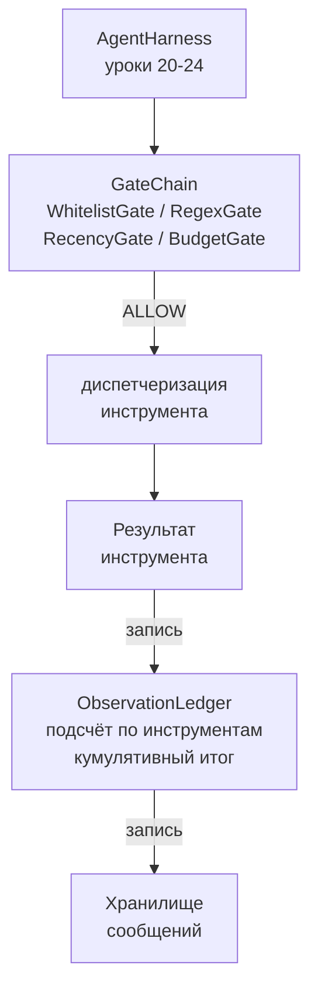

# Выпускной проект (Capstone), урок 25: Верификационные шлюзы (Verification Gates) и бюджет наблюдений (Observation Budget)

> Обвязка агента без слоя верификации — это желание в плаще. В этом уроке мы построим детерминированную цепочку шлюзов, которая решает, разрешён ли вызов инструмента к исполнению, какую часть его вывода агенту разрешено видеть, и когда цикл должен остановиться, потому что агент прочитал слишком много. Цепочка представляет собой совокупность небольших именованных шлюзов и журнала наблюдений (observation ledger), который отслеживает каждый токен, показанный модели.

**Тип:** Практическое задание
**Языки:** Python (stdlib)
**Предварительные требования:** Фаза 19 · 20–24 (Дорожка A1: цикл агента, реестр инструментов, хранилище сообщений, конструктор промптов, маршрутизатор моделей), Фаза 14 · 33 (инструкции как ограничения), Фаза 14 · 36 (контракты области), Фаза 14 · 38 (верификационные шлюзы)
**Время:** ~90 минут

## Цели обучения

- Реализовать протокол `VerificationGate` с детерминированным методом `evaluate(call)`.
- Составить из шлюзов бюджета (budget), свежести (recency), белого списка (whitelist) и регулярных выражений (regex) цепочку с семантикой короткого замыкания.
- Отслеживать каждое наблюдение через `ObservationLedger` с ключами по инструменту и ходу (turn).
- Отклонять вызов инструмента, если кумулятивный бюджет наблюдений будет превышен.
- Формировать структурированную запись `GateDecision`, которую могут потребить системы наблюдаемости (observability).

## Проблема

Когда обвязка агента позволяет модели вызывать инструменты бесконтрольно, в течение первого часа реального использования проявляются три класса ошибок.

Первый — неограниченные наблюдения. grep по репозиторию из 200 тысяч строк сливает полмиллиона токенов вывода в следующий ход. Мода видит одно совпадение на килобайт, а остальной контекст оказывается бесполезным. Счёт за токены растёт, а агент становится хуже, а не лучше.

Второй — устаревшая свежесть (stale recency). Долгая задача накапливает пятьдесят вызовов инструментов. Модель заново читает первый вызов `read_file` из третьего хода так, будто это актуальное состояние. Правки, сделанные на сорок седьмом ходу, никогда не появляются, потому что конструктор промптов сериализует самые ранние наблюдения первыми.

Третий — размывание привилегий (privilege creep). Исследовательская задача начинается с вызова `web_search`, а затем каким-то образом заканчивается запуском `shell`, потому что модель придумала имя инструмента, а об택ка по умолчанию использует разрешающую политику. К тому моменту, когда кто-то читает трейс, в `/tmp` лежит мусорный файл, а curl был выполнен к приватному API.

Верификационный шлюз — это компонент обвязки, который говорит «нет». Это не модель. Это не судья. Это детерминированная функция `(call, history, ledger)`, которая возвращает либо ALLOW (разрешить), либо DENY (отклонить) с указанием причины. Причина логируется. Модели сообщается. Цикл продолжается или прерывается.

## Концепция



Шлюз — это любой компонент с методом `evaluate(call, ctx) -> GateDecision`. Цепочка — упорядоченный список. Оценка останавливается на первом отклонении (короткое замыкание). Порядок важен: дешёвые структурные шлюзы выполняются перед дорогостоящими подсчётными.

В этом уроке реализуются четыре шлюза:

- `WhitelistGate`. Допустимые имена инструментов задаются явным множеством. Всё остальное отклоняется. Это самый дешёвый шлюз, выполняется первым.
- `RegexGate`. Аргументы инструмента проверяются регулярным выражением. Полезно для отклонения вызовов shell с `rm -rf` или HTTP-запросов к внутренним IP. Чистая проверка по полезной нагрузке вызова.
- `RecencyGate`. Модель видит только наблюдения за последние N ходов. Более старые наблюдения маскируются. Шлюз отклоняет вызов инструмента, если его результат расширит окно наблюдений, которое уже устарело.
- `BudgetGate`. Кумулятивное количество токенов, прочитанных моделью за сессию, имеет верхний предел. Когда журнал сообщает, что предел достигнут, все последующие вызовы инструментов отклоняются.

Журнал наблюдений — это учётная запись. Каждый успешный вызов инструмента записывает одну строку: имя инструмента, ход, выпущенные токены, кумулятивный итог. Журнал отвечает на два вопроса: сколько модель видела всего и сколько она видела инструмента X. Шлюз бюджета читает первый вопрос. Шлюз бюджета по отдельным инструментам (который вы напишете в качестве упражнения) читает второй.

## Архитектура



Обязка обращается к цепочке. Цепочка либо соглашается, либо отказывает. Если соглашается — инструмент запускается, журнал обновляется, а результат дописывается в хранилище сообщений. Если отказывает — модели передаётся отказ в виде системного сообщения, и цикл решает, повторить попытку или прерваться.

## Что вы будете создавать

Реализация состоит из одного файла `main.py` и тестов.

1. Датаклассы `Observation` и `ToolCall` определяют структуры данных.
2. `ObservationLedger` записывает строки `(turn, tool, tokens)` и отвечает на запросы `cumulative()` и `per_tool(name)`.
3. `GateDecision` несёт данные `(allow, reason, gate_name)`.
4. `VerificationGate` — протокол. Каждый шлюз реализует `evaluate(call, ctx)`.
5. `GateChain` оборачивает упорядоченный список. Он вызывает каждый шлюз, возвращает первое отклонение или возвращает разрешение, если все шлюзы пройдены.
6. Демо запускает небольшой синтетический цикл агента. Три хода. Третий ход активирует шлюз бюджета, и цикл сообщает об отказе с ненулевым счётчиком отказов.

Счётчик токенов намеренно реализован простой эвристикой `len(text) // 4`. Суть урока — в архитектуре шлюзов, а не в токенизаторе. В продакшене используйте настоящий токенизатор.

## Почему порядок цепочки важен

Отклонение дешевле, чем разрешение. `WhitelistGate` выполняется за O(1) по хеш-таблице. `RegexGate` работает за O(pattern * argv). `RecencyGate` читает небольшой срез хранилища сообщений. `BudgetGate` читает весь журнал. Их упорачивают по возрастанию стоимости, чтобы отклонённый вызов останавливался до выполнения дорогостоящих операций.

Также их упорачивают по радиусу поражения. Белый список — самое сильное утверждение: этот инструмент не в контракте. Шлюз регулярных выражений — следующий: этот аргумент не в контракте. Свежесть — после: обвязка всё ещё учитывает, но вызов структурно легален. Бюджет — последний, потому что, по определению, он срабатывает только тогда, когда всё остальное прошло.

## Как это соотносится с остальной частью дорожки A

Предыдущие уроки дали вам цикл, реестр инструментов, хранилище сообщений, конструктор промптов и маршрутизатор моделей. Этот урок добавляет слой между моделью и инструментами. Урок 26 реализует песочницу (sandbox), в которую диспетчер передаёт вызов инструмента после того, как цепочка шлюзов вернула ALLOW. Урок 27 реализует среду оценки (eval harness), которая записывает количество отказов как показатель качества. Урок 28 подключает решения шлюзов к спанам OpenTelemetry. Урок 29 собирает всё вместе в работающего кодового агента.

## Запуск

```bash
cd phases/19-capstone-projects/25-verification-gates-observation-budget
python3 code/main.py
python3 -m pytest code/tests/ -v
```

Демо выводит пошаговый трейс, включающий каждое решение шлюза, и завершается с кодом 0. Тесты покрывают журнал, каждый шлюз по отдельности, короткое замыкание цепочки и синтетический цикл от начала до конца.
