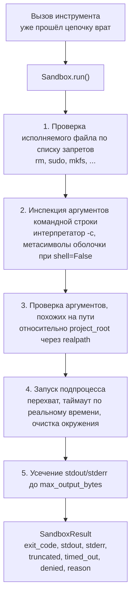
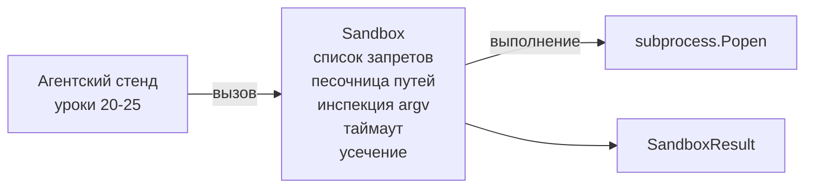

# Выпускной проект (Capstone) 26: Песочница (Sandbox) с запуском выполнения, списком запретов (Denylist) и песочницей путей

> Врата проверки решают, следует ли выполнять вызов инструмента. Песочница решает, что происходит, когда он выполняется. В этом уроке реализован запуск подпроцесса, который отказывает в выполнении опасных исполняемых файлов, отказывает в выполнении опасных структур аргументов командной строки (argv), изолирует каждый путь к файлу в пределах корня проекта, усекает вывод превышающий допустимый объём и убивает процесс с таймаутом по реальному времени. Это второй из двух уровней, расположенных между моделью и операционной системой.

**Тип:** Сборка
**Языки:** Python (стандартная библиотека)
**Предварительные требования:** Фаза 19 · 25 (врата проверки и бюджет наблюдения), Фаза 14 · 33 (инструкции как ограничения), Фаза 14 · 38 (врата проверки)
**Время:** ~90 минут

## Цели обучения

- Создать класс `Sandbox`, оборачивающий `subprocess.run` с таймаутом, перехватом вывода и усечением.
- Отклонять команду по имени на основе списка запретов (denylist) и по структуре на основе инспектора аргументов командной строки.
- Отклонять любой аргумент пути, который разрешается за пределами объявленного корня проекта.
- Отклонять метасимволы оболочки, когда режим оболочки отключён.
- Возвращать структурированный `SandboxResult`, который могут обработать системы наблюдения и тестовый стенд.

## Проблема

Агент для написания кода, имеющий доступ к командной оболочке, может установить бэкдоры, украсть ключи, повредить ноутбук разработчика и создать большой счёт за облачные ресурсы за один шаг. Наименее затратная защита — не давать ему доступ к оболочке. Второй по стоимости вариант — песочница, которая отвергает точный список паттернов.

В трассировках агента повторяются три класса ошибок.

Первый — опасные исполняемые файлы. Модель, которой нужно исправить проблему с путём, попытается использовать `sudo`, `chmod -R 777`, `rm -rf`, `mkfs`, `dd`. Ничего из этого не должно присутствовать в запуске агента. Список запретов отлавливает их по имени и по псевдониму.

Второй — трюки с аргументами командной строки. Модель, которой запретили оболочку, направит атаку через интерпретатор: `python3 -c "import os; os.system('rm -rf /')"`, `bash -c '...'`, `node -e '...'`, `perl -e '...'`. Песочница должна знать, что любой интерпретатор, запущенный с флагом, подобным `-c`, — это просто вызов оболочки с дополнительными шагами.

Третий — побег через пути. Модели сказано прочитать `./src/main.py`, а она вместо этого читает `../../etc/passwd`. Песочница изолирует каждый аргумент пути, разрешая его через `os.path.realpath` и проверяя префикс.

Песочница не является границей безопасности в смысле операционной системы. Упорный атакующий, имеющий выполнение кода, всё ещё может вырваться за её пределы. Песочница — это средство защиты на этапе разработки: она делает типичные режимы ошибок громкими и не позволяет агенту нанести ущерб по незнанию.

## Концепция



У песочницы четыре оси отказа: имя, аргументы командной строки, путь, структура. Каждая ось — чистая функция вызова, подпроцесс ещё не создан. Подпроцесс порождается только после того, как все оси пройдены.

Коды возврата `SandboxResult` стандартные: 0 — успех, ненулевой — ошибка, плюс три сигнатурных кода: отказано (-100), таймаут (-101) и усечение (код возврата — реальный, с установленным флагом). Последующие уроки читают этот структурированный результат вместо разбора stderr.

## Архитектура



Список запретов — это неизменяемое множество (frozenset) базовых имён исполняемых файлов. Псевдонимы (`/bin/rm`, `/usr/bin/rm`) все разрешаются к одному базовому имени. Инспектор аргументов командной строки знает структуру интерпретатора: любой argv, где argv[0] — интерпретатор и любой последующий аргумент начинается с `-c` или `-e`, отклоняется. Метасимволы оболочки (`;`, `|`, `&`, `>`, `<`, обратные кавычки, `$()`) приводят к отказу, если вызов не запрашивал оболочку явно.

Песочница путей — самая тонкая часть. Песочница принимает `project_root` при создании. Любой аргумент, который выглядит как путь (содержит `/` или соответствует существующему файлу), нормализуется через `os.path.realpath`, а затем проверяется относительно realpath корня проекта. Если разрешённый путь находится не под корнем — отказ. Попытки побега через символьные ссылки (symlink в корне проекта, указывающий за его пределы) блокируются проверкой realpath, а не литерального пути.

## Что вы будете создавать

Реализация состоит из файла `main.py` и директории с тестами.

1. Датакласс `SandboxResult`: exit_code, stdout, stderr, truncated, timed_out, denied, reason, duration_ms.
2. Датакласс `SandboxConfig`: project_root, max_output_bytes, timeout_seconds, denylist, interpreter_block.
3. Класс `Sandbox`: метод `run(argv, *, shell=False, cwd=None)` возвращает `SandboxResult`.
4. Внутренние вспомогательные функции отказа: `_check_executable_denylist`, `_check_argv_interpreter`, `_check_shell_metachars`, `_check_path_jail`.
5. Усечение вывода с чётким флагом `truncated` и строкой-маркером в захваченном потоке.
6. Демонстрация внизу файла: последовательность легитимных и враждебных вызовов. Каждый показан вместе с результатом.

Песочница использует `subprocess.run` с `shell=False` по умолчанию и `capture_output=True`. Таймаут по реальному времени реализован через аргумент `timeout`; при `TimeoutExpired` песочница убивает группу процессов и формирует результат `SandboxResult`.

## Почему это не настоящая песочница

Песочница в данном уроке не использует пространства имён, cgroups, seccomp, gVisor, Firecracker или какой-либо изоляции на уровне ядра. Всё, что может сделать подпроцесс, может сделать и песочница. Защита носит структурный характер: агенту запрещены наиболее частые опасные вызовы, а громкий отказ фиксируется в системе наблюдения вместо тихого выполнения.

Для продакшн-агентов накладываются дополнительные слои: запуск в привилегированном Docker-контейнере, запуск в микровиртуальной машине, отказ от привилегий, монтирование корня проекта в режиме только для чтения, а временной директории — в режиме чтения-записи, установка ulimit на память и процессор, очистка окружения до безопасного списка разрешений. Урок 29 реализует часть этого. Изоляция на уровне операционной системы выходит за рамки данного урока.

## Запуск

```bash
cd phases/19-capstone-projects/26-sandbox-runner-denylist
python3 code/main.py
python3 -m pytest code/tests/ -v
```

Демонстрация создаёт временную директорию, размещает в ней чистый файл, а затем выполняет набор вызовов. Легитимные вызовы завершаются успешно. Отклонённые вызовы возвращают `SandboxResult` с `denied=True` и указанием причины. Таймауты возвращают `timed_out=True`. Усечение устанавливает `truncated=True`. Демонстрация печатает JSON-таблицу результатов и завершается с кодом 0.

## Как это связывается с остальными частями трека A

Урок 25 создал цепочку врат. Урок 26 — исполнитель, который запускается после разрешения врат (ALLOW). Тестовый стенд урока 27 сравнивает результаты песочницы с ожидаемым кодом возврата для каждой задачи. Урок 28 формирует спан `gen_ai.tool.execution` вокруг каждого вызова `Sandbox.run`. Демонстрация от конца к концу в уроке 29 подключает реального агента для написания кода через оба уровня.
