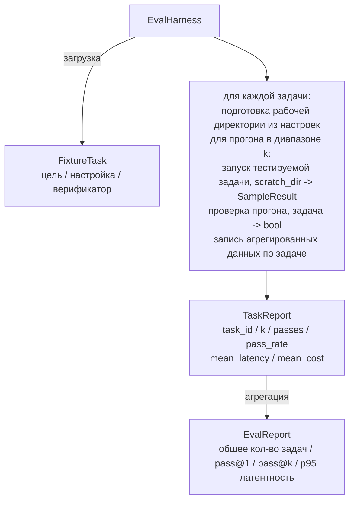

# Выпускной проект (Capstone) — Урок 27: Eval-обвязка (Eval Harness) с фиксированными задачами (Fixture Tasks)

> Кодирующий агент ровно настолько хорош, насколько хорош набор задач, по которым его оценивают. В этом уроке создаётся eval-обвязка (eval harness), которая берёт папку с фиксированными задачами (fixture tasks), прогоняет каждую через тестируемого агента, проверяет результат прохождения или провала детерминированным верификатором и агрегирует данные в показатели pass@1, pass@k, среднюю латентность и среднюю стоимость. Обвязка является основным источником истины, позволяющим отличить регрессию от рефакторинга.

**Тип:** Разработка
**Языки:** Python (стандартная библиотека)
**Предварительные условия:** Фаза 19 · 25 (gate-цепочки), Фаза 19 · 26 (sandbox-раннер), Фаза 14 · 30 (агентная разработка на основе оценок), Фаза 14 · 19 (бенчмарки SWE-bench и GAIA)
**Время:** ~90 минут

## Цели обучения

- Определить фиксированную задачу (fixture task) как тройку: цель, настройка и верификатор.
- Оценивать несколько прогонов (samples) для каждой задачи и вычислять pass@1 и pass@k.
- Агрегировать латентность и стоимость в средние значения и показатели 95-го перцентиля.
- Интегрировать детерминированные верификаторы (diff файла, код возврата, совпадение с регулярным выражением) в переиспользуемые функции.
- Генерировать структурированный JSON-отчёт, который может обработать скрипт отслеживания регрессий.

## Проблема

Три типа ошибок преследуют бенчмарки агентов, построенные без eval-обвязки.

Первый — непроверенное прохождение. Агент заявляет, что исправил ошибку, человек бросает взгляд на diff, тесты отмечаются как пройденные, а через три недели тест на регрессию выявляет ту же самую ошибку. Агент рассуждал правдоподобно, но фактически ничего не исправил.

Второй — незамеченная регрессия. Изменение шаблона промпта делает агента на 4% лучше на заметной задаче и на 14% хуже на незаметной. Без эталонного набора (goldset) и оценки по каждой задаче регрессия проникает в основную ветку и обнаруживается только тогда, когда жалуется заказчик.

Третий — дрейф по задачам. В понедельник eval запускался на 100 задачах, а в пятницу — на 95 из них, потому что кто-то переименовал пять фиксированных задач. Коэффициент прохождения выглядит как улучшение на 5%. Но это не так.

Обвязка — это программа, которая превращает эти ошибки в факты. Она запускает каждую фиксированную задачу каждый раз, в воспроизводимом порядке, с верификатором, который возвращает true или false на основе детерминированной проверки.

## Концепция

```mermaid
flowchart LR
  F1[fixtures/task_001/<br/>task.json + expected/] --> Обвязка
  F2[fixtures/task_002/<br/>...] --> Обвязка
  Обвязка[Обвязка<br/>для каждой задачи:<br/>настройка / запуск k прогонов агента /<br/>проверка каждого прогона /<br/>запись латентности и стоимости]
  Обвязка --> Отчёт[EvalReport<br/>pass@1 / pass@k<br/>среднее мс / p95 мс<br/>средняя стоимость]
```

`FixtureTask` — это небольшой JSON-файл и опциональная директория `expected/`. JSON объявляет `id`, `goal` (промпт, передаваемый агенту), блок `setup` (файлы для размещения в рабочей директории) и блок `verifier`. Блок верификатора указывает функцию из реестра верификаторов обвязки и задаёт её аргументы.

Три типа верификаторов покрывают большинство полезных задач.

Первый — `file_equals`. После выполнения агента сравнивается именованный файл с ожидаемым содержимым. Это выявляет задачи типа «исправьте эту ошибку именно этим способом».

Второй — `regex_match`. Содержимое именованного файла проверяется на соответствие регулярному выражению. Это выявляет задачи типа «функция должна существовать и возвращать X», где допустимо множество решений.

Третий — `shell_exit_zero`. Обвязка выполняет shell-команду (через sandbox из урока 26) и считает задачу пройденной только если команда завершилась с кодом 0. Это выявляет задачи типа «тесты должны пройти».

Обвязка запускает каждую задачу `k` раз. Pass@k вычисляется как `1 - (1 - p)^k`, где p — эмпирический коэффициент прохождения; обвязка также выводит необработанные данные, чтобы вы могли увидеть дисперсию. Латентность — это реальное время на каждый прогон. Стоимость — это то, что агент сообщает сам (количество токенов, доллары или оба показателя); обвязка суммирует по прогонам и выводит данные по каждой задаче и в агрегате.

## Архитектура



Тестируемый агент (candidate) является вызываемым объектом: `Callable[[FixtureTask, str], SampleResult]`. Обвязка создаёт рабочую директорию через `tempfile.mkdtemp()` и передаёт путь в виде обычной строки. Обвязке всё равно, как работает тестируемый агент. Это может быть детерминированный патчер (полезно для тестов самой обвязки), реальный LLM-агент или фаззер. Контрактом является `SampleResult`.

## Что вы создадите

Файл `main.py` включает:

1. Датакласс `FixtureTask`.
2. Датакласс `SampleResult`: success_self_reported, latency_ms, cost_units, edits.
3. Датаклассы `TaskReport`, `EvalReport` с методом `to_dict()`.
4. `VerifierRegistry` — реестр, сопоставляющий имя верификатора с функцией. Встроенные верификаторы: file_equals, regex_match, shell_exit_zero.
5. Класс `EvalHarness`. Запускает директорию задач против тестируемого агента. Возвращает `EvalReport`.
6. Пять фиксированных задач в директории `tasks/`:
   - ошибка на единицу (off-by-one) в `fizzbuzz`
   - отсутствующий return в `factorial`
   - опечатка в сообщении об ошибке
   - пустое тело функции
   - ошибка на единицу в обходе связного списка
7. Детерминированный эталонный агент (`apply_known_fixes`), который обвязка использует для демонстрации чистого pass@1 = 1.0.
8. Демо-программа выводит EvalReport в JSON и завершается с кодом 0.

Фиксированные задачи поставляются как JSON-файлы в директории `tasks/` вместе с исходными файлами в `tasks/<id>/buggy/` и `tasks/<id>/expected/`. Обвязка копирует файлы buggy в рабочую директорию, передаёт их тестируемому агенту и проверяет по файлам expected.

## Почему pass@k, а не только pass@1

Реальные LLM-агенты являются стохастическими. Pass@1, равный 0.6, выглядит как провал. Pass@5, равный 0.95, говорит о том, что агент получает правильный ответ большую часть времени, но ошибается на первых прогонах. Решение — семплирование и ранжирование, а не всегда больше обучения. Pass@k делает это видимым.

Pass@k выводится рядом с pass@1, потому что pass@k скрывает реальную проблему: если модель получает правильный ответ один раз из двадцати попыток, у вас нет полезного агента. Обвязка показывает оба показателя.

## Как это вписывается в остальное направление A

Урок 25 создал gate-цепочку. Урок 26 создал sandbox. Обвязка использует sandbox для любого верификатора `shell_exit_zero`. Урок 28 оборачивает каждый запуск обвязки в OTel-трассировку. Урок 29 запускает сквозную демонстрацию на одной из поставляемых фиксированных задач и проверяет, что pass@1 = 1.0 для эталонного агента.

## Запуск

```bash
cd phases/19-capstone-projects/27-eval-harness-fixture-tasks
python3 code/main.py
python3 -m pytest code/tests/ -v
```

Демо-программа выводит EvalReport в JSON, включая pass@1, pass@5, среднюю латентность и разбивку по задачам. Код завершения — 0. Тесты покрывают функции верификаторов, математику pass@k, загрузку фиксированных задач и сквозную работу обвязки с поставляемым эталонным агентом.
