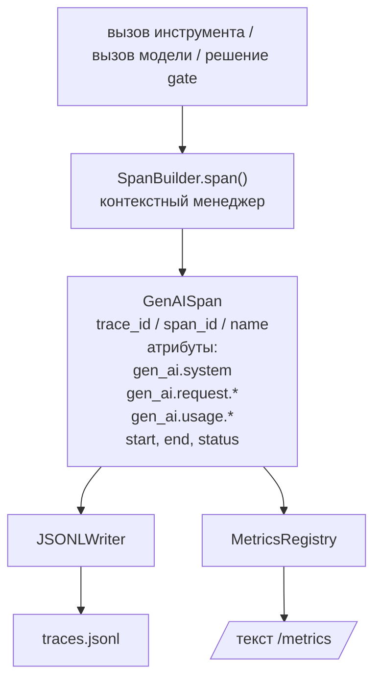
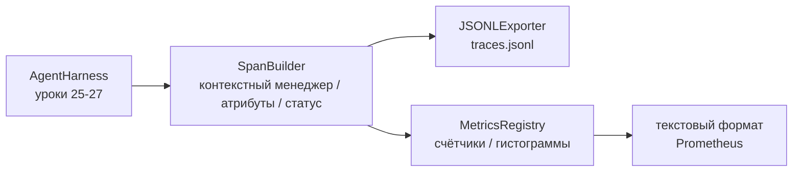

# Выпускной проект (Capstone), Урок 28: Наблюдаемость (Observability) с трассировками (Tracing) GenAI OTel и метриками Prometheus

> Средство (harness) агента без наблюдаемости — это чёрный ящик, который стоит денег. В этом уроке самостоятельно реализуется конструктор спанов (span builder), который формирует записи, соответствующие семантическим соглашениям OpenTelemetry GenAI, записывает их в JSON-Lines файл по одному спану на строку и выводит счётчики и гистограммы в текстовом формате Prometheus. Всё написано на стандартной библиотеке Python и работает офлайн.

**Тип:** Практическая реализация
**Языки:** Python (стандартная библиотека)
**Предварительные требования:** Фаза 19 · 25 (gate-цепочки проверок), Фаза 19 · 26 (песочница), Фаза 19 · 27 (средство оценки), Фаза 13 · 20 (OpenTelemetry GenAI), Фаза 14 · 23 (соглашения OTel GenAI)
**Время:** ~90 минут

## Цели обучения

- Создать класс данных спана (span), структурированный в соответствии с семантическими соглашениями OpenTelemetry GenAI.
- Реализовать экспортёр JSONL, записывающий один самодостаточный спан на строку.
- Построить счётчики и гистограммы с метками и представлением в текстовом формате Prometheus.
- Обернуть любой вызываемый объект в контекстный менеджер спана, фиксирующий длительность, статус и исключения.
- Убедиться, что формируемые спаны корректно проходят цикл сериализации через `json.loads` и соответствуют спецификации.

## Проблема

Кодовый агент (coding agent) в producción на каждом шаге порождает три класса артефактов: вызов модели, выполнение инструмента и решение gate-цепочки проверок. Ни один из этих артефактов не полезен без структурированной телеметрии.

Первый тип отказа — отсутствующая трассировка. Что-то пошло не во вторник, но единственная запись — это лог из 500 строк. Нет никакой информации о том, какой инструмент запускался, сколько времени он выполнялся, сколько токенов было потрачено на промпт и отверг ли gate что-либо. Автору агента приходится угадывать.

Второй тип отказа — неразбираемая трассировка. Средство записывало спаны, но использовало собственные произвольные имена полей. Ни Grafana, ни Honeycomb, ни Jaeger, ни локальный CLI не могут их прочитать. Любой инструментарий в технологическом стеке команды оказывается бесполезным, поскольку спаны являются нестандартными.

Третий тип отказа — неагрегированная метрика. В трассировке виден один медленный вызов инструмента, но невозможно ответить на вопрос: «Какова p95-задержка вызовов read_file за последний час?» — потому что метрик нет, есть только трассировки.

Семантические соглашения OpenTelemetry GenAI созданы именно для этого. Они определяют небольшой набор стандартных атрибутов, которые используют генераторы спанов в различных фреймворках LLM. Если ваше средство записывает эти атрибуты, любой совместимый с OTel бэкенд сможет их прочитать.

## Концепция



Каждая операция в средстве порождает спан. Спан имеет идентификатор трассировки (trace id) — 전체 вызов агента — идентификатор спана (span id) — данная операция, имя (например, `gen_ai.chat`, `gen_ai.tool.execution`), атрибуты, соответствующие соглашениям GenAI, время начала и окончания, а также статус.

Соглашения GenAI стандартизируют следующие ключи атрибутов: `gen_ai.system` (провайдер, например `anthropic`, `openai`), `gen_ai.request.model` (идентификатор модели), `gen_ai.request.max_tokens`, `gen_ai.usage.input_tokens`, `gen_ai.usage.output_tokens`, `gen_ai.response.model`, `gen_ai.response.id`, `gen_ai.operation.name`, а также специфичные для инструментов ключи `gen_ai.tool.name` и `gen_ai.tool.call.id`.

Экспортёр записывает JSONL — один JSON-объект на строку. Это простейший формат, который может обрабатывать, искать и импортировать инструменты последующего этапа. Настоящий экспортёр OTel использовал бы OTLP gRPC; JSONL-экспортёр урока — это офлайн-аналог, который завершается с кодом 0 на любой рабочей станции.

Метрики соседствуют с трассировками. Счётчик инкрементируется при каждом вызове инструмента: `tools_called_total{tool="read_file"}`. Гистограмма фиксирует наблюдаемую задержку: `tool_latency_ms{tool="read_file"}`. Обе структуры сериализуются в текстовый формат представления Prometheus, который является де-факто стандартом для pull-метрик.

## Архитектура



Конструктор спанов — это небольшой класс с методом `span(name, attrs)`, который возвращает контекстный менеджер. Контекстный менеджер фиксирует время начала при входе, фиксирует время окончания при выходе, прикрепляет исключение при его наличии и передаёт завершённый спан в экспортёр.

Реестр метрик — это два словаря. Счётчики — `{(name, frozen_labels): int}`. Гистограммы хранят сырые выборки в списке и сериализуются в бакеты гистограммы Prometheus в момент представления.

## Что вы создадите

Файл `main.py` включает:

1. Класс данных `GenAISpan`: trace_id, span_id, parent_span_id, name, attributes, start_unix_nano, end_unix_nano, status, status_message, events.
2. Класс `SpanBuilder` с контекстным менеджером `span(name, attrs, parent=None)`.
3. Класс `JSONLExporter` с методом `export(span)`, дописывающим одну строку.
4. Классы `Counter` и `Histogram` вместе с `MetricsRegistry`.
5. Функцию `prometheus_exposition(registry)`, генерирующую вывод в текстовом формате.
6. Декоратор `wrap_tool_call(name)`, порождающий спан и обновляющий метрики.
7. Демонстрация: синтезирует полный вызов агента (спан `gen_ai.chat` вокруг спанов инструментов), записывает traces.jsonl, выводит представление Prometheus, завершается с кодом 0.

Идентификатор спана и идентификатор трассировки — это 16-байтовые шестнадцатеричные строки, сформированные из `os.urandom`. Это соответствует контексту трассировок W3C в OTel. Экспортёр никогда не выбрасывает исключений; ошибки ввода-вывода выводятся, но средство продолжает работу.

Гистограмма использует фиксированный набор бакетов (стандартные значения OTel для задержки в миллисекундах: 5, 10, 25, 50, 100, 250, 500, 1000, 2500, 5000, 10000, +Inf). Выборки хранятся в списке; в момент представления вычисляется количество элементов для каждого бакета.

## Почему реализовано вручную, а не используется opentelemetry-sdk

Python-SDK OTel — это полноценная зависимость. Он также состоит из тысяч строк кода, нескольких процессов для экспортёра OTLP и затрат времени выполнения, которые превышают бюджет урока. Ручная реализация обучает формату передачи. В production вы подключаете те же атрибуты к настоящему SDK и бесплатно получаете экспортёр OTLP, пакетную обработку и определение ресурса.

Соглашения являются стабильными. Формат передачи, генерируемый в уроке, будет корректно разбираться и в 2030 году, поскольку OTel никогда не нарушает имена атрибутов GenAI; они только добавляют новые.

## Как это сочетается с остальными уроками трека A

Урок 25 породил gate-цепочку проверок. Урок 26 породил песочницу. Урок 27 породил средство оценки (eval harness). Урок 28 делает все три компонента наблюдаемыми. Урок 29 оборачивает каждый шаг полного демо-запуска спанами и выводит текст Prometheus в конце.

## Запуск

```bash
cd phases/19-capstone-projects/28-observability-otel-traces
python3 code/main.py
python3 -m pytest code/tests/ -v
```

Демонстрация генерирует файл `traces.jsonl` в рабочей директории урока (удаляется в конце), затем выводит пример трёх спанов и далее выводит представление Prometheus для счётчиков и гистограмм. Тесты проверяют, что спаны корректно проходят цикл сериализации, что канонические атрибуты GenAI присутствуют, что счётчики корректно инкрементируются и что представление гистограммы содержит ожидаемое количество элементов в бакетах.
