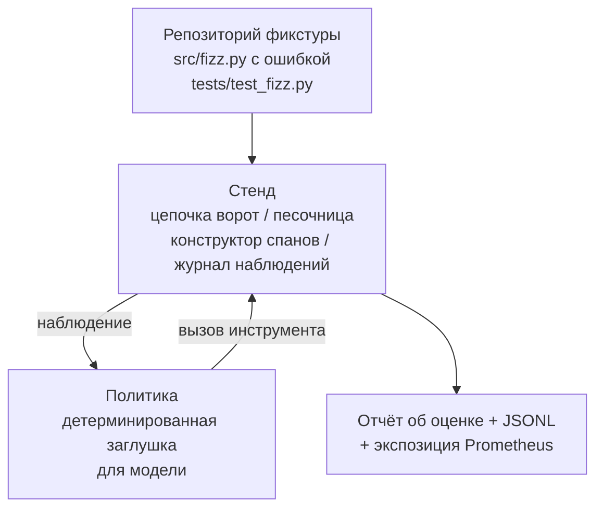
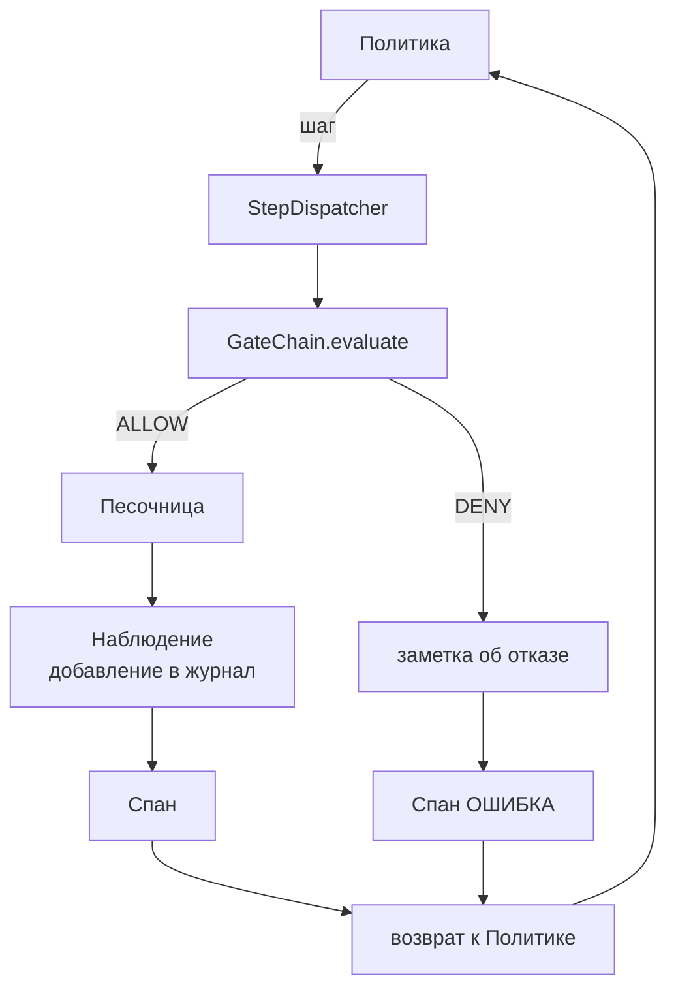

# Выпускной проект (Capstone), урок 29: Сквозной (end-to-end) кодирующий агент (coding agent) на испытательном стенде

> Кульминация Track A. В этом уроке цепочка ворот, песочница, испытательный стенд и спаны OTel собираются в работающий кодирующий агент (coding agent), который исправляет реальную (небольшую, фикстурного масштаба) ошибку в многofайловом проекте на Python. Агент — детерминированная политика, а не LLM; такая подставка делает урок воспроизводимым и показывает, что именно испытательный стенд был важной частью на протяжении всего курса. Контракт остаётся прежним: реальная модель подключается на стыке политик.

**Тип:** Практическое задание
**Языки:** Python (стандартная библиотека)
**Предварительные требования:** Фаза 19, урок 25 (ворота верификации), Фаза 19, урок 26 (песочница), Фаза 19, урок 27 (испытательный стенд оценки), Фаза 19, урок 28 (наблюдаемость), Фаза 14, урок 38 (ворота верификации), Фаза 14, урок 41 (рабочий стенд для реальных репозиториев), Фаза 14, урок 42 (выпускной проект рабочего стенда агента)
**Время:** ~90 минут

## Цели обучения

- Собрать цепочку ворот, песочницу, испытательный стенд оценки и конструктор спанов в единый цикл агента.
- Реализовать детерминированную политику, использующую `read_file`, `run_tests` и `write_file` для исправления ошибки в фикстуре.
- Ограничить общее количество шагов и бюджет токенов наблюдения на протяжении сквозного (end-to-end) запуска.
- Генерировать полные трассы OTel GenAI и метрики Prometheus для полного запуска.
- Убедиться, что агент решает фикстуру менее чем за 12 шагов с нулевым срабатыванием ворот при использовании допустимых инструментов.

## Проблема

Большинство демонстраций агентов работают изолированно: песочница сама по себе, испытательный стенд оценки сам по себе, генератор спанов сам по себе. По отдельности всё выглядит хорошо. Но при сборке вместе становятся видны швы.

Цепочка ворот говорит ALLOW, но песочница отказывает по причине, которую цепочка не предвидела. Испытательный стенд фиксирует успех, но спаны OTel говорят, что ворота отказали в инструменте, который агент утверждает, что использовал. Счётчик Prometheus увеличивается дважды, когда должен увеличиться один раз. Бюджет наблюдения превышен, но агент продолжал работать, потому что бюджет отслеживался в цепочке, а песочница об этом не знала.

Этот урок — интеграционный тест для всего трека. Агент должен выполнить четыре действия последовательно: прочитать проект, запустить тесты, определить ошибку по результатам падения теста, записать исправление, повторно запустить тесты и остановиться. Каждая операция проходит через цепочку ворот. Каждое выполнение инструмента проходит через песочницу. Каждый шаг обёрнут в спан. Испытательный стенд оценивает всё по завершении.

## Концепция



Политика агента — это конечный автомат. Пять состояний.

`SURVEY`: агент читает содержимое проекта. Следующее состояние — RUN_TESTS.

`RUN_TESTS`: агент выполняет команду запуска тестов. Если тесты пройдены, конечный автомат завершается успешно. В противном случае следующее состояние — INSPECT.

`INSPECT`: агент читает файл с ошибкой. Следующее состояние — FIX.

`FIX`: агент записывает исправленный файл. Следующее состояние — VERIFY.

`VERIFY`: агент повторно выполняет команду запуска тестов. Если тесты пройдены — успешное завершение. В противном случае — завершение с ошибкой.

Каждое состояние соответствует вызову инструмента. Каждый вызов инструмента проходит через цепочку ворот. Если вызов инструмента отклонён, агент фиксирует отказ в трассе и останавливается.

Ошибка в фикстуре — смещение на единицу (off-by-one) в `fizz.py`. Детерминированная политика определяет ошибку по сообщению о падении теста с помощью регулярного выражения и генерирует исправленный файл. Замена политики на LLM не меняет контракт испытательного стенда.

## Архитектура



Урок самодостаточен. Каждый примитив из предыдущих уроков минимально реалитован в `main.py` (ворота, песочница, журнал, спан), так что урок работает без импорта сторонних модулей. Имена точно соответствуют урокам 25–28, поэтому концептуальное соответствие однозначно.

## Что вы построите

Содержимое `main.py`:

1. Минимальные примитивы стенда, скопированные с теми же именами, что в уроках 25–28: `GateChain`, `Sandbox`, `ObservationLedger`, `SpanBuilder`, `MetricsRegistry`.
2. Класс `CodingAgentPolicy`: конечный автомат с пятью состояниями.
3. Вспомогательный класс `Repo`: подготавливает временную директорию с прилагаемой фикстурой, содержащей ошибку.
4. Класс `AgentRun`: управляет политикой, диспетчеризует через стенд, возвращает `AgentRunReport`.
5. Прилагаемая фикстура (`fixture_repo/`) с src/fizz.py, tests/test_fizz.py и деревом expected/ для испытательного стенда оценки.
6. Демонстрация: запускает политику сквозным образом, выводит пошаговую трассу, проверяет успешное прохождение, выводит метрики.

Прилагаемая фикстура повторяет структуру задания из урока 27: файл с ошибкой и файл с тестами. Сообщение о падении теста содержит достаточно информации для детерминированной политики, чтобы определить исправление. Настоящий LLM выполнил бы ту же задачу медленнее и с более широким охватом, но это не изменило бы ожиданий испытательного стенда.

## Почему политика — не LLM

Настоящий LLM требует ключа API, сетевого вызова и невоспроизводимой стохастичности. Испытательный стенд — это та часть, которая важна для данного урока. Подстановка детерминированной политики позволяет уроку работать на любом компьютере разработчика без внешних зависимостей и позволяет набору тестов проверять точное количество шагов.

Политика урока — строгое подмножество того, что делает LLM-агент. Политика читает репозиторий, видит падающий тест, определяет строку и генерирует исправление. LLM проходит тот же цикл с тем же контрактом испытательного стенда; учёт одинаков.

## Что проверяет демонстрация

Сквозная демонстрация проверяет пять условий по завершении, а набор тестов повторно проверяет их программно.

- Политика решила фикстуру менее чем за 12 шагов.
- Бюджет наблюдения никогда не был превышен.
- Ни одного отказа ворот при использовании допустимых инструментов. (Агент никогда не придумал имя отклонённого инструмента.)
- Каждый шаг имеет соответствующий спан в traces.jsonl.
- Экспозиция Prometheus содержит запись `tools_called_total{tool="read_file"}` и гистограмму `tool_latency_ms`.

## Как это сочетается с остальным Track A

Этот урок — интеграция. Урок 25 создал цепочку ворот. Урок 26 создал песочницу. Урок 27 создал испытательный стенд оценки. Урок 28 создал наблюдаемость. Урок 29 доказывает, что они работают как система. Настоящий испытательный стенд агента расширяется отсюда: замените детерминированную политику на модель, прилагаемую фикстуру — на задачу из реального репозитория, а экспортер JSONL — на OTLP.

## Запуск

```bash
cd phases/19-capstone-projects/29-end-to-end-coding-task-demo
python3 code/main.py
python3 -m pytest code/tests/ -v
```

Демонстрация выводит пошаговую трассу, итоговый отчёт об оценке и экспозицию Prometheus. Код возврата равен нулю. Тесты покрывают переходы состояний политики, отказы ворот для синтетических вызовов инструментов, сквозной запуск на прилагаемой фикстуре и инварианты бюджета шагов.
